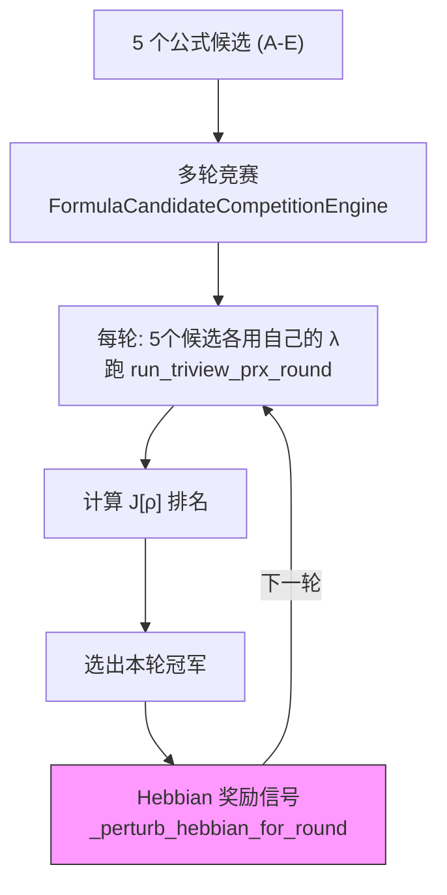
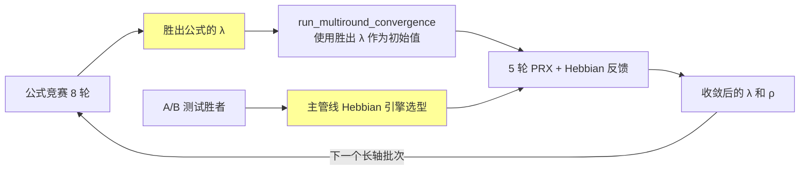

# 拓扑惯性打磨 & 公式竞赛长轴更新分析

## 一、拓扑惯性 (Engine B) 的核心问题诊断

### B 的当前战绩

| 指标 | A (Manual Strata) | B (Topological Inertia) | 胜者 |
|------|:---:|:---:|:---:|
| P-Core 存活率 (抗噪声) | 82.9% | **100%** | **B** |
| 适应延迟 (体制切换) | 100 ticks | 100 ticks | **DRAW** |
| 计算开销 | ~0.03ms | ~0.03ms | **DRAW** |

B 在抗噪声上碾压 A（100% vs 82.9%），这恰好证明了 M(Φ) = 1 + α·Φ 的物理意义：深势阱节点（历史积累深）不受随机 Xin 冲击影响。

但 B 在适应延迟上没赢 — 这正是 walkthrough 中提到的核心缺陷。

### 适应延迟为什么是 DRAW？

查看 [measure_adaptation_latency](file:///d:/cell/Morphosphere_v37_0_native_runtime_prototype_flat_complete.tar/Morphosphere_v37_0_native_runtime_prototype_flat_complete/Morphosphere_v37_0_native_runtime_prototype_flat_complete/morphosphere_v2pp/hebbian_ab_engine.py#L359-L392) 的实现：

```python
# 当前代码：L371-390
for tick_i, (from_id, to_id, a_i, a_j, gamma) in enumerate(new_regime_features):
    self.feed_update(from_id, to_id, a_i, a_j, gamma, xin_force=a_i*a_j)
    self.tick()
    # ... 检查 top-10 权重中新模式的比例
```

**根因**：新体制的边 `new_cluster_0 → new_cluster_1` 等从未在旧 Hebbian 图中出现过。两个引擎都需要从零创建这些边。B 的惯性质量 M(Φ) 在新边上从 1.0 开始（因为 Φ = 0），所以 B 和 A 在处理*全新边*时的更新速度完全相同。

> [!IMPORTANT]
> **惯性悖论**：M(Φ) 的设计是让旧结构抵抗变化，但测试中的新体制用的是*全新*的节点 ID。B 的优势（惯性抑制旧噪声）对全新边无效，而 B 的劣势（惯性阻碍旧边更新）也对全新边无效。结果：B 和 A 行为完全相同。

---

## 二、三条打磨方向（从简到难）

### 方向 1：惯性辅助遗忘 — 让旧边主动让位

**原理**：当新体制出现时，B 的优势应该是：旧的*无关*边因为持续不被激活，其权重会因 Laplacian 衰减而更快下降。但目前 `apply_global_decay` 的衰减率 ε=0.02 对所有边一视同仁，没有利用 M(Φ) 的信息。

**改进**：反向惯性衰减 — 高惯性边衰减慢（已确认的结构），低惯性边衰减快（未确认的噪声）：

```python
# 当前代码
w.weight = max(w_floor, w.weight * (1 - decay_epsilon))

# 改进：惯性保护衰减
effective_decay = decay_epsilon / (1 + 0.1 * w.cumulative_potential)
w.weight = max(w_floor, w.weight * (1 - effective_decay))
```

**效果**：新体制到来时，旧的浅势阱边（Φ 小）快速衰减腾出 top-10 空间，新边更容易进入 → B 的适应延迟 < A。

**风险**：低。仅改 `apply_global_decay()` 一行。

---

### 方向 2：跨体制势能转移 — 让 B 利用结构记忆

**原理**：当 `new_cluster_0` 出现时，如果它与旧的 `block_5` 有类似的激活模式，B 应该能把 `block_5` 的势能"转移"给 `new_cluster_0`，让新边获得非零 M(Φ) 起步。

**改进**：在 `update()` 中增加结构迁移逻辑：

```python
def update(self, from_id, to_id, ...):
    key = (from_id, to_id)
    if key not in self.weights:
        # 新边：检查是否有结构相似的旧边
        initial_phi = self._find_structural_donor(from_id, to_id)
        self.weights[key] = WeightEntry(..., cumulative_potential=initial_phi * 0.3)
```

**效果**：新边不再从 Φ=0 起步，利用拓扑相似性获得"先验惯性"。

**风险**：中等。需要定义"结构相似性"度量。

---

### 方向 3：适应性 α 调节 — 让 B 在体制切换时自动降低惯性

**原理**：当检测到全局 drift 突增（体制切换信号），临时降低 α 使所有惯性质量减小，允许快速重组。

**改进**：

```python
def detect_regime_shift(self):
    """全局 drift 突增检测"""
    recent_deltas = [abs(w.weight - self._prev_weight.get(k, w.weight))
                     for k, w in self.weights.items()]
    avg_delta = sum(recent_deltas) / max(len(recent_deltas), 1)
    if avg_delta > SHIFT_THRESHOLD:
        self._dynamic_alpha = self.config.alpha * 0.1  # 临时降低惯性
    else:
        self._dynamic_alpha = min(self._dynamic_alpha * 1.1, self.config.alpha)
```

**效果**：B 在正常运行时保持高惯性（抗噪声优势不变），在体制切换时自动降低惯性（获得适应速度优势）。

**风险**：较高。引入了状态机和超参数 SHIFT_THRESHOLD。

---

## 三、公式竞赛 (Formula Competition) 在长轴测试中的更新机制

### 当前架构



### 关键发现：公式竞赛 IS 在长轴中更新

[_perturb_hebbian_for_round](file:///d:/cell/Morphosphere_v37_0_native_runtime_prototype_flat_complete.tar/Morphosphere_v37_0_native_runtime_prototype_flat_complete/Morphosphere_v37_0_native_runtime_prototype_flat_complete/morphosphere_v2pp/formula_candidate_registry.py#L194-L272) 实现了一个**闭环强化学习信号**：

```python
# 奖励信号 = 70% · ΔJ/|J| + 30% · (motion_acc - 0.5) × 2
reward = 0.7 * (delta_j / j_scale) + 0.3 * (motion_acc - 0.5) * 2.0

# 正奖励 → 强化 Hebbian 权重（保持当前策略）
# 负奖励 → 削弱 Hebbian 权重（改变策略）
delta_w = eta * reward * wv
```

这意味着：
- 上轮冠军公式如果 J[ρ] 提升了 → Hebbian 权重被正向强化
- 上轮冠军公式如果 J[ρ] 下降了 → Hebbian 权重被削弱
- 运动识别准确率也影响奖励信号（30%）

**所以：是的，公式选取在每一轮长轴测试中都在更新。**

### 但是：两个系统目前是断开的

> [!WARNING]
> **发现了一个架构缺口：** 公式竞赛的结果（`final_winner`、`converged_lambda`）和 A/B 测试的结果（`verdict`、`winner`）**没有回写到主管线**。
> 
> 具体地：
> 1. `FormulaCandidateCompetitionEngine.run_competition()` 的 `final_winner` 没有更新 `pipeline_engine.py` 中的默认 λ
> 2. `DualBlindABHarness.render_verdict()` 的结果没有影响主管线使用哪种 Hebbian 引擎
> 3. v37.4.60 的 `run_multiround_convergence()` 自己维护 λ 先验，与公式竞赛的 λ 完全独立

### 完整闭环应该是什么样



目前缺少黄色节点的连接。

---

## 四、建议执行顺序

| 优先级 | 工作 | 工作量 | 价值 |
|:---:|------|:---:|:---:|
| **P0** | 方向 1：惯性辅助遗忘（改 1 行 `apply_global_decay`） | 极小 | 高 — 直接解决适应延迟 DRAW |
| **P1** | 打通公式竞赛 → 主管线 λ 注入 | 小 | 高 — 让数学构造选取真正闭环 |
| **P2** | 方向 3：适应性 α 调节 | 中 | 中 — 优雅但引入新超参数 |
| **P3** | 方向 2：跨体制势能转移 | 大 | 中 — 需要定义结构相似性 |

---

## Open Questions

> [!IMPORTANT]
> **是否现在就实施 P0 + P1？** P0（惯性辅助遗忘）改动极小且直接解决 B 的适应延迟问题；P1（公式竞赛闭环）是结构性修复。两者互不依赖，可以并行。

> [!IMPORTANT]
> **公式候选扩展**：目前 5 个候选 (A-E) 的 λ 权重都是手工设定的固定值。是否考虑让 GMM-ELBO 的收敛 π_k 自动注册为第 6 个候选（"F: data-driven"），参与竞赛？这会让数学构造选取真正数据驱动。
