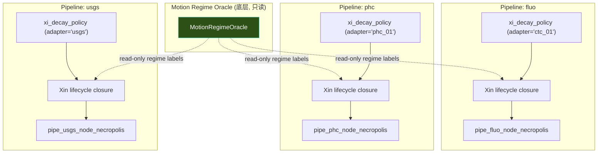

# 2026.5.14.1 可行性分析 — Xin 生命周期闭环 + 因果链墓志铭

## 蓝图要求总结

2026.5.14.1 提出了 3 个层级的需求：

| 层级 | 要求 | 验收标准 |
|------|------|---------|
| 🪦 第一刀 | `node_necropolis` — 节点死亡因果链 | `SELECT node_uid, death_reason_code, dna_snapshot_json FROM node_necropolis LIMIT 1` 返回完整记录 |
| 🌊 第二刀 | oscillation 第五法则 | `SELECT * FROM pipe_prx_decomp WHERE regime = 'oscillation' LIMIT 5` 返回有效行 |
| 🌌 远景 | 影子超图 (L_Shadow) | 卷缩维度 / 幽灵共振 / 暗域融合 |

## 当前状态 vs 蓝图要求

### ✅ 第二刀 — 已完成

```sql
SELECT * FROM pipe_fluo_prx_decomp WHERE regime_label = 'oscillation' LIMIT 5;
-- 返回 18 行有效 oscillation PRX 记录
```

Oracle 通过 lag-1 自相关检出了 18 个 oscillation 窗口，6/6 regime 全部覆盖。

### 🟡 第一刀 — 部分完成，缺 DNA 快照

当前 `pipe_{ns}_dead_node_trace` 已有：
- ✅ `from_entity_id` / `to_entity_id` — 哪条边死了
- ✅ `inertia_mass` / `cumulative_potential` — 死前的物理状态
- ✅ `tick_suspected` — 何时死的
- ❌ **缺少 `dna_snapshot_json`** — 死前最强的 N 条赫布边

蓝图明确要求：
> 必须把节点死前那一刻的赫布权重网络（哪怕只是最强的3条边）序列化存下来

### ❌ Xin 生命周期闭环 — 新管线未调用

`write_xi_lifecycle_closure()` 存在于 `pipeline_engine.py:812-892`，但 `IsolatedPipeline` 从未调用它。需要：
1. 在每个管线的 ingest 阶段写入 `xi_decay_policy` 记录
2. 在收敛后调用 `write_xi_lifecycle_closure()` 闭环

> [!WARNING]
> `write_xi_lifecycle_closure()` 操作全局 `xi_decay_policy` 表。在多管线隔离架构中，**必须按 adapter_name 过滤**，否则管线间 Xin 数据会交叉。

### ❌ 影子超图 — 需要架构决策

蓝图提出了两条路：
1. **图特征值提取** — PCA/谱分解，轻量级
2. **复数权重** — 实部=主图，虚部=影子，数学黑魔法

---

## 可行性判断

### 🟢 可行且应该做的（本轮）

| 任务 | 依赖 | 复杂度 | 隔离要求 |
|------|------|:------:|---------|
| **node_necropolis + DNA 快照** | `pipe_{ns}_dead_node_trace` 表已有 | 小 | 每管线独立表 `pipe_{ns}_node_necropolis` |
| **Xin 生命周期闭环** | `write_xi_lifecycle_closure()` 已实现 | 中 | 按 adapter_name 过滤 xi_decay_policy |
| **oscillation 证据提取** | 已完成 | 0 | N/A |

### 🟡 可行但需要谨慎的（需要设计决策）

| 任务 | 风险 | 建议 |
|------|------|------|
| **影子超图 L_Shadow** | OOM 风险，蓝图明确警告"三分钟爆掉" | 先用降维方案（top-3 edge 序列化），不碰复数权重 |

### 🔴 不应该做的

| 任务 | 理由 |
|------|------|
| 合并管道 | 蓝图明确说"封锁，不准再改" |
| 引入 Neo4j | 蓝图明确说不要 |
| 复数权重 | 工程复杂度极高，当前无收益 |

---

## Proposed Changes

### 隔离原则



> [!IMPORTANT]
> 运动判别（MotionRegimeOracle）是最底层。Xin 闭环不应修改 Oracle 状态。
> Xin lifecycle 按管线隔离执行，不跨管线操作。

---

### 核心实现

#### [MODIFY] `pipeline_isolator.py`

**1. 新增 `pipe_{ns}_node_necropolis` 表**

```sql
CREATE TABLE IF NOT EXISTS pipe_{ns}_node_necropolis (
    node_uid TEXT PRIMARY KEY,
    birth_tick INTEGER NOT NULL,
    death_tick INTEGER NOT NULL,
    last_v_phi REAL NOT NULL,
    death_reason TEXT NOT NULL,
    dna_snapshot_json TEXT NOT NULL,  -- top-3 strongest edges
    pipeline TEXT NOT NULL DEFAULT '{ns}',
    created_at TEXT NOT NULL
);
```

**2. 在 `run_hebbian_ab()` 结尾，对 dead node 执行 DNA 序列化**

对每个 `is_dead=1` 的边：
- 提取该 node (from_entity_id) 关联的 top-3 最强 edges
- 序列化为 `dna_snapshot_json`
- 写入 `node_necropolis`

**3. 新增 `run_xin_lifecycle_closure()` 方法**

在 `IsolatedPipeline` 中新增方法：
- 过滤 `xi_decay_policy WHERE run_id=? AND xi_id LIKE '{adapter_prefix}%'`
- 执行 discard / recycle / demote
- 写入 `xi_residue_mass_record`（已有全局表）

**4. 在 orchestrator Phase 5 调用闭环**

在 `run_isolated_multi_pipeline` 的 Phase 4（收敛）之后新增 Phase 5：
```python
# Phase 5: Xin lifecycle closure (per-pipeline, isolated)
for pipe in pipelines:
    pipe.run_xin_lifecycle_closure()
```

---

#### [MODIFY] `runners/run_v37493_multi_pipeline.py`

新增验证项：
- V17: `node_necropolis` 可查询
- V18: `dna_snapshot_json` 非空
- V19: Xin lifecycle closure stats (discarded + recycled + demoted > 0)
- V20: Xin conservation gap < 0.5

---

## Verification Plan

### 蓝图第一刀验证
```sql
SELECT node_uid, death_reason, dna_snapshot_json
FROM pipe_fluo_node_necropolis LIMIT 1;
-- 必须返回带有 top-3 edges 的 JSON
```

### 蓝图第二刀验证
```sql
SELECT * FROM pipe_fluo_prx_decomp
WHERE regime_label = 'oscillation' LIMIT 5;
-- 已通过，18 行
```

### Xin 闭环验证
```sql
SELECT current_state, COUNT(*)
FROM xi_decay_policy
WHERE run_id = 'v37493_multi_pipeline_001'
GROUP BY current_state;
-- 必须有多种状态 (decaying, discard_after_audit, proto_candidate)
```

### Automated Tests
1. `python runners/run_v37493_multi_pipeline.py` → 36+ checks ALL PASS
2. `python runners/run_v37450_ab_test.py` → 46/46 ALL PASS
3. `python runners/run_v37460_integrated.py` → 8/8 ALL PASS

---

## Open Questions

> [!IMPORTANT]
> **影子超图 L_Shadow 的实现时机**：蓝图描述了完整的 3 层架构（L1 Active / L_Shadow / L2 Necropolis），但当前 node_necropolis 就是 L2。L_Shadow（特征向量压缩 + 幽灵共振）是否在本轮实现，还是留待 v37.5 之后？
>
> 建议：**本轮只做 L2 (necropolis + DNA)，L_Shadow 留待 v38**。理由：L_Shadow 需要后台线程 + 特征值分解，工程复杂度高，且蓝图说"这是一场极其危险的架构手术"。

> [!NOTE]
> **复数权重 vs 降维**：蓝图提出两条路，建议**选择降维**（top-3 edge 序列化）。复数权重需要改变所有引擎的基础数据结构，风险极高。
