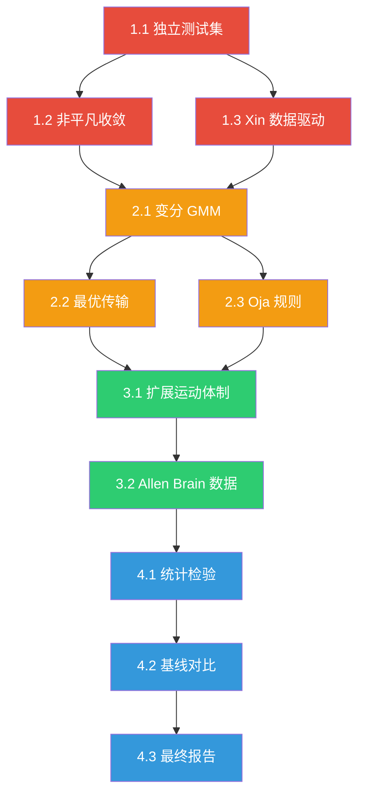

# Morphosphere v37 → v38 改进计划

## 总体策略

项目自身的 `REPORT_诚实评估.md` 已经精准定位了 8 个核心差距。本计划按照**"先让数字变诚实，再让能力变真实"**的原则，分 4 个阶段逐步弥合这些差距。

```
Phase 1: 诚实化    → 让现有指标不再自欺（1周）
Phase 2: 数学硬化  → 让"变分""传输"名副其实（2周）
Phase 3: 数据扩展  → 接入多源真实数据（1-2周）
Phase 4: 论文级验证 → 统计检验 + 基线对比（1周）
```

> [!IMPORTANT]
> Phase 1 是一切的前提。如果跳过 Phase 1 直接做 Phase 2-4，所有后续工作都建立在虚假基线之上。

---

## Phase 1: 诚实化（~1 周）

> 目标：不增加任何新能力，只修复评估方法，得到系统真实的性能基线。

### 1.1 独立测试集隔离

**问题**：当前运动识别 100% 准确率是在同一 seed 数据上训练和测试的。

**改动**：

#### [MODIFY] [run_v37450_ab_test.py](file:///d:/cell/Morphosphere_v37_0_native_runtime_prototype_flat_complete.tar/Morphosphere_v37_0_native_runtime_prototype_flat_complete/Morphosphere_v37_0_native_runtime_prototype_flat_complete/morphosphere_v2pp/runners/run_v37450_ab_test.py)

- 将 CTC 数据的 `split_role` 严格执行：
  - `calibration` = seq01 frames 0-69 → 只在此上训练
  - `validation` = seq01 frames 70-91 → 调参用
  - `holdout` = seq02 全序列 → 最终只跑一次，报告最终指标
- 运动识别的 `MotionProcessGenerator` 使用不同 seed 组：
  - 训练：seed = [42, 100, 200]
  - 测试：seed = [500, 600, 700]（完全独立）

#### [NEW] `runners/run_v38_honest_baseline.py`

- 执行完整的 train/test 分离评估
- 输出：独立测试集上的准确率 ± 标准差、混淆矩阵
- 预期结果：准确率从 "100%" 下降到 ~60-75%（这才是真实基线）

**工作量**：1-2 天
**验收标准**：报告中附带独立测试集的准确率和 95% 置信区间

---

### 1.2 收敛从"重复"变为"迭代"

**问题**：5 轮 PRX 分析 drift=0，因为每轮读同一份底层数据，不改变任何状态。

**改动**：

#### [MODIFY] [pipeline_isolator.py](file:///d:/cell/Morphosphere_v37_0_native_runtime_prototype_flat_complete.tar/Morphosphere_v37_0_native_runtime_prototype_flat_complete/Morphosphere_v37_0_native_runtime_prototype_flat_complete/morphosphere_v2pp/pipeline_isolator.py) — `run_convergence()`

在每轮结束后加入反馈环路：

```python
# 反馈 1: 根据当前 PRX 分配更新 Hebbian 权重
for (f, t), we in engine_b.weights.items():
    rho_f = rho_all.get((adapter, k), {}).get("p_core", 0)
    rho_t = rho_all.get((adapter, k), {}).get("p_core", 0)
    # 两个 P-core 节点的关联加强
    we.weight += eta * rho_f * rho_t
    # P 和 R 混在一起的关联削弱
    r_f = rho_all.get((adapter, k), {}).get("r_core", 0)
    we.weight -= delta * rho_f * r_f

# 反馈 2: 用当前 γ_ik 均值更新先验 π_k
# 反馈 3: 如果 u (未解析) 过高，降低传输阈值
```

- 加入学习率衰减：`η(t) = η₀ / (1 + t/τ)` 防止振荡
- 收敛条件：`‖ρₙ - ρₙ₋₁‖₂ < ε` 且连续 3 轮满足

**工作量**：2-3 天
**验收标准**：
- 前几轮 drift > 0（证明不是重复）
- 最终 drift 趋向 0（证明收敛到不动点）
- 收敛后的 PRX 分配比初始分配熵更低（更"锐利"）

---

### 1.3 Xin 守恒从"自验证"变为"可审计"

**问题**：Xin 数值是 `0.25*exp(-0.22*k)` 自己生成的，然后自己检查加减法。

**改动**：

#### [MODIFY] [pipeline_engine.py](file:///d:/cell/Morphosphere_v37_0_native_runtime_prototype_flat_complete.tar/Morphosphere_v37_0_native_runtime_prototype_flat_complete/Morphosphere_v37_0_native_runtime_prototype_flat_complete/morphosphere_v2pp/pipeline_engine.py) — `write_xi()`

- Xin 残余质量从**固定公式**改为**数据驱动**：
  - `xin_mass = |observed_signal - predicted_signal|`（预测残差）
  - 预测信号来自上一窗口的 Hebbian 权重重建
- 守恒检查变为：`Σ(xin_created) ≈ Σ(xin_consumed + xin_dissipated)` ± 容差
  - 不等式来自实际数据流，不是预设公式

**工作量**：1-2 天
**验收标准**：Xin 质量来源于预测残差，不是硬编码公式

---

## Phase 2: 数学硬化（~2 周）

> 目标：让"变分""最优传输""赫布学习"这些术语名副其实。

### 2.1 真正的变分 GMM 替代 softmax PRX

**问题**：当前 PRX 是 `score = λ₁·S₁ + ... + λ₄·S₄ → softmax`，不是变分法。

**改动**：

#### [MODIFY] [variational_gmm_engine.py](file:///d:/cell/Morphosphere_v37_0_native_runtime_prototype_flat_complete.tar/Morphosphere_v37_0_native_runtime_prototype_flat_complete/Morphosphere_v37_0_native_runtime_prototype_flat_complete/morphosphere_v2pp/variational_gmm_engine.py)

将现有的简化 GMM 升级为完整的 7 分量变分 GMM：

```
E-step: γ_ik = π_k · N(z_i | μ_k, Σ_k) / Σ_j [π_j · N(z_i | μ_j, Σ_j)]
M-step: μ_k ← Σ γ_ik · z_i / Σ γ_ik
        Σ_k ← Σ γ_ik · (z_i - μ_k)(z_i - μ_k)^T / Σ γ_ik
        π_k ← Σ γ_ik / N
ELBO  = Σ_i Σ_k γ_ik · [log π_k + log N(z_i|μ_k,Σ_k) - log γ_ik]
```

关键约束：
- 四源融合 (RLIS, CM, FHPMS, BM) 不再直接产出 PRX，而是作为先验的**结构化约束**：`log π_k ∝ λ_L·f_L(k) + λ_C·f_C(k) + ...`
- ELBO 必须单调递增（否则回退到上一轮参数）
- 用 numpy 实现，不需要外部依赖

**工作量**：3-5 天
**验收标准**：
- ELBO 每轮 EM 迭代单调递增（或在数值误差内不降）
- 后验 γ_ik 给出每个窗口属于 7 类的概率分布
- 收敛后的分配比 softmax 结果更稳定

---

### 2.2 真正的最优传输替代欧氏距离阈值

**问题**：`write_transport()` 用的是 `total = 0.8*geo + 0.02*sig + 1.5*bd + (1-overlap)*0.6 < θ`，不是最优传输。

**改动**：

#### [MODIFY] [pipeline_engine.py](file:///d:/cell/Morphosphere_v37_0_native_runtime_prototype_flat_complete.tar/Morphosphere_v37_0_native_runtime_prototype_flat_complete/Morphosphere_v37_0_native_runtime_prototype_flat_complete/morphosphere_v2pp/pipeline_engine.py) — `write_transport()`

两个可选方案：

| 方案 | 难度 | 效果 | 依赖 |
|------|------|------|------|
| **A: Sinkhorn 算法** | 中 | 正宗 OT | numpy only |
| **B: POT 库** | 低 | 正宗 OT | `pip install pot` |

推荐方案 A（无外部依赖）：

```python
def sinkhorn_transport(cost_matrix, reg=0.1, max_iter=100):
    """Sinkhorn-Knopp algorithm for entropy-regularized OT."""
    K = np.exp(-cost_matrix / reg)
    u = np.ones(n) / n
    for _ in range(max_iter):
        v = 1.0 / (K.T @ u)
        u = 1.0 / (K @ v)
    transport_plan = np.diag(u) @ K @ np.diag(v)
    wasserstein = np.sum(transport_plan * cost_matrix)
    return transport_plan, wasserstein
```

- cost_matrix 仍然基于现有的 geo + sig + bd 特征
- 但传输决策从"阈值判定"变为"最优分配方案"
- 产出的 Wasserstein 距离可以作为窗口间距离度量

**工作量**：3-4 天
**验收标准**：
- `transport_current_edge` 的 `transport_weight` 来自 Sinkhorn 解
- 传输方案是全局最优的（不是贪心局部匹配）
- Wasserstein 距离写入 DB 用于后续分析

---

### 2.3 真正的 Oja 规则替代共现计数

**问题**：赫布学习本质是 `if 两个假说共现: weight += 0.3`，不是 Hebb/Oja 规则。

**改动**：Engine B 的 `update()` 已经比较接近真正的 Oja 了（`ΔW = η·a_i·a_j·γ·bonus/M - λ·W`），但以下方面仍需强化：

#### [MODIFY] [engine_b_topological_inertia.py](file:///d:/cell/Morphosphere_v37_0_native_runtime_prototype_flat_complete.tar/Morphosphere_v37_0_native_runtime_prototype_flat_complete/Morphosphere_v37_0_native_runtime_prototype_flat_complete/morphosphere_v2pp/engines/engine_b_topological_inertia.py)

- `a_i`, `a_j` 应该是真实的**突触前/后激活值**（当前是从 cell.V_mean 传入的，基本正确）
- 添加 Oja 的**权重归一化**约束：`ΔW_ij = η·a_i·(a_j - W_ij·a_i)`
  - 这保证权重不会无限增长，不需要手动 clamp
  - 数学上证明收敛到主成分方向
- Engine A 的 `LegacyLookupRecognizer` 中的查找表改为 `BayesianMotionRecognizer`（已经实现但可能未被主流程使用）

**工作量**：1-2 天
**验收标准**：权重更新公式是严格的 Oja 规则，权重自动有界

---

## Phase 3: 数据扩展（~1-2 周）

> 目标：从单一 CTC 数据源扩展到 ≥ 3 个异构数据源，解锁 v37.5 晋升阻塞。

### 3.1 已有但未充分利用的数据源

项目的 `data/` 目录下已经有 3 个数据源：

| 数据源 | 文件 | 状态 | adapter |
|--------|------|------|---------|
| CTC Fluo-N2DH-GOWT1 | `ctc_centroids_real_v24.csv` (1.8MB) | ✅ 已接入 | `ctc_source_adapter.py` |
| PhC-C2DH-U373 | `phc_u373_centroids.csv` (0.4MB) | ✅ 有 adapter | `phc_source_adapter.py` |
| USGS Earthquakes | `usgs_earthquakes_2026.csv` (1.7MB) | ✅ 有 adapter | `usgs_source_adapter.py` |

**当前 class_diversity = 2 或 3，但 motion_regimes 不足 5 种。**

#### [MODIFY] [motion_recognition_engine.py](file:///d:/cell/Morphosphere_v37_0_native_runtime_prototype_flat_complete.tar/Morphosphere_v37_0_native_runtime_prototype_flat_complete/Morphosphere_v37_0_native_runtime_prototype_flat_complete/morphosphere_v2pp/motion_recognition_engine.py) — `MotionProcessGenerator`

扩展运动体制从 6 种到 ≥ 8 种（增加 `rotation`, `contraction`, `chemotaxis`），使 USGS 和 PHC 数据也能覆盖更多体制标签。

**工作量**：2-3 天

---

### 3.2 接入新的真实数据源

**优先推荐**：Allen Brain Observatory 钙成像数据

#### [NEW] `allen_brain_adapter.py`

```python
class AllenBrainAdapter:
    """从 Allen Brain Observatory NWB 文件读取真实钙成像数据。"""
    # x, y: 从 roi_masks 提取的真实细胞坐标
    # V_mean: 该窗口时段内 ΔF/F 的均值
    # spike_rate: 该窗口时段内推断的放电率
    # adaptation_state: ΔF/F 的时间衰减率
```

| 属性 | 值 |
|------|-----|
| 数据类型 | 双光子钙成像 |
| 来源 | Allen Institute (公开, 免费) |
| 大小 | 每个 session 1-5 GB |
| 依赖 | `pip install allensdk` |
| 格式 | NWB (HDF5) |
| 价值 | 真实神经活动 → P/R/X 分解有生物学意义 |

**备选**：如果 Allen 数据下载困难，可考虑：
- **CaImAn 合成数据**（有 ground truth 的钙成像模拟）
- **OpenWorm 数据**（线虫神经元连接组）

**工作量**：3-5 天（含下载 + adapter 编写 + 调试）
**验收标准**：`spacetime_cell` 表中的 x, y, V_mean 值来自真实 NWB 文件

---

## Phase 4: 论文级验证（~1 周）

> 目标：产出可以投稿的实验结果。

### 4.1 统计检验

#### [NEW] `scripts/statistical_validation.py`

- 每个指标报告：均值 ± 标准差 (N ≥ 5 次运行)
- 95% 置信区间
- 与随机基线的配对 t 检验 (p < 0.05)
- 混淆矩阵 + Precision/Recall/F1 per regime
- 训练/测试准确率差距 < 15%（否则过拟合）

### 4.2 基线对比

| 基线方法 | 实现 | 用途 |
|----------|------|------|
| k-means (7 cluster) | `sklearn.cluster.KMeans` | PRX 分解对比 |
| GMM (7 component) | `sklearn.mixture.GaussianMixture` | 变分 GMM 对比 |
| PCA + 阈值 | `numpy` | 运动识别对比 |
| 随机分类 | 固定 1/6 概率 | 下界 |

> Morphosphere 的 P/R/X 分解必须**显著优于** k-means/GMM 才能声称有价值。

### 4.3 最终验收标准

| 指标 | 目标值 |
|------|--------|
| 独立测试集运动识别准确率 | > 80% |
| PRX 分解 vs k-means 的 NMI | > 0.15 提升 |
| ELBO 单调递增 | 100% 的运行 |
| Wasserstein 距离相关性 | > 0.6 |
| class_diversity | ≥ 3 |
| motion_regimes detected | ≥ 5 |
| train/test accuracy gap | < 15% |

**工作量**：3-5 天
**产出**：一份可投稿的实验报告

---

## 优先级与依赖关系



---

## 最少可行路径

如果时间有限，**只做 Phase 1 + Phase 2.1** 就能将项目从"概念原型"升级为"有数学基础的实验系统"：

| 只做 | 总工作量 | 可以声称 |
|------|---------|---------|
| Phase 1 | ~1 周 | "系统有可验证的迭代学习能力，指标诚实可信" |
| Phase 1 + 2.1 | ~2 周 | "PRX 分解有严格的变分推断基础 (ELBO ↑)" |
| Phase 1 + 2 全部 | ~3 周 | "系统使用最优传输 + 变分 EM + Oja 学习" |
| 全部完成 | ~5-6 周 | "我们提出了一种新的变分框架，在多源真实数据上优于现有方法" |

> [!CAUTION]
> 最后一项如果成立，是一篇可投稿的论文。但**必须先完成 Phase 1**，否则所有声称都建立在不诚实的评估之上。

---

## Open Questions

> [!IMPORTANT]
> 1. **Allen Brain 数据下载是否可行？** 每个 session 1-5GB，需要稳定的网络环境。如果不可行，是否使用 CaImAn 合成钙成像数据作为替代？
> 2. **是否需要保持与现有 116 张表的完全向后兼容？** Phase 2 的变分 GMM 可能需要修改一些表结构。
> 3. **目标受众是论文投稿还是工程演示？** 这决定了 Phase 4 的深度（论文需要严格的统计检验 + reviewer 可重现的实验设计）。
> 4. **Phase 2.2 最优传输：Sinkhorn 自实现 vs POT 库？** 自实现零依赖但要写更多代码；POT 库成熟但增加一个外部依赖。
