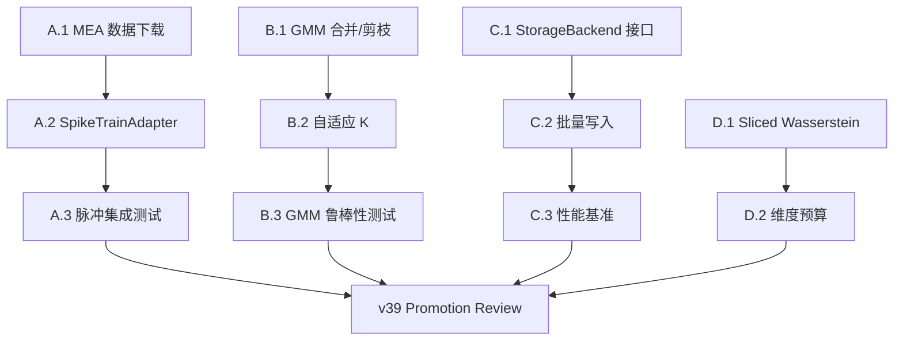

# Morphosphere v39 工程硬化计划 — 回应 Liying 2026.5.14.2 拷问

> 本计划回应 [Liying/2026.5.14.2.txt](file:///d:/cell/Morphosphere_v37_0_native_runtime_prototype_flat_complete.tar/Morphosphere_v37_0_native_runtime_prototype_flat_complete/Liying/2026.5.14.2.txt) 中提出的 4 个工业级挑战。
> 策略：**不做断臂求生式的全面重写**，而是在 Python 原型框架内逐步引入工程级加固，为未来的 Rust/C++ 迁移铺路。

---

## 整体优先级排序

| Phase | 目标 | 紧迫度 | 理由 |
|-------|------|--------|------|
| **Phase A** | MEA 脉冲数据接入 | 🔴 高 | 直接扩展能力边界，验证核心架构的鲁棒性 |
| **Phase B** | GMM 组件生命周期 | 🟡 中 | 修复 slow_drift 坍缩问题，提升分类质量 |
| **Phase C** | 存储层升级 | 🟡 中 | 为高频场景做准备，但当前不是瓶颈 |
| **Phase D** | OT 维度鲁棒性 | 🟢 低 | 当前 7-8 维无风险，预防性措施 |

---

## Phase A: 直面高频脉冲 (MEA Spike Train)

> **回应拷问 3：** *"把真正的微电极脉冲序列数据喂进去，看看引擎是否还能优雅地维持极限环"*

### A.1 数据获取

#### [NEW] `runners/run_v39_spike_download.py`

- 从 [DANDI Archive](https://dandiarchive.org) 下载 1-2 个开放的 Neuropixels / MEA 数据集
- 候选数据集：
  - **Steinmetz et al. 2019** (Neuropixels, 多脑区, 30KHz) — DANDI:000009
  - **Allen Neuropixels Visual Coding** — 已有 allensdk 基础设施
- 输出：`data/spike_trains/` 目录，spike times + cluster IDs 的 CSV/Parquet

### A.2 脉冲特征提取器

#### [NEW] `engines/spike_train_adapter.py`

新的 source adapter，与 `AllenBrainAdapter` 同级，专门处理离散脉冲数据：

```
输入: spike_times[], cluster_ids[] (10-30KHz 原始脉冲)
      ↓
窗口化: 按 time_window (e.g. 50ms) 分段
      ↓
特征提取 (每个窗口):
  - firing_rate:      脉冲频率 (Hz)
  - isi_mean:         平均放电间隔 (ms)
  - isi_cv:           ISI 变异系数 (regularity)
  - burst_index:      突发放电指标 (ISI < 10ms 的比例)
  - sync_index:       群体同步度 (跨神经元相关)
  - fano_factor:      Fano 因子 (方差/均值, 超泊松检测)
      ↓
输出: CellRecord (与钙成像接口统一)
```

关键设计决策：

> [!IMPORTANT]
> **HebbianSignalTransform 是否需要重训？**
> 是的。钙成像的 W_signal 映射不能直接用于脉冲数据，因为输入特征的物理含义完全不同。
> 需要在 MEA 数据上重新校准 W_signal，然后冻结。
> 但 z_t → Φ → d_σ_t 的下游链路保持不变——这是架构的核心价值。

### A.3 验证协议

#### [NEW] `runners/run_v39_spike_integration.py`

- 用 MEA 数据运行完整管线：SpikeTrainAdapter → FeatureExtractor → BayesianRecognizer → GMM → OT
- 对比指标：
  - regime 多样性 (是否仍然 slow_drift 主导?)
  - W_signal 收敛性 (Oja 权重是否在 MEA 数据上稳定?)
  - ELBO 是否仍然单调?
  - 处理延迟 (50ms 窗口 × 10K 脉冲 = 每窗口多少 ms?)

### A.4 预期结果

| 场景 | 预期 | 意义 |
|------|------|------|
| 管线跑通 + regime 多样 | ✅ 架构在脉冲时间尺度下鲁棒 | 论文级别声称大幅增强 |
| 管线跑通 + regime 坍缩 | ⚠️ 特征提取需要调整 | 证实 Liying 的预言，需要迭代 |
| 管线崩溃 | ❌ 架构无法处理高频离散信号 | 需要根本性重新设计 |

---

## Phase B: GMM 组件生命周期

> **回应拷问 2：** *"如何保证引擎在保持方差弹性的同时，不丧失对高频细节的分辨率？"*

### B.1 组件合并/剪枝机制

#### [MODIFY] `engines/variational_gmm_engine.py`

在 EM 迭代的 M-step 后追加组件维护逻辑：

```python
def _component_maintenance(self):
    """合并相似组件 + 剪枝无效组件."""
    
    # 1. 剪枝: π_k < ε 的组件标记为死亡
    PRUNE_THRESHOLD = 0.01  # 占比 < 1% 视为冗余
    
    # 2. 合并: KL(k1 || k2) < δ 的相邻组件合并
    MERGE_THRESHOLD = 0.5   # KL 散度阈值
    
    # 3. 分裂: 如果某组件的方差异常大 (> 3σ_median)
    #    考虑分裂为两个子组件 (仅在 K < K_max 时)
    K_MAX = 12
```

### B.2 自适应 K 策略

#### [MODIFY] `engines/variational_gmm_engine.py`

引入 BIC/AIC 信息准则选择最优 K：

```python
def select_k(self, X, K_range=(3, 12)):
    """用 BIC 选择最优组件数."""
    best_k, best_bic = 3, float('inf')
    for k in range(K_range[0], K_range[1]+1):
        bic = -2 * elbo + k * d * log(n)  # 惩罚复杂度
        if bic < best_bic:
            best_k, best_bic = k, bic
    return best_k
```

### B.3 验证

#### [NEW] `runners/run_v39_gmm_robustness.py`

- 长序列测试 (1000+ 窗口) — 验证组件数不膨胀
- 模式坍缩检测 — 最大组件占比 < 80%
- 合并/剪枝日志审计

---

## Phase C: 存储层升级

> **回应拷问 1：** *"抛弃 SQLite 作为高频记录器"*

### C.1 DuckDB 迁移 (中期方案)

> [!NOTE]
> 不直接跳到 InfluxDB（需要独立服务进程），而是先迁移到 **DuckDB** —— 嵌入式列式数据库，
> 无服务器进程、单文件部署、Python 原生支持、列式存储天然适合时序聚合。

#### [NEW] `engines/storage_backend.py`

抽象存储接口，支持 SQLite 和 DuckDB 后端切换：

```python
class StorageBackend(Protocol):
    def write_batch(self, table: str, records: list[dict]) -> None: ...
    def query(self, sql: str) -> list[dict]: ...
    def flush(self) -> None: ...

class SQLiteBackend(StorageBackend): ...   # 当前实现
class DuckDBBackend(StorageBackend): ...   # 新实现
```

### C.2 批量写入优化

#### [MODIFY] `pipeline_engine.py`, `pipeline_isolator.py`

- 将逐条 `INSERT` 改为批量 `executemany` (每 100 条)
- 添加内存写缓冲区 + 定时 flush
- 对 `xin_lifecycle` 和 `necropolis` 表启用 append-only 模式

### C.3 性能基准

#### [NEW] `runners/run_v39_storage_benchmark.py`

- 对比 SQLite WAL vs DuckDB 在 1K/10K/100K TPS 下的写入延迟
- 对比查询延迟 (聚合 xin_lifecycle 状态统计)
- 目标：DuckDB 在 >1K TPS 下延迟 < SQLite 的 50%

### C.4 迁移策略

```
v38: SQLite only (当前)
v39: SQLite default + DuckDB optional (通过 StorageBackend 接口切换)
v40: DuckDB default + SQLite legacy 兼容
v41+: 考虑 Rust 运行时 + Arrow 内存格式
```

---

## Phase D: OT 维度鲁棒性

> **回应拷问 4：** *"Wasserstein 距离在高维空间极其脆弱"*

### D.1 Sliced Wasserstein 备选

#### [MODIFY] `optimal_transport_engine.py`

添加 Sliced Wasserstein Distance (SWD) 作为高维场景的替代：

```python
def compute_sliced_wasserstein(self, source, target, n_projections=50):
    """1D 随机投影的 Wasserstein 平均 — O(n·log(n)·d) 而非 O(n³)."""
    # POT 库已支持: ot.sliced_wasserstein_distance()
```

### D.2 自动维度预算

#### [MODIFY] `optimal_transport_engine.py`

```python
def compute_transport(self, source, target):
    d = feature_dim(source)
    if d > 15:
        # 自动降维到 10 维后再计算 OT
        source, target = self._pca_reduce(source, target, n_components=10)
    if d > 30:
        # 切换到 Sliced Wasserstein
        return self.compute_sliced_wasserstein(source, target)
```

### D.3 验证

- 构造 50 维 / 100 维合成数据，对比 Sinkhorn vs Sliced Wasserstein 的区分能力
- 目标：Sliced WD 在 d=50 时仍能区分不同 regime (ARI > 0.3)

---

## 依赖关系与执行顺序



**Phase A 和 B 可并行；Phase C 独立；Phase D 最低优先级。**

---

## 不在本计划范围内的事项

以下是 Liying 提到的长期目标，属于 v40+ 路线图：

| 项目 | 理由 |
|------|------|
| C++/Rust 核心重写 | 工作量巨大，需先确认 Python 原型的算法设计稳定后再迁移 |
| CUDA Sinkhorn | 依赖 C++ 基础设施，v39 先用 Sliced WD 缓解 |
| InfluxDB / 独立时序服务 | v39 先用 DuckDB 嵌入式方案验证列式存储的价值 |
| 完整 SNN 仿真 | 需要专门的脉冲神经网络模拟器 (Brian2/NEST)，不属于 Morphosphere 核心 |

---

## Open Questions

> [!IMPORTANT]
> 1. **Phase A 的 MEA 数据选择**：是否优先使用 Allen Neuropixels (已有 allensdk 基础设施)，还是 DANDI Archive 的第三方数据集？
> 2. **Phase B 的 K 上限**：K_MAX = 12 是否合理？Liying 场景中"成千上万个组件"暗示需要更大的搜索空间。
> 3. **Phase C 的优先级**：当前 runner 的 SQLite 延迟是否已经构成实际痛点？如果不是，C 可以推迟到 v40。
> 4. **整体范围控制**：4 个 Phase 全部执行估计需要 3-5 个 session。是否需要先只做 Phase A（最高价值）？
