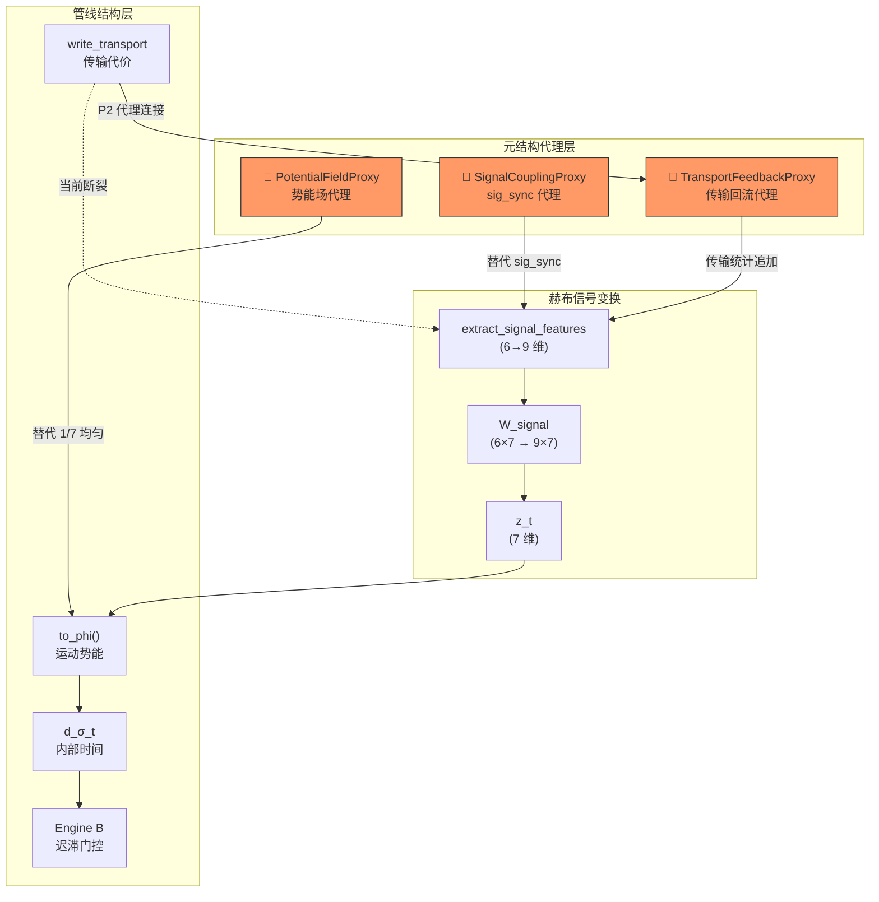

# 元结构代理架构（Meta-Structure Proxy Architecture）

## 核心思想

物理结构尚未设计完成，但管线需要继续运行。**元结构代理**是一个明确标注的占位模块，它：

1. **声明**自己代理的是什么物理概念
2. **约定**输入/输出接口（真正的物理结构也必须满足这个接口）
3. **记录**当前实现是代理（非最终结构）
4. **追踪**替换为真正结构时会影响哪些下游组件

```
代理模块 ≠ 最终结构
代理模块 = 接口契约 + 临时实现 + 替换影响声明
```

---

## 现有系统中已经是"代理"但未标注的部分

| 位置 | 当前实现 | 实际应代理的物理概念 | 问题 |
|------|---------|-------------------|----|
| `extract_signal_features` → `sig_sync` | `1.0 - CV` | 细胞群体同步耦合强度 | 恒等于 0，公式不适用 |
| `W_signal` 初始值 | 手写先验矩阵 | 信号→测度空间的物理映射 | 训练后几乎不变 |
| `to_phi()` | 7 维均值 | 运动势能场 | 均匀系数(1/7)，无结构 |
| `write_transport` → `total cost` | `0.8*geo + 0.02*sig_d + 1.5*bd` | 细胞间迁移代价函数 | 系数硬编码 |
| `extract` → `coherence` | `1.0 - CV(ΔF/F)` | 细胞运动一致性 | 与 sig_sync 相同的 CV 坍塌 |

---

## 设计：MetaStructureProxy 框架

### 层次结构

```
engines/
├── _common.py                    # 核心类型（MeasureCoordinate, WeightEntry...）
├── _meta_proxy.py                # ← 新文件：元结构代理基类 + 注册表
├── proxies/                      # ← 新目录：所有代理模块
│   ├── __init__.py
│   ├── signal_coupling.py        # 代理：细胞群体同步耦合
│   ├── transport_feedback.py     # 代理：传输代价→特征回流
│   └── potential_field.py        # 代理：运动势能场结构
├── engine_b_topological_inertia.py
└── shadow_hypergraph.py
```

### 代理基类设计

```python
class MetaStructureProxy:
    """元结构代理基类。
    
    每个代理必须声明：
      - PROXY_FOR:     代理的物理概念名称
      - STRUCTURAL_CONTRACT: 输入/输出类型约定
      - COUPLING_MAP:  与哪些管线组件耦合
      - REPLACEMENT_IMPACT: 替换为真结构时的影响范围
    
    Iron Laws:
      1. 代理必须标注 _is_proxy = True
      2. 代理的输出必须与最终结构的接口完全一致
      3. 代理必须记录每次调用到审计日志
      4. 代理必须声明其"近似度"（与真结构的差距有多大）
    """
    _is_proxy = True
    
    # 子类必须覆盖
    PROXY_FOR: str                    # "cell_population_coupling"
    APPROXIMATION_LEVEL: str          # "statistical_summary" | "structural_partial" | "placeholder"
    STRUCTURAL_CONTRACT: dict         # {"input": [...], "output": [...]}
    COUPLING_MAP: dict                # {"upstream": [...], "downstream": [...]}
    REPLACEMENT_IMPACT: list[str]     # ["W_signal learning", "z_t discrimination", ...]
    
    def compute(self, **kwargs):
        """代理计算。子类实现。"""
        raise NotImplementedError
    
    def audit_entry(self) -> dict:
        """返回审计记录，标明这是代理输出。"""
        return {
            "proxy_for": self.PROXY_FOR,
            "approximation": self.APPROXIMATION_LEVEL,
            "is_proxy": True,
        }
```

---

## 三个具体代理模块

### Proxy 1: SignalCouplingProxy — 替代 sig_sync

```python
class SignalCouplingProxy(MetaStructureProxy):
    """代理：细胞群体同步耦合强度。
    
    物理概念：
      在真正的物理结构中，"同步性"应该是细胞之间的
      信号相关矩阵的特征值分布。第一主成分的解释方差
      越大，群体越同步。
      
    当前近似：
      使用细胞间信号的 Pearson 相关系数均值。
      这不是最终结构——真正的结构应该是赫布超图中
      细胞节点之间边权重的谱特性。
      
    替换路径：
      当赫布超图的细胞级边结构完成后，此代理应被替换为：
      coupling = spectral_gap(W_cell_graph)
      其中 W_cell_graph 是细胞间赫布连接的邻接矩阵。
    """
    PROXY_FOR = "cell_population_synchrony"
    APPROXIMATION_LEVEL = "statistical_summary"
    STRUCTURAL_CONTRACT = {
        "input": ["signal_values: List[float]"],   # 214 cells' ΔF/F
        "output": ["coupling: float (0-1)"],        # 同步强度
    }
    COUPLING_MAP = {
        "upstream": ["AllenBrainAdapter.generate_cells"],
        "downstream": ["HebbianSignalTransform.extract_signal_features → sig_sync",
                       "FeatureExtractor.extract → coherence"],
    }
    REPLACEMENT_IMPACT = [
        "sig_sync 不再恒等于 0 → W_signal 第5行获得梯度信号",
        "z_t 的 xin_residual_cost 维度开始有区分力",
        "BayesianMotionRecognizer 获得新的判别特征",
    ]
```

### Proxy 2: TransportFeedbackProxy — 传输代价→特征回流

```python
class TransportFeedbackProxy(MetaStructureProxy):
    """代理：传输层结构信息到信号特征层的回流。
    
    物理概念：
      管线 Transport 层已经计算了细胞间的物理传输代价
      (geo + sig_d + bd)。这些代价的统计特性（分布、
      门控拒绝率、最佳匹配代价变化率）是结构性信息，
      应该流入 W_signal 的学习。
      
    当前近似：
      从上一窗口的传输边代价中提取 3 个统计量，
      追加到信号特征中。这是"读取管线中间产物"，
      不是真正的结构反馈——真正的反馈应该是
      传输代价通过赫布学习规则直接影响权重更新。
      
    替换路径：
      当赫布超图实现传输层→权重层的结构性连接后：
      ΔW += η_transport · transport_cost_gradient · W
    """
    PROXY_FOR = "transport_to_hebbian_structural_feedback"
    APPROXIMATION_LEVEL = "structural_partial"
    STRUCTURAL_CONTRACT = {
        "input": ["transport_edges: List[Edge]",   # 当前窗口的传输边
                  "theta: float"],                  # 门控阈值
        "output": ["transport_entropy: float",      # 边代价分布的熵
                   "rejection_rate: float",          # theta 拒绝率
                   "cost_delta: float"],             # 最佳代价变化率
    }
    COUPLING_MAP = {
        "upstream": ["write_transport → edge_data"],
        "downstream": ["HebbianSignalTransform.extract_signal_features (扩展为 9 维)",
                       "W_signal 矩阵扩展为 9×7"],
    }
    REPLACEMENT_IMPACT = [
        "W_signal 输入维度 6 → 9（含传输结构特征）",
        "Oja 学习可以从结构变化中获得梯度",
        "z_t 开始编码传输层的物理结构信息",
    ]
```

### Proxy 3: PotentialFieldProxy — 运动势能场

```python
class PotentialFieldProxy(MetaStructureProxy):
    """代理：运动势能场 Φ(t) 的结构化计算。
    
    物理概念：
      to_phi() 当前是 7 维均值。但在物理结构中，
      不同 z_t 维度对势能的贡献应该由超图的
      拓扑结构决定——连接密集的维度贡献更大，
      孤立的维度贡献更小。
      
    当前近似：
      使用 W_signal 的列范数作为各维度权重，
      替代均匀的 1/7 系数。这让 Φ 的计算
      至少反映了 W_signal 学到的结构。
      
    替换路径：
      当超图拓扑结构完成后：
      phi_weights = degree_centrality(W_hypergraph)
      Φ = Σ phi_weights[j] · z_t[j]
    """
    PROXY_FOR = "motion_potential_field_structure"
    APPROXIMATION_LEVEL = "statistical_summary"
    STRUCTURAL_CONTRACT = {
        "input": ["z_t: MeasureCoordinate",
                  "W_signal: Matrix[6,7]"],
        "output": ["phi: float",
                   "phi_weights: Tuple[float, ...]"],
    }
    COUPLING_MAP = {
        "upstream": ["HebbianSignalTransform.signal_to_z_t → z_t"],
        "downstream": ["MeasureCoordinate.to_phi",
                       "InternalMeasureTime.compute_from_z",
                       "Engine B hysteresis gate"],
    }
    REPLACEMENT_IMPACT = [
        "to_phi() 从均匀 1/7 变为结构化权重",
        "d_σ_t 的尺度跟随 Φ 权重变化",
        "迟滞门控阈值可能需要重新标定",
    ]
```

---

## 白盒追踪：替换影响关系图



---

## 代理注册表 — 全局可查

```python
# _meta_proxy.py
PROXY_REGISTRY = {}

def register_proxy(proxy_class):
    """注册代理，使其可被全局查询。"""
    PROXY_REGISTRY[proxy_class.PROXY_FOR] = {
        "class": proxy_class.__name__,
        "approximation": proxy_class.APPROXIMATION_LEVEL,
        "contract": proxy_class.STRUCTURAL_CONTRACT,
        "coupling": proxy_class.COUPLING_MAP,
        "impact": proxy_class.REPLACEMENT_IMPACT,
        "is_proxy": True,
    }
    return proxy_class

def audit_all_proxies():
    """返回所有代理的审计报告。"""
    return {name: info for name, info in PROXY_REGISTRY.items()}

def get_replacement_impact(proxy_name):
    """查询替换某个代理时的影响范围。"""
    return PROXY_REGISTRY.get(proxy_name, {}).get("impact", [])
```

---

## 与当前结构的接入方式

> [!IMPORTANT]  
> 代理模块**只在特征提取和 Φ 计算中接入**，不改变 T/O/P/R/Xin 的管线流转。这保证了：
> 1. 管线结构不变
> 2. 代理可以随时被替换而不影响管线骨架
> 3. 所有代理计算都有审计日志

### 接入点

| 接入位置 | 修改方式 | 可逆性 |
|---------|---------|-------|
| `extract_signal_features` | 用 `SignalCouplingProxy` 替换 `sig_sync` 计算 | 完全可逆 |
| `extract_signal_features` | 追加 `TransportFeedbackProxy` 的 3 个输出 | W 矩阵需扩展 |
| `MeasureCoordinate.to_phi` | 用 `PotentialFieldProxy` 的权重替换 1/7 | 完全可逆 |

---

## 决策点

> [!IMPORTANT]
> 1. **代理模块是否应该写入 DB 审计表？** 建议是：当代理产生输出时，附加 `_proxy_origin` 列标注这是代理数据。
> 2. **W_signal 维度从 6 扩展到 9 是否可接受？** TransportFeedbackProxy 需要 3 个额外输入维度。
> 3. **是否先实现 Proxy 1（sig_sync 修复）再看效果？** 这是最小侵入的改动。
> 4. **代理的"近似度"分级是否合理？** `placeholder` < `statistical_summary` < `structural_partial`

