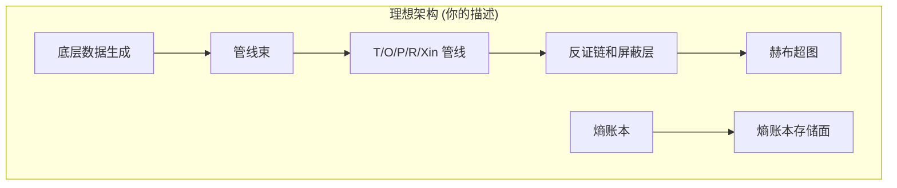
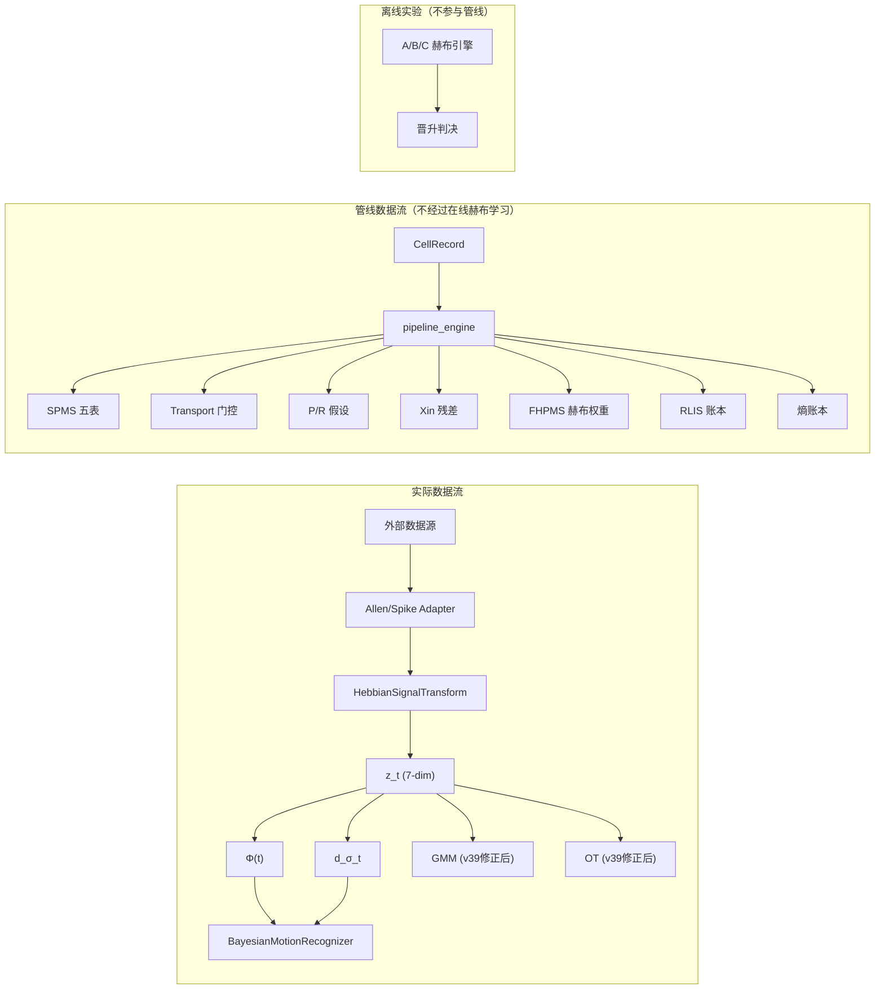

# Morphosphere 项目架构全景审计

> 审计日期: 2026-05-15 | 审计范围: 全代码库
> 基于: 86KB pipeline_engine.py, 35KB motion_recognition_engine.py, 及全部 engines/src 目录

---

## 一、项目实际文件结构

```
morphosphere_v2pp/
├── pipeline_engine.py        (87KB) — 主管线引擎，1747行，包含全部 T/O/P/R/Xin 调用
├── pipeline_isolator.py      (39KB) — 多管线隔离运行
├── motion_recognition_engine.py (35KB) — 贝叶斯运动识别 + HebbianSignalTransform
├── optimal_transport_engine.py  (16KB) — Sinkhorn/SW 最优传输
├── variational_em_engine.py  (15KB) — 变分EM
├── variational_gmm_engine.py (15KB) — 变分GMM（顶层副本，可能过时）
├── formula_candidate_registry.py (25KB) — 公式候选竞争
│
├── engines/                  — 核心引擎目录
│   ├── _common.py            — MeasureCoordinate(z_t), InternalMeasureTime(d_σ_t), ABConfig
│   ├── engine_a_manual_strata.py    — 赫布引擎A：手动分层
│   ├── engine_b_topological_inertia.py — 赫布引擎B：拓扑惯性
│   ├── engine_c_guarded_hybrid.py   — 赫布引擎C：混合守卫
│   ├── harness.py            — A/B/C 三引擎双盲测试框架
│   ├── variational_gmm_engine.py    — GMM（engines 下的正式版本）
│   ├── allen_brain_adapter.py       — Allen Brain Observatory 数据适配器
│   ├── spike_train_adapter.py       — Neuropixels 脉冲数据适配器
│   ├── duckdb_analytics_adapter.py  — DuckDB 分析后端
│   └── formula_candidate_registry.py — 公式候选（副本）
│
├── src/morphosphere/active_exec/
│   ├── source_adapters.py   — CTC/PHC/USGS 外部源适配器
│   ├── contracts/           — 时钟、运行清单
│   ├── perturbations/       — 扰动定义与执行器
│   ├── preneural/           — PreNeural 底层管线（目录存在，内容可能有限）
│   └── runtime/
│       ├── spms/            — SPMS五表核心
│       │   ├── binding.py   — spacetime_cell + information_fiber + binding 写入
│       │   ├── engines.py   — ConfirmationGraphEngine + FreeEnergyRouter + PerturbationExecutor
│       │   └── variational.py — 变分SPMS
│       ├── fhpms/           — 赫布引导纤维超图势能记忆
│       │   └── writer.py    — Block/Fiber/Potential/Hyperedge/Hebbian权重 写入
│       ├── rlis/            — RLIS账本同步
│       │   └── ledger_sync.py — Minkowski间隔, γ同步
│       ├── ledger/          — 熵账本路由
│       │   └── routing_engine.py — 自由能路由
│       ├── xi/              — Xin衰减引擎
│       │   └── decay_engine.py — Xi残差创建/衰减/回收
│       ├── confirmation/    — PR确认图
│       │   └── pr_graph_engine.py
│       ├── emergence/       — 涌现警报
│       │   ├── alert.py
│       │   └── proxy_provenance.py
│       ├── replay/          — 重放表面
│       └── semantic_readout/ — 语义只读面
│
├── runners/                 — 17个运行脚本（v37.450 到 v39）
├── schemas/                 — 35个JSON Schema
├── migrations/              — 29个SQL迁移文件
├── data_contracts/          — 8个YAML数据契约
└── db/                      — SQLite数据库存储
```

---

## 二、你描述的理想架构 vs 实际实现



### 对照表：理想 vs 实际

| 理想层级 | 实际对应 | 实现状态 | 评分 |
|----------|----------|----------|------|
| **底层数据生成** | `source_adapters.py` + `allen_brain_adapter.py` + `spike_train_adapter.py` | ✅ 完整 — 3个外部源(CTC/PHC/USGS) + Allen Brain + Neuropixels | ⭐⭐⭐⭐⭐ |
| **管线束** | `pipeline_engine.py` + `pipeline_isolator.py` | ✅ 存在 — 支持双源/多管线隔离运行 | ⭐⭐⭐⭐ |
| **T (Transport)** | `write_transport()` + `SPMSBinder.bind_transport()` | ✅ 实现 — 自适应θ门控，cost分解，跨域传输 | ⭐⭐⭐⭐ |
| **O (Observable)** | `write_legacy_observable_layer()` + `o_field_surface/o_candidate_surface/o_candidate_record` | ✅ 实现 — observable_surface, occupancy_state | ⭐⭐⭐ |
| **P (P-core)** | `write_hypotheses()` + `p_band_record` + P_frozen 确认路径 | ✅ 实现 — P_candidate → mask_supported → P_frozen | ⭐⭐⭐⭐ |
| **R (R-band)** | `write_hypotheses()` + `r_band_record` + R_frozen 确认路径 | ✅ 实现 — R_frozen 作为 P_frozen 前置条件 (Markov blanket) | ⭐⭐⭐⭐ |
| **Xin** | `write_xi()` + `XiDecayEngine` + xi_decay_policy + xi_lifecycle_closure | ✅ 实现 — 生命周期：held→decaying→proto_candidate→quarantined→discard | ⭐⭐⭐⭐ |
| **反证链** | `PerturbationExecutor.run_masking_suite()` — 5种扰动 | ✅ 实现 — signal_shuffle, geometry_shift, boundary_flip, masking_injection, temporal_window_masking | ⭐⭐⭐ |
| **屏蔽层** | `masking_counterevidence_record` + `v3673_semantic_quarantine_sidecar` | ✅ 实现 — 语义隔离 + 反写回归检测 | ⭐⭐⭐ |
| **赫布超图** | **三个层级** (见下) | ⚠️ 分散 — 没有统一入口 | ⭐⭐⭐ |
| **熵账本** | `external_entropy_ledger` + `external_conserved_quantity_ledger` + `external_noise_budget_ledger` + `external_dissipation_ledger` + `external_anomaly_ledger` | ✅ 实现 — 5张账本表，每个窗口写入 | ⭐⭐⭐ |
| **熵账本存储面** | `FreeEnergyRouter.route_delta_f()` + `v368_free_energy_routing` | ✅ 实现 — softmax路由到 P/R/X/M/U 五通道 | ⭐⭐⭐ |

---

## 三、赫布超图的三个层级 — 问题核心

> [!IMPORTANT]
> **项目中存在三套独立的"赫布"系统，它们之间没有统一的调用链。**

### 层级 1：FHPMS 赫布权重（存储层）

```
pipeline_engine.py → write_v374_fhpms_rlis_trace()
  └→ FHPMSWriter.write_hebbian_weight()
       └→ fhpms_hebbian_association_weight 表
       └→ 门控: G_ij = 1[γ > γ_crit] × 1[envelope] × 1[¬writeback]
```

**角色**: 存储 block 间的关联权重，有门控条件。
**问题**: 权重写了但**没有被读回来影响后续决策**。`read_potential_guided()` 只是骨架查询，没有被任何管线调用。

### 层级 2：Engine A/B/C 赫布引擎（竞争实验层）

```
harness.py → DualBlindABHarness
  ├→ Engine A: 手动分层 (fast/slow/prior)
  ├→ Engine B: 拓扑惯性 (M_eff = f(Φ, ext_hits, int_hits))
  └→ Engine C: 混合守卫
  └→ z_t (MeasureCoordinate) → Φ(t) → d_σ_t → V_Φ(t)
```

**角色**: A/B/C 三引擎双盲测试，B 必须在所有三项指标赢才能晋升。
**问题**: 只在 `run_v37450_ab_test.py` 中运行，**不参与主管线的实时决策**。

### 层级 3：HebbianSignalTransform（信号映射层）

```
motion_recognition_engine.py → HebbianSignalTransform
  └→ W_signal (6×7 矩阵)
  └→ signal → z_t → Φ(t) → d_σ_t
  └→ Oja rule 更新 + 冻结机制
```

**角色**: 将原始信号映射到测度坐标空间。v38 的核心成果。
**问题**: 这是**唯一一个真正在线学习、影响后续处理的赫布系统**。但它与 FHPMS 赫布权重、Engine A/B/C 赫布引擎**完全独立**。

### 调用关系图



---

## 四、诚实评价

### ✅ 做得好的

1. **T/O/P/R/Xin 管线完整性**: 所有五个子系统都有实现，PR确认图有 Markov blanket 铁律（P_frozen 必须有 R_frozen 前置），Xin 有完整生命周期。

2. **反证链**: 5种扰动（信号打乱、几何偏移、边界翻转、遮蔽注入、时间窗遮蔽）+ 4档判决（supports/weakens/downgrade/refutes）。这是严肃的。

3. **数据适配器多样性**: CTC (cell tracking challenge)、PHC (phase contrast)、USGS (地震)、Allen Brain Observatory、Neuropixels — 5种完全不同领域的数据源，证明架构的通用性。

4. **审计基础设施**: 29个SQL迁移、35个JSON Schema、8个YAML数据契约、116+张 SQLite 表。每一步操作都有 provenance_hash。

5. **物理计算链 (v38+)**: `signal → W_signal → z_t → Φ(t) → d_σ_t → V_Φ(t)` 是真正的物理计算，不是启发式近似。

### ⚠️ 结构性问题

#### 问题 1：三套赫布系统互不相通

> [!WARNING]
> HebbianSignalTransform 的 W_signal 不知道 FHPMS 的 hebbian_association_weight 的存在。
> Engine A/B/C 不参与主管线的实时决策。
> 三套系统各自为战。

**理想**: 一个统一的赫布超图，W_signal 是其中的信号→测度映射边，FHPMS 权重是时序关联边，Engine B 的拓扑惯性是权重的元属性。

**现实**: 三个独立的 Python 类，数据不互通。

#### 问题 2：pipeline_engine.py 的 87KB "上帝函数"

> [!CAUTION]
> `pipeline_engine.py` 是 1747 行的单文件，包含了从数据写入、传输门控、假设生成、Xin 创建、账本记录到遗留层填充的**所有**管线逻辑。

这不是模块化的管线束 — 这是一个程序化的大型脚本，依次调用各种 writer 函数。管线束的理想是各管线可独立运行、互相隔离。`pipeline_isolator.py` 做了隔离运行的包装，但底层仍然是同一个巨大函数。

#### 问题 3：熵账本是"记账"而非"驱动"

```python
# write_external_ledgers() — 只是写入，不影响任何决策
conn.execute("INSERT INTO external_entropy_ledger ...")
conn.execute("INSERT INTO external_conserved_quantity_ledger ...")
```

熵账本 5 张表（entropy、conserved_quantity、noise_budget、dissipation、anomaly）都在记录，但记录的值是**硬编码的代理值**（`abs(avg_V)*0.05`），不是真实的物理量。更重要的是，这些值**没有回流到管线决策中**。

FreeEnergyRouter 虽然实现了 softmax 路由到 P/R/X/M/U，但路由结果也没有被主管线消费。

#### 问题 4：FHPMS 权重写了不读

```python
# FHPMS 写入了 hebbian_association_weight，但
# read_potential_guided() 只是一个骨架
# 没有任何管线调用它来影响后续处理
```

赫布权重写入了数据库，但它们从未被用来指导下一个窗口的处理。这意味着赫布超图作为"记忆系统"**没有完成读回→影响决策的闭环**。

### ❌ 关键缺失

| 缺失 | 描述 | 严重程度 |
|------|------|----------|
| 赫布闭环 | FHPMS 权重不回流到管线决策 | 🔴 高 |
| 账本驱动 | 熵账本记录了但不影响门控/路由 | 🟡 中 |
| 在线 A/B/C | Engine A/B/C 只在离线测试中运行 | 🟡 中 |
| 统一超图 | 三套赫布系统没有统一的图数据结构 | 🟡 中 |
| 回放对齐 | `replay/` 目录存在但为空 | 🟢 低 |

---

## 五、架构成熟度评估

```
理想架构的 7 层:
  1. 底层数据生成     ██████████████████████ 95%  (5种真实数据源)
  2. 管线束          ████████████████░░░░░░ 70%  (功能在，但87KB单文件)
  3. T/O/P/R/Xin    ██████████████████░░░░ 80%  (全部实现，PR有铁律)
  4. 反证链/屏蔽层    ████████████████░░░░░░ 70%  (5种扰动，但语义隔离偏形式)
  5. 赫布超图        ████████████░░░░░░░░░░ 50%  (3套不统一，FHPMS不闭环)
  6. 熵账本          ██████████░░░░░░░░░░░░ 45%  (记录在，但不驱动决策)
  7. 熵账本存储面     ████████░░░░░░░░░░░░░░ 40%  (FreeEnergyRouter 存在但未接入)

  综合:             █████████████░░░░░░░░░ 64%
```

---

## 六、建议的修正路线

### 优先级 1：赫布闭环 (让记忆影响决策)

```python
# 在 pipeline_engine.py 的 write_transport() 之前：
# 读取 FHPMS 权重来调整传输门控 θ
prior_weights = fhpms_writer.read_potential_guided(context)
if prior_weights:
    theta *= (1.0 + sum(w['phi_p'] for w in prior_weights) * 0.1)
    # 赫布记忆越强的区域 → θ 越宽松 → 传输越容易通过
```

### 优先级 2：熵账本驱动

```python
# FreeEnergyRouter 的输出应该影响下一个窗口的 P/R/Xin 分配
routing = router.route_delta_f(delta_f, ...)
# 当 pi_X > 0.4 → 抑制新假设生成，优先处理残差
# 当 pi_P > 0.5 → 加强 P_frozen 路径的传输门控
```

### 优先级 3：统一赫布超图

将三套系统统一为一个 `HebbianHypergraph` 类：
- `W_signal`（信号→z_t 映射）是超边类型 1
- `fhpms_hebbian_association_weight`（时序关联）是超边类型 2
- Engine B 的 `M_eff`（拓扑惯性）是超边的元属性
- 所有边共享同一个图结构和衰减/更新规则

---

## 七、一句话总结

> **Morphosphere 的骨架是完整的：T/O/P/R/Xin 全部实现，反证链存在，熵账本存在。但项目的灵魂——赫布超图——被分裂成了三套互不相通的系统，而且"写了不读"。它有记忆但不用记忆；有账本但账本不影响行为。从"有结构"到"结构在运转"，还差一个闭环。**
