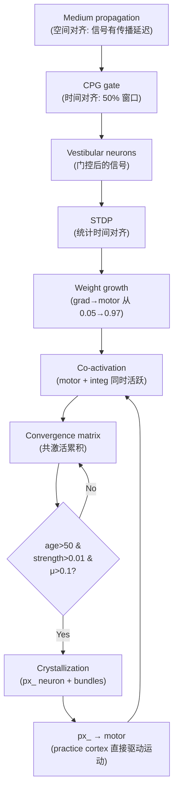

# 对齐和结晶：实际代码机制的诚实分析

## 1. 对齐（Alignment）

### 当前实现

对齐发生在 **两个地方**，但本质上是 **同一个机制的两种表达**：

#### 1a. CPG 相位门控 → 信号对齐

[inject_sensory()](file:///D:/cell-cc/experiments/_phase5_pipeline.py#L163-L217)

```python
# 计算门控值（CPG A-B 差值）
phase_gate = clamp((cpg_fast_a - cpg_fast_b) * 5 + 0.5, 0, 1)

# 外部信号 × gate
vest.neurons[k].activation = raw * phase_gate     # lever/dlever/integ
vest.neurons[gk].activate(tanh(raw_grad*5) * phase_gate)  # gradient
```

**这做了什么**：
- CPG 振荡 → gate 在 0 和 1 之间交替（period=10, duty=50%）
- 外部信号（gradient, lever）只在 gate=1 时进入
- 信号乘以 gate → 时间上的"窗口选择"

**诚实评估**：这不是真正的"对齐"——这是一个 **时间采样器**。它不判断信号是否与内部状态"一致"，它只是周期性地开关大门。信号的到达时间和 CPG 相位之间没有**因果反馈**——CPG 不会因为信号好而调整相位，信号也不会因为错过窗口而等待。

**真正的对齐**需要：信号到达 → 改变 CPG 相位（如 phase-resetting），或 CPG 相位 → 改变信号路由。目前这两者之间没有双向耦合。

#### 1b. STDP 时间对齐 → 权重对齐

[stdp_update()](file:///D:/cell-cc/Morphosphere_v37_0_native_runtime_prototype_flat_complete/morphosphere_v2pp/engines/hebbian_circuit.py#L450-L550)

```python
# LTP: pre fires BEFORE post → strengthen (causal)
ltp = A_plus * ltp_boost * pre_n.pre_trace * abs(post_n.activation)
# LTD: post fires BEFORE pre → weaken (anti-causal)
ltd = A_minus * post_n.post_trace * abs(pre_n.activation)
delta = (ltp - ltd) / inertia
```

**这做了什么**：
- pre_trace 在 pre-neuron 激活后指数衰减（~5 tick 半衰期）
- post_trace 类似
- 如果 pre 比 post 先激活 → pre_trace 还高 → LTP → 权重增大
- 如果 post 先于 pre → post_trace 高 → LTD → 权重减小

**诚实评估**：这**是**真正的时间对齐——它检测因果时序。但它的"对齐"是被动的：它不改变信号路由，只改变权重。权重的变化需要**很多次**一致的因果巧合才能累积。这类似于生物 STDP 的"统计学习"。

### 对齐的实际链条

```
外部信号 ──→ medium propagation (延迟) ──→ CPG gate (窗口)
                                           │
                                           ↓
                                    vestibular neurons
                                           │
                              inter-layer bundles (weighted)
                                           │
                                    encoding neurons
                                           │
                              STDP: pre_trace × post_activation
                                           │
                                    weight change (slow)
```

> [!IMPORTANT]
> **关键诚实点**：对齐发生在两个时间尺度上：
> - **快速（tick级）**：CPG 门控 — 但这只是一个开关，不是真对齐
> - **慢速（百tick级）**：STDP 权重累积 — 这才是真正的对齐，但它不是结构性的，是统计性的
>
> 两者之间没有中间时间尺度的对齐机制。生物系统有：theta-gamma coupling, spindle-ripple coupling, phase-amplitude coupling。我们没有。

---

## 2. 结晶（Crystallization）

### 当前实现

[_detect_practice_convergence()](file:///D:/cell-cc/Morphosphere_v37_0_native_runtime_prototype_flat_complete/morphosphere_v2pp/engines/hebbian_circuit.py#L2264-L2444)

分为 5 步：

#### Step 1: 共激活矩阵

```python
active_ids = [nid for nid, a in acts.items() if abs(a) > 0.01]
for i, j pairs:
    product = abs(acts[a]) * abs(acts[b])
    matrix[a][b] += product
```

**做了什么**：每 tick，如果两个 motor/vestibular 神经元同时活跃，它们在矩阵中的值增加。

#### Step 2: 衰减

```python
matrix[a][b] *= 0.99  # 每tick衰减1%
```

半衰期 = ln(2)/ln(1/0.99) ≈ 69 ticks。

#### Step 3: 收敛节点创建

```python
if strength > 0.001:
    nodes[f"pconv_{a}_{b}"] = {"dims": [a, b], "strength": strength}
```

当共激活累积超过阈值 → 创建一个"收敛候选"。

#### Step 4: 结晶条件

```python
if age > 50 and strength > 0.01 and circ_mu > 0.1 and has_integ:
    # CREATE px_ neuron + bundles
```

**门控条件**：
- age > 50 ticks（持续性要求）
- strength > 0.01（强度要求）
- circ_mu > 0.1（环流必须存在——结构完整性）
- has_integ（至少一个积分器神经元参与——功能相关性）

#### Step 5: 结构创建

```python
# 1. 创建 px_ 神经元
px_n = pc_layer.add_neuron(px_nid)
# 2. 输入 bundle: 源神经元 → px_
b_in = MetaSynapticBundle(source=[dim_id], target=[px_nid])
# 3. 输出 bundle: px_ → motor
b_px_motor = MetaSynapticBundle(source=[px_nid], target=["move_x","move_y","move_z"])
# 4. 输出 bundle: px_ → encoding
b_px_enc = MetaSynapticBundle(source=[px_nid], target=["transition","magnitude","drift"])
# 5. 内部连接: px_ ↔ existing px_
b_fwd = pc_layer.add_bundle(source=[px_nid], target=[existing_px])
```

### 诚实评估

> [!WARNING]
> **结晶不是真正的相变**。它是一个 **阈值计数器 + 结构创建**。
>
> 真正的"结晶"（物理学意义）需要：
> 1. **自发对称性破缺**：系统从均匀状态自发选择一个特定构型
> 2. **集体行为**：大量元素同时协调转变
> 3. **不可逆性**：一旦结晶，需要大量能量才能融化
>
> 我们的实现只有 (1) 的弱形式（共激活统计偏好一些对）和 (3) 的弱形式（一旦 px_ 创建就不会被删除）。完全没有 (2)——每个 px_ 是独立创建的。

---

## 3. 对齐与结晶的关系



### 关键链条

1. **Medium → STDP**：medium 给信号以传播延迟 → STDP 利用这个延迟来检测因果 → 权重对齐
2. **STDP → 结晶**：权重增长 → grad_acoustic 激活 motor → 两者共激活 → 结晶条件满足
3. **结晶 → 环流**：px_ neuron 创建新的 bundle → 环流路径变长 → μ(G) 增大
4. **μ(G) → Noether**：μ 变化 → dμ/dt → anomaly（对称性破缺的度量）

> [!NOTE]
> **时空耦合的真实状态**：
> - 时间：CPG 搏动（结构性的，来自物质）✓
> - 空间：medium propagation（结构性的，来自物质）✓
> - 时空耦合：**人工的**。CPG 和 medium 之间没有物理联系。CPG 不知道 medium 的传播速度。对齐的成功是因为 STDP 的统计容忍度足够高，不需要精确的时空匹配。
>
> 你说的"时空环流"目前是 **测量** 而非 **机制**。我们追踪 coherence 和 period，用它们调制学习率，但没有一个"时空环流"作为独立的结构性实体存在。

---

## 4. 缺失的对齐机制

如果要实现真正的结构性对齐，需要：

| 机制 | 生物对应 | 当前状态 |
|------|---------|---------|
| Phase resetting | 强信号重置 θ 相位 | ❌ 缺失 |
| Phase-amplitude coupling | γ 振幅被 θ 相位调制 | ❌ 缺失 |
| Spike-timing dependent delay | STDP 调整传导延迟 | ❌ 缺失 |
| Resonance filter | 只有与 CPG 频率匹配的信号通过 | ❌ 缺失 |
| Homeostatic adaptation | CPG 频率适应信号统计 | ❌ 缺失 |

这些才是"信号与时空环流对齐"的真正结构性实现。
