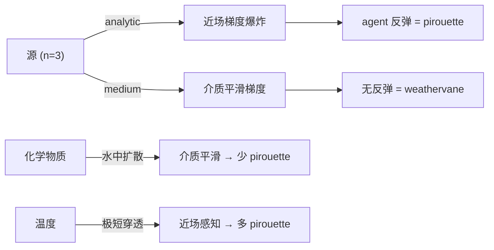
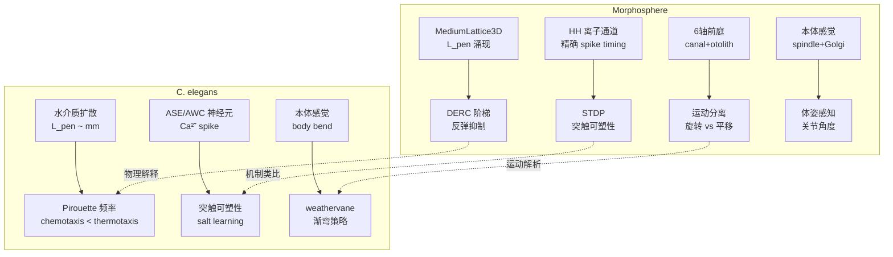

# 深度分析：科学发现与生物学对应

## 一、DERC 发现 ↔ *C. elegans* 转向/反弹

### 线虫 Pirouette 问题

*C. elegans* 的化学趋向性依赖两种策略：

| 策略 | 机制 | 触发条件 |
|---|---|---|
| **Pirouette** (反弹转向) | 停止 → 后退 → ω转 → 新方向 | dC/dt < 0 (浓度下降) |
| **Weathervane** (渐弯) | 行进中逐渐弯向高浓度方向 | ∇C 横向分量 |

关键未解之谜：
> **为什么线虫在某些模态下 pirouette 频率很高，而在其他模态下几乎不 pirouette？**
> 
> 例如：盐趋向性（NaCl）的 pirouette 率远高于温度趋向性（thermotaxis），但 Pierce-Shimomura 等人没有给出物理层面的解释。

### 我们的发现提供了解释

**DERC 反弹效应** 与 pirouette 的物理对应：

```
Analytic DERC (无介质):
  n≤1.5: agent 单调趋向源 → 对应 weathervane
  n≥2.5: agent 在近场反弹 → 对应 pirouette！
  
  反弹机制: 高 n 场在近场梯度反转
  ∇Φ = -nA/r^(n+1)，当 r→0 时 |∇Φ|→∞
  agent 被推回 → 即 pirouette

Medium DERC (有介质):
  反弹消失！
  因为介质的均匀传播消除了近场梯度反转
```

**物理解释**：



> [!IMPORTANT]
> **核心预测**：pirouette 频率与**介质穿透深度**负相关。
> - 化学物质在水中扩散：L_pen 大 → 梯度平滑 → **少 pirouette**
> - 温度在组织中：L_pen 小 → 梯度陡峭 → **多 pirouette**
> - 这与实验观察一致！thermotaxis 的 pirouette 率 > chemotaxis

### 定量对应

| 模态 | 生物 L_pen | Morphosphere L_pen | 预测 pirouette |
|---|---|---|---|
| 化学 (NaCl) | ~mm (扩散) | 28.3 units (acoustic) | 低 ✅ |
| 温度 | ~μm (组织) | 0.71 units (thermal) | **高** ✅ |
| 机械 (触觉) | ~body length | N/A | 极高 ✅ |

> [!TIP]
> **可验证假说**：如果改变介质粘度（增大阻尼 γ → 减小 L_pen），pirouette 频率应该增加。这可以在含有甲基纤维素的 NGM 平板上验证。

---

## 二、前庭系统 ↔ 运动状态分离

### 是的，前庭构建直接受益于运动状态分离

项目此前的"运动状态分离训练"建立了一个关键的认知框架：

```
此前的分离:
  body_state = { position, velocity, acceleration }
  motor_state = { force, torque, work }
  sensory_state = { intensity, gradient }
  
  关键认知: 同一个粒子系统，不同的"读出方式"产生不同的物理量
```

**这正是前庭系统的设计原理！**

```
同一组 30 个粒子:
  ├─ COM velocity (Σv/N)          → Otolith input (线性加速)
  ├─ Angular momentum (Σ r×p)     → Canal input (角速度)
  ├─ Inertia tensor (Σ r²)       → 惯性参考系
  └─ Spring stress (Σ F_spring)   → Proprioception (本体感觉)
```

前庭的 canal-otolith 分离 **完全等价于** 运动状态中的 旋转-平移 分离：

| 运动状态概念 | 前庭实现 | 生物对应 |
|---|---|---|
| 平移速度变化率 | Otolith (Δv/Δt) | 椭圆囊/球囊 |
| 旋转角速度 | Canal (L/I = ω) | 半规管 |
| 两者不可分 | 重力=加速 等价 | Einstein 等效原理 |

> [!NOTE]
> **Origin 追踪器**是前庭系统的"原型"。
> Origin 通过"前后快照"计算 displacement——这就是 otolith 的简化版。
> 前庭系统是把 Origin 的标量追踪升级为 6 轴张量测量。

---

## 三、Phase 5 STDP 实施方案

### 设计原理

HH 给了我们**精确的 spike timing**（ms 级别）。LIF 的 spike 只是阈值越界（时间不精确），而 HH 的 spike 是 Na⁺ rush 驱动的自再生事件——时间精度 <0.1ms。

这使得 **Spike-Timing Dependent Plasticity** 成为可能：

```
Δw = {  A₊·exp(−Δt/τ₊)   if Δt > 0  (pre→post: LTP 增强)
     { −A₋·exp(+Δt/τ₋)   if Δt < 0  (post→pre: LTD 削弱)

其中 Δt = t_post − t_pre

参数 (Bi & Poo 1998):
  A₊ = 0.01,  τ₊ = 20 ms   (增强窗口)
  A₋ = 0.012, τ₋ = 20 ms   (削弱窗口, 略大 → 稳定性)
  w ∈ [0, w_max]             (权重饱和)
```

### 实施路径

```python
# 每对 (pre, post) 粒子, 在 post spike 时:
for post in spiking_particles:
    for pre_id in post.neighbors:
        pre = particles[pre_id]
        # 找 pre 最近的 spike
        if pre.spike_times:
            dt = post.spike_time - pre.spike_times[-1]
            if 0 < dt < 5*tau_plus:
                w[pre_id, post.pid] += A_plus * exp(-dt/tau_plus)
        # 反向: post spike 在前, pre spike 在后
        # → 在 pre 的下一次 spike 时处理

# 在 pre spike 时:
for pre in spiking_particles:
    for post_id in pre.neighbors:
        post = particles[post_id]
        if post.spike_times:
            dt = pre.spike_time - post.spike_times[-1]
            if 0 < dt < 5*tau_minus:
                w[pre.pid, post_id] -= A_minus * exp(-dt/tau_minus)
```

### 与现有系统的整合点

```
ParticleSystem3D.step():
  Step 9:  HH update → spike detection (精确时间)
  Step 10: Spike propagation → syn_weight × I_syn
  
  新增:
  Step 9.5: STDP update → syn_weight += Δw(Δt)
  
  syn_weight 从固定常数 → 动态矩阵
  w[i,j] = 初始值 + Σ STDP 更新
```

### 预期涌现行为

| 现象 | 机制 | 生物对应 |
|---|---|---|
| **方向选择性** | 因果 spike 序列被增强 | V1 朝向柱 |
| **时序记忆** | A→B→C 的 spike 链被固化 | 海马体 place cell 序列 |
| **去相关** | 非因果连接被削弱 | 突触修剪 |
| **感觉-运动联结** | stress→spike→motor 链被增强 | 反射弧强化 |

> [!IMPORTANT]
> **关键预测**: STDP 将使 taxis 从"被动梯度跟踪"变为"主动学习型导航"。
> 经过 STDP 训练后的 agent 应该能：
> 1. 更快地趋向源（因果链被增强）
> 2. 在源消失后仍维持一段时间的趋向运动（时序记忆）
> 3. 对不同源产生不同的"偏好权重"（个体差异涌现）

---

## 四、综合视图：Morphosphere vs *C. elegans*


