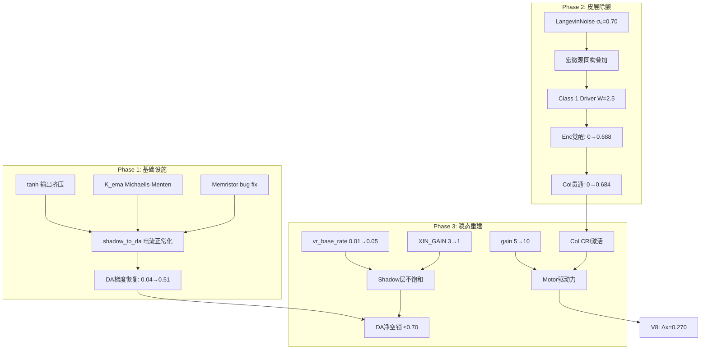

# 延长线工作全景综合 — 14份文档阅读笔记

## 时间线重建：三次大步长构建

```mermaid
graph LR
    A["Phase 1<br/>熵账本修复<br/>6/15-6/16早"] --> B["Phase 2<br/>皮层除颤三刀<br/>6/16中"]
    B --> C["Phase 3<br/>六刀战役<br/>6/17"]
    C --> D["V8引擎点火<br/>6/17晚"]
    
    style A fill:#1a1a2e,stroke:#e94560
    style B fill:#1a1a2e,stroke:#f59e0b
    style C fill:#1a1a2e,stroke:#4ade80
    style D fill:#1a1a2e,stroke:#60a5fa
```

---

## Phase 1：熵账本修复 + 抗饱和基础设施（6/15-6/16早）

**大方案**：[工作报告_熵账本修复_v1.0](file:///D:/cell-cc/cell/other/工作报告_熵账本修复_v1.0_2026-06-15.md)

### 完成项（11+3项）
| 类别 | 关键改动 |
|------|---------|
| 熵账本 V01-V15 | SomatosensoryChain实例化、KCL归零、K_ema告警、ρ单纯形升级 |
| B.06 热势 | `soma_to_da` bundle 接入（4 relay → 3 DA），`MotionState` thermal fields |
| **抗饱和三件套** | ① Memristor 负电阻 bug fix ② K_ema Michaelis-Menten ③ shadow_to_da tanh |

### 核心bug发现
**Memristor.conductance 负电阻保护错误**：`w > 1.0` → resistance < 0 → `max(负, 1e-6) = 1e-6` → conductance = 1,000,000 → shadow_to_da 电流 800k。修复为 `max(resistance, r_min)`。

### 设计原则确立
- **抗饱和方案**：[Shadow层抗饱和物理原理](file:///D:/cell-cc/cell/other/方案合并：Shadow%20层抗饱和的物理原理与架构理念.2026.6.16.1.md)
  - tanh（电化学驱动力饱和）+ Michaelis-Menten（资源有限饱和）
  - **"硬截断是对物理的背叛，平滑饱和是对物理的忠诚"**

---

## Phase 2：皮层除颤三刀 + 双轨架构（6/16中-6/16晚）

**大方案**：[皮层除颤与热力学大一统方案](file:///D:/cell-cc/cell/other/皮层除颤与热力学大一统方案%20——%20涨落耗散、皮层贯通与热趋性涌现最终物理蓝图.md)

### 三刀（P2→P1→P0）

| 刀 | 内容 | 物理原理 |
|----|------|---------|
| P2 | LangevinNoise 组件化，σ₀=0.70 | 涨落耗散定理：σ=σ₀√T_bath，热浴=ECM温度 |
| P1 | 宏微观绝对同构叠加：`oto_k = acc + η` | 大脑不区分运动vs热噪声 — 都是KCL电流 |
| P0 | Aff→Enc Class 1 Driver：W=2.5, g=2.0 | 丘脑→皮层L4第一类驱动突触，绝对无损穿透 |

### 效果（v2.0分析）
- Enc从零→0.688，Col从零→0.684
- 速度9×提升（0.000165→0.001495）
- 方向偏置 **9/9 approaching**（持续正确）
- **但暴露新病理**：Shadow Col calcium_rate 积累 → DA再饱和

### 双轨架构确立
[步骤2统一物理架构方案](file:///D:/cell-cc/cell/other/步骤%202%20统一物理架构方案：双轨并行%20+%20ECM%20热浴%20+%20涨落耗散%20+%20宏微观%20Xin%20绝对同构.md)
- **第一轨**：VitalOscillator（Van der Pol，耗能，低频，传出→Motor膜）
- **第二轨**：Langevin Noise（OU过程，免费，高频，传入→Otolith）
- **二者正交不可互替**：只有Vital→对称死锁；只有Langevin→原地抽搐
- **合在一起 = 随机共振**

---

## Phase 3：六刀战役 + V8引擎（6/17）

**大方案**：[影子层稳态重建与宏观行为涌现——大一统方案](file:///D:/cell-cc/cell/other/影子层稳态重建与宏观行为涌现%20——%20结构容量极限、动力学软平权与热趋性大一统方案.md)

### 六刀总表

| 执行序 | 战役 | 参数变更 | 物理锚定 |
|--------|------|---------|---------|
| 1 | 三+归一 | XIN_GAIN 3→1, vr_base_rate 0.01→0.05 | 除法归一化 V*_ss 公式 |
| 2 | 一 | shadow_to_da w 1.0→0.1 | DA稳态方程 DA_ss ≤ 0.70 |
| 3 | 二 | Col CRI q=0.02, R=1.0 | Ca_ss = f×ΔCa/γ = 0.31 |
| 4 | 四 | axis gain 5→10, lr 0.005→0.05 | 贝兹细胞扩音器 |

### V8引擎
- 战术一：Col[yaw] Langevin噪声驱动 → CRI积累 → axis束传播
- 战术二：皮肤ΔT_lr → yaw趋向反射
- **结果：200k步 Δx=0.270（6.2× vs 六刀基准 0.0434）**

### 关键洞见：颅骨闭合是特性不是bug
$$\frac{dN_{bundle}}{dt} = \kappa_{sprout} \cdot \Theta(\Xi - \Xi_{th}) \cdot \Theta(C_{max} - N)$$

当 $N → C_{max}=20$ 时拓扑冻结 → 惊奇只能通过**行为输出释放** → 这是宏观意志诞生的物理必然。

---

## 完整因果链图谱

---

## 与本地代码库的差异矩阵

> [!IMPORTANT]
> 以下改动存在于**另一台工作电脑**，尚未合入本地 `d:\cell-cc\nexus_v1`

| 文件 | 远端改动 | 本地状态 |
|------|---------|---------|
| `semiconductor.py` | Memristor 负电阻 fix | ❌ 未合入 |
| `shadow_sandbox.py` | XIN_GAIN→1, vr_base_rate→0.05, K_ema MM | ❌ 未合入 |
| `variant_adapter.py` | soma_to_da bundle, tanh, V04 KCL, Langevin叠加 | ⚠️ 部分（我加了hunger reflex） |
| `motor_decision.py` | thermal_potential/gradient fields | ⚠️ 部分（我加了fill_fraction） |
| `hebbian.py` | Col CRI激活, axis gain→10, lr→0.05 | ❌ 未合入 |
| `energy_ledger.py` | spike_proxy, K_ema追踪, Soma层分类 | ❌ 未合入 |
| `toprxin.py` | RhoVector 4分量单纯形 | ❌ 未合入 |
| `langevin_noise.py` [NEW] | OU过程组件 | ❌ 不存在 |
| `somatosensory/chain.py` | 无改动 | ✅ 我修了热感受器τ |

---

## 我的工作与延长线工作的兼容性

| 我的改动 | 兼容性 | 说明 |
|---------|--------|------|
| 热感受器 τ=100→5, v_th=0.3→0.01 | ✅ **完全兼容** | 延长线未改chain.py，我的修复补了它的缺 |
| hunger reflex (SpinalReflex) | ✅ **完全兼容** | 新增独立通路，不冲突 |
| fill_fraction in MotionState | ⚠️ **需合并** | 远端也改了MotionState（加thermal fields）|
| feed_alignment物理化 | ✅ **完全兼容** | 同一哲学：拒绝god-view |

---

## 剩余目标差距

| 指标 | 当前最好结果 | 目标 | 差距 |
|------|------------|------|------|
| Δx (200k步) | 0.270 (V8) | 5.0 | **18×** |
| axis权重 | 0.132 (衰减中) | 0.5 (成熟) | LTD>LTP不平衡 |
| Motor EMA | 0.002 | >0.1 | 间歇性CRI，非持续 |
| DA梯度 | 有效（0.04→0.51） | 稳定 | shadow再饱和已解 |

> [!NOTE]
> 核心瓶颈已从"基础设施断裂"（Phase 1-2解决）转移到"STDP权重成熟速度"（需更长运行+参数微调）。系统已经从"不能动"变成"能动但慢"——这是质变，量变需要时间。

