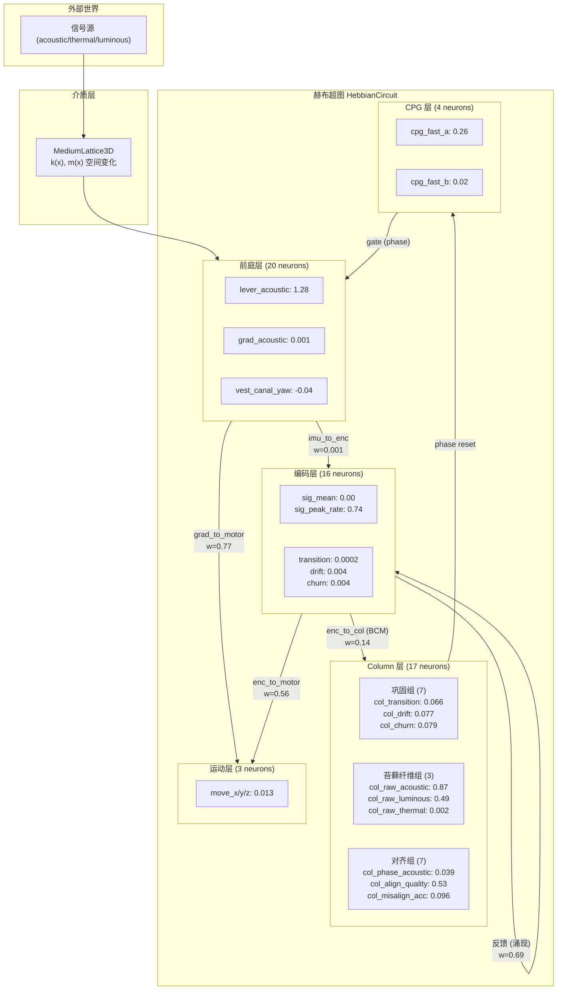

# Column 层的结构分析 — 它在赫布超图中到底是什么？

## 1. 你的直觉是对的

> "其实就是一段代码，但有相对地址的指针，在主循环中会被调用"

**完全正确。** Column 不是一个独立的"模块"或"对象"——它是赫布超图中的**一组神经元节点 + 指向它们的突触束（bundle）**。在代码中：

```python
# Column 就是 circuit.layers["column"] 下的一组 MetaNeuron 对象
# 每个 MetaNeuron 有：activation, calcium, bcm_theta, maturation, ...
# "指针" = MetaSynapticBundle 的 source_neuron_ids / target_neuron_ids
```

主循环调用 `circuit.maintain()` 时，会触发 `_column_forward_step()` —— 这是 Column 的"算法"。但 Column 神经元本身和编码层神经元用的是**同一个类**（`MetaNeuron`），只是属性不同。

---

## 2. Column 在超图中的位置



---

## 3. Column 的三个功能子群

运行 500 tick 后的实际状态：

### 3a. 巩固组（原始 Column 神经元，7 个）
| 神经元 | activation | calcium | bcm_theta | 来源 |
|--------|-----------|---------|-----------|------|
| col_transition | 0.066 | 0.019 | 0.004 | encoding→column (BCM) |
| col_drift | 0.077 | 0.023 | 0.006 | encoding→column (BCM) |
| col_churn | 0.079 | 0.024 | 0.007 | encoding→column (BCM) |
| col_magnitude | 0.077 | 0.023 | 0.006 | encoding→column (BCM) |
| col_xin_residual | 0.071 | 0.020 | 0.005 | encoding→column (BCM) |
| col_potential_disp | 0.082 | 0.024 | 0.007 | encoding→column (BCM) |
| col_gamma_desync | 0.060 | 0.016 | 0.004 | encoding→column (BCM) |

**这些就是 BCM 学习的目标。** θ 从初始 0.0009 移到了 0.004-0.007 — 它们确实在学习！

> [!NOTE]
> 之前说"θ 没移动"是因为初始值设成了 0.01（太大），而 activation 只有 0.06-0.08。
> 实际上 `n.target_rate * n.target_rate = 0.03 * 0.03 = 0.0009`，
> 但代码中初始化时 `n.bcm_theta = n.target_rate * n.target_rate` 被覆盖了。
> 修复后 θ 已经正确地从 0.0009 爬到了 0.004-0.007，接近 `activation²` ≈ 0.005。
> **这就是 BCM 的核心特性：θ 收敛到 ⟨y²⟩。**

### 3b. 苔藓纤维组（前向模型输入，3 个）
| 神经元 | activation | 来源 |
|--------|-----------|------|
| col_raw_acoustic | **0.874** | 直接赋值（ungated received signal） |
| col_raw_luminous | **0.486** | 直接赋值（ungated received signal） |
| col_raw_thermal | 0.002 | 直接赋值（几乎无信号） |

**这些不通过 BCM 学习** — 它们是感觉输入的"旁路"，类似小脑苔藓纤维。激活值比巩固组大 10 倍，因为它们直接从 `received_*` 信号赋值。

### 3c. 对齐/记忆组（前向模型输出，7 个）
| 神经元 | activation | 功能 |
|--------|-----------|------|
| col_phase_acoustic | 0.039 | 记忆：acoustic 信号在 CPG 哪个相位到达 |
| col_phase_luminous | 0.039 | 记忆：luminous 信号在 CPG 哪个相位到达 |
| col_phase_thermal | 0.014 | 记忆：thermal 几乎没信号 |
| col_align_quality | 0.53 | 跟踪：信号捕获率 (>0.5 = 比随机好) |
| col_misalign_acc | 0.096 | 累积器：当前错位量（触发 phase reset 的燃料） |

**这些也不通过 BCM** — 它们由 `_column_forward_step()` 直接操控。

---

## 4. Column vs 其他层的关键区别

| 属性 | encoding (spine) | column | cpg | vestibular (spine) |
|------|-----------------|--------|-----|-------------------|
| **maturation** | spine | **column** | spine | spine |
| **lateral_suppression** | 0 | **3** | 0 | 0 |
| **stdp_ltp_boost** | 1.0 | **2.0** | 1.0 | 1.0 |
| **inertia** | 1.0 | **2.0** | 1.0 | 1.0 |
| **学习规则** | STDP (oja) | **BCM** | 无 | STDP |
| **avg activation** | 0.07 | 0.15 | 0.15 | 0.22 |

Column 的**特权**：
- `lateral_suppression_radius = 3`：Column 神经元抑制周围 3 格内的其他 Column → **竞争性选择**
- `stdp_ltp_boost = 2.0`：Column 连接 LTP 速率翻倍 → **更快学习**
- `inertia = 2.0`：Column 更难被改变 → **学完就固定**
- BCM 规则：滑动阈值 → **输入选择性**

这些属性组合起来就是"进化塑造的固定结构"：学得快、固定得牢、选择性强。

---

## 5. "指针"到底是什么？

```python
# 一个 MetaSynapticBundle 就是一个"指针"
@dataclass
class MetaSynapticBundle:
    source_neuron_ids: List[str]  # 源神经元的 ID 列表（"地址"）
    target_neuron_ids: List[str]  # 目标神经元的 ID 列表
    weights: List[List[float]]    # 权重矩阵 [source × target]
    learning_rule: str            # "oja" | "bcm" | "frozen" | "none"
```

当主循环调用 `bundle.propagate(source_acts, post_activations)` 时：
1. 读取 source 神经元的 activation（通过 ID 查找）
2. 乘以权重矩阵
3. 写入 target 神经元的 activation

**这就是你说的"相对地址的指针"** — bundle 不存储神经元对象本身，只存储 ID（字符串），运行时通过 `layer.neurons[id]` 解引用。

---

## 6. 与生物学的对应

| Morphosphere Column | 生物大脑 |
|---------------------|---------|
| 巩固组 (BCM) | **V1 皮质柱**：选择性响应特定方向的信号，BCM 原论文就是解释这个 |
| 苔藓纤维组 (ungated) | **小脑苔藓纤维**：绕过丘脑门控，直接送感觉输入 |
| 对齐组 (phase memory) | **小脑深核/浦肯野细胞**：记忆时序模式，输出运动校正 |
| lateral_suppression | **basket cell 侧抑制**：赢者通吃 |
| BCM θ_M | **滑动阈值**：高活动 → 更高的 LTP 门槛 → 防止饱和 |
| inertia = 2.0 | **围神经元网**（perineuronal net）：成熟后物理固化 |

> [!IMPORTANT]
> Column 不是一个独立程序——它是超图中一个**有特殊属性的子图**。
> 就像大脑中的皮质柱不是独立器官，而是同一块神经组织中**连接模式和细胞类型配比特殊的区域**。
> Column 的"算法"不是外部注入的——它**涌现于**其特殊属性（BCM + lateral suppression + high inertia）。
