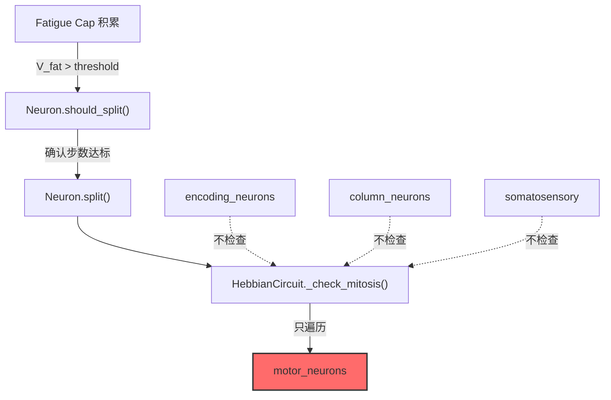

# 母本分化 × 熵账本 盲区审计

## 审计结论

> [!CAUTION]
> **两个独立的架构盲区，且互相遮盖。**
> 熵账本看不见体感层 → 无法为分化提供数据依据 → 分化系统也不覆盖体感层 → 双重死角。

---

## 1. 熵账本为什么没有给出指导意见？

### 1.1 根因：体感层神经元不在清单里

`get_all_neurons()` 调用链：

```
VariantCircuit.get_all_neurons()
  └─ super().get_all_neurons()       # HebbianCircuit
       └─ vestibular.get_all_neurons()  # MET, HC, Aff
       └─ encoding_neurons              # reg_, irr_
       └─ column_neurons                # col_
       └─ motor_neurons                 # move_
  └─ da_neurons                          # da_
  └─ _xin_relay                          # xin_relay
```

**体感链的 12 个神经元在哪？**

```
SomatosensoryChain.get_all_neurons()  # thermo_*, noci_*, relay_*
   ← 没有人调用这个方法！
```

[HebbianCircuit.get_all_neurons()](file:///d:/cell-cc/nexus_v1/circuit/hebbian.py#L1034-L1040) 不包含 somatosensory。
[VariantCircuit.get_all_neurons()](file:///d:/cell-cc/nexus_v1/circuit/variant_adapter.py#L1482-L1492) 只追加了 DA + xin_relay。

**结果：**

| 系统 | 是否追踪体感神经元 | 影响 |
|------|-----|------|
| [EntropyLedger.record()](file:///d:/cell-cc/nexus_v1/ledger/energy_ledger.py#L81-L186) | ❌ 完全看不见 | 无层级活动、热耗散、ISI 熵数据 |
| [NoetherProbe.check()](file:///d:/cell-cc/nexus_v1/ledger/noether_probe.py#L120-L318) | ❌ 完全看不见 | 能量守恒计算缺失 12 个神经元的热输出 |
| [WeightEntropyProbe](file:///d:/cell-cc/nexus_v1/ledger/weight_entropy.py#L60-L89) | ❌ 完全看不见 | 只追踪 vest_to_enc / enc_to_col / col_to_motor |
| Vascular energy delivery | ❌ 不配送 | 体感神经元没有被 vascular 系统供能 |
| Maturation lifecycle | ❌ 不监控 | potential_phi 不累积，无成熟转换 |

### 1.2 即使看见了，也没有"指导"能力

> [!IMPORTANT]
> 当前熵账本系统是纯**被动观测器**（READ-ONLY observer）。
> 它 **从不** 写入电路状态，也 **不** 产生建议/警告/触发结构变化。

看 [energy_ledger.py 头注释](file:///d:/cell-cc/nexus_v1/ledger/energy_ledger.py#L6-L7)：

```
ZERO DEPENDENCY ON EXISTING NEXUS CODE (observation only).
```

这意味着：

- ✅ 它能告诉你 "nociceptor 热耗散 = 0"（如果能看见的话）
- ❌ 它**不能**告诉你 "应该调整 nociceptor 参数" 或 "应该触发分裂"
- ❌ 它**不能**发出 "死通道" 警告

**结论：缺少一个 "诊断→处方" 转换层。**

---

## 2. 母本分化（Mitosis / Differentiation）的覆盖范围

### 2.1 当前分化架构只覆盖 Motor 层



[_check_mitosis()](file:///d:/cell-cc/nexus_v1/circuit/hebbian.py#L867-L936) 的遍历范围：

```python
for key, neuron in self.motor_neurons.items():
    if not neuron.should_split():
        continue
```

**只有 motor_neurons。** 编码层、柱层、体感层的神经元即使配置了 `enable_mitosis=True`，也永远不会被检查。

### 2.2 体感层缺失的不只是分裂

| 生命周期能力 | Motor | Encoding | Column | Somatosensory |
|---|---|---|---|---|
| Fatigue Cap | ✅ | ❌ | ❌ | ❌ |
| Mitosis (split) | ✅ | ❌ | ❌ | ❌ |
| Apoptosis (death) | ✅ | ❌ | ❌ | ❌ |
| Sprout/Prune (bundle) | ✅ | ✅ | ✅ | ❌ |
| STDP learning | ✅ | ✅ | ✅ | ✅ |
| Energy delivery | ✅ | ✅ | ✅ | ❌ |
| PNN maturation gate | ✅ | ✅ | ✅ | ❌ |
| Noether tracking | ✅ | ✅ | ✅ | ❌ |

> [!WARNING]
> 体感层只有 STDP 学习是有效的。其他所有生命周期机制均未接入。

### 2.3 Nociceptor 参数修改的分化影响

我在 EXP-016 修复中将 Nociceptor 从"损伤检测器"改为"裸牙微分器"：

| 参数 | 修复前 | 修复后 | 分化风险 |
|---|---|---|---|
| C | 0.5 | 0.02 | 膜面积 25× 更小 → 代谢预算完全不同 |
| R_leak | 8.0 | 50.0 | τ 从 4ms→1ms，但 V_ss 从 0 变为 0.5 |
| v_peak | 0.5 | 0.01 | 发火频率可能暴增 100× |
| v_reset | 0.1 | 0.001 | 几乎无复位间隔 → 高频爆发 |

**关键风险：**

1. **能量耗尽**：高频 spike → 每个 spike 消耗 SPIKE_ENERGY_COST=0.005 → 如果 200Hz firing，0.005×200=1.0/sec → 瞬间耗尽
2. **但无人供能**：体感神经元不在 vascular energy delivery 链上
3. **且无人监控**：Noether probe 看不到能量失衡
4. **且无法分裂**：即使 fatigue 爆表也不会触发 mitosis

---

## 3. 修复清单

### Priority 1: 让熵账本"看见"体感层

```diff
# variant_adapter.py: get_all_neurons()
 def get_all_neurons(self):
     neurons = super().get_all_neurons()
     neurons.extend(self.da_neurons.values())
     neurons.append(self._xin_relay)
+    neurons.extend(self.somatosensory.get_all_neurons())
     return neurons

# variant_adapter.py: get_all_bundles()
 def get_all_bundles(self):
     bundles = super().get_all_bundles()
     bundles.extend(self.bundles_shadow_to_da)
     bundles.extend(self.bundles_xin_to_da)
+    bundles.extend(self.somatosensory.get_all_bundles())
     return bundles
```

### Priority 2: 让 EntropyLedger 识别体感层类别

```diff
# energy_ledger.py: record() layer categorization
 layers = {
     'L1_MET': [], 'L2_HC': [], 'L3_Aff': [],
     'L4_Enc': [], 'L5_Col': [], 'L6_Mot': [],
     'S_Enc': [], 'S_Col': [], 'S_Mot': [],
     'DA': [],
+    'Soma_Therm': [], 'Soma_Noci': [], 'Soma_Relay': [],
 }
 ...
+elif nid.startswith('therm_'):
+    layers['Soma_Therm'].append(n)
+elif nid.startswith('noci_'):
+    layers['Soma_Noci'].append(n)
+elif nid.startswith('relay_'):
+    layers['Soma_Relay'].append(n)
```

### Priority 3: 让 WeightEntropyProbe 覆盖体感 bundle

```diff
# weight_entropy.py: measure()
 layer_weights = {
     "vest_to_enc": [],
     "enc_to_col": [],
     "col_to_motor": [],
     "sprouts": [],
+    "soma_thermo_to_relay": [],
+    "soma_noci_to_relay": [],
+    "soma_lateral": [],
 }
```

### Priority 4: 将体感层接入 Vascular energy delivery

这需要在 [variant_adapter.py step()](file:///d:/cell-cc/nexus_v1/circuit/variant_adapter.py#L1138-L1149) 的 vascular 节确保 `get_all_neurons()` 包含体感 — Priority 1 修复后自动覆盖。

### Priority 5 (未来): 体感层分化机制

目前不紧急。Nociceptor 作为 C-fiber 传入神经元，生物学上不分裂。但：

- Relay 神经元可能需要扩容（类似 motor mitosis）
- Lateral inhibition bundle 可能需要 sprout/prune
- 这些需要在 `_structural_growth()` 和 `_check_mitosis()` 中扩展遍历范围

---

## 4. 为什么熵账本"本该"能预警？

如果 Priority 1-3 修复到位，熵账本**本来就有**足够的数据来暴露问题：

| 指标 | 值（修复前 Noci） | 应触发的诊断 |
|---|---|---|
| `Soma_Noci avg_activity` | 0.000000 | "死层" — 100k 步零活动 |
| `Soma_Noci avg_heat` | 0.000200 | 只有 basal metabolic，无 spike 热 |
| `ISI entropy (noci_*)` | N/A (0 spikes) | 无法计算 = 信息通道完全堵塞 |
| `Layer Transfer: Soma_Noci → Soma_Relay` | 0.000 | 零传递 = 断路 |
| `Noether E_balance` | 偏移 ↑ | 12 个神经元的能量不在账本里 |

> [!TIP]
> 真正需要的不是让账本"给指导意见"，而是让它**能观测到**。
> 一个零活动 100k 步的神经元层，数字本身就是最响亮的警报。
> **诊断 ≠ 处方。但没有诊断，连处方的依据都不存在。**
