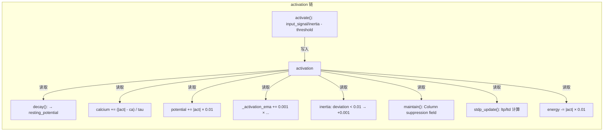
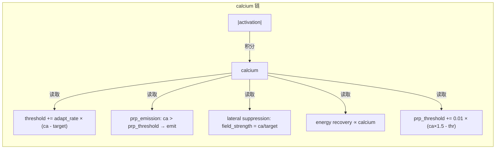
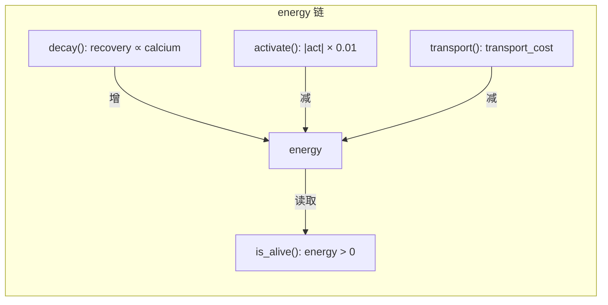
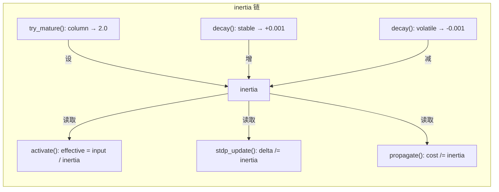
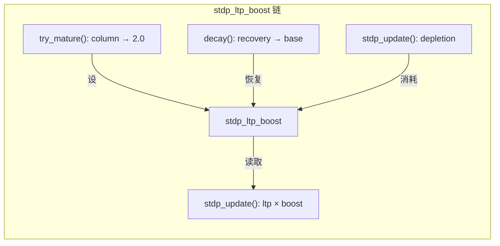
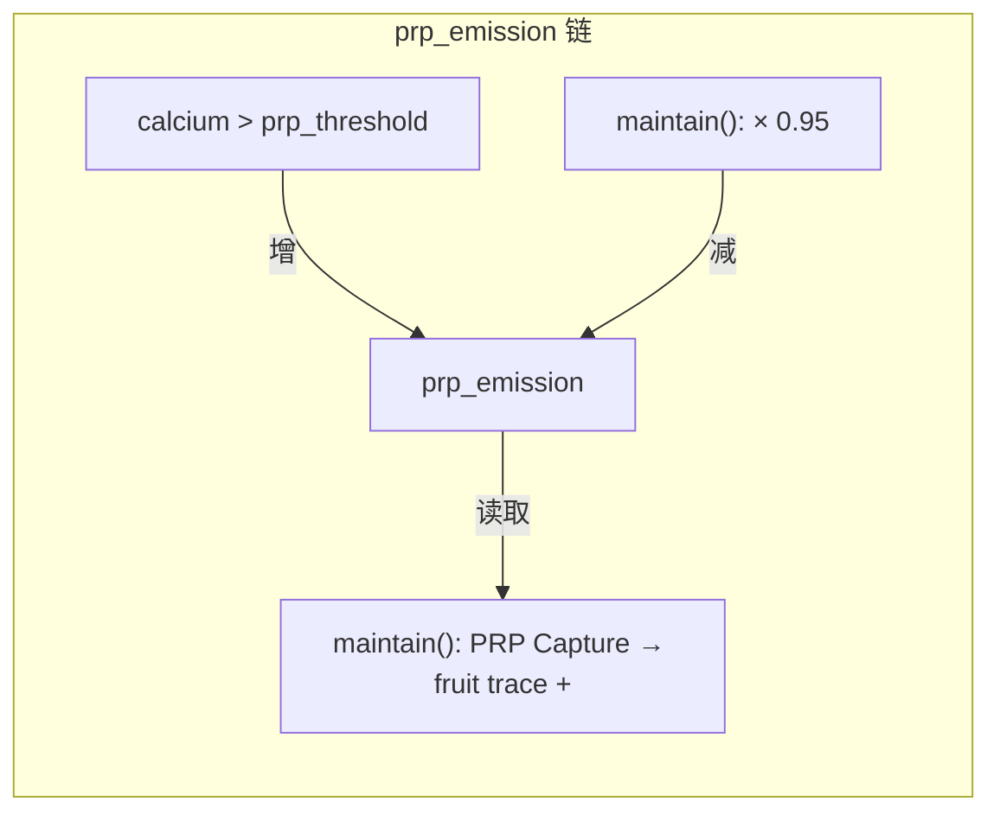
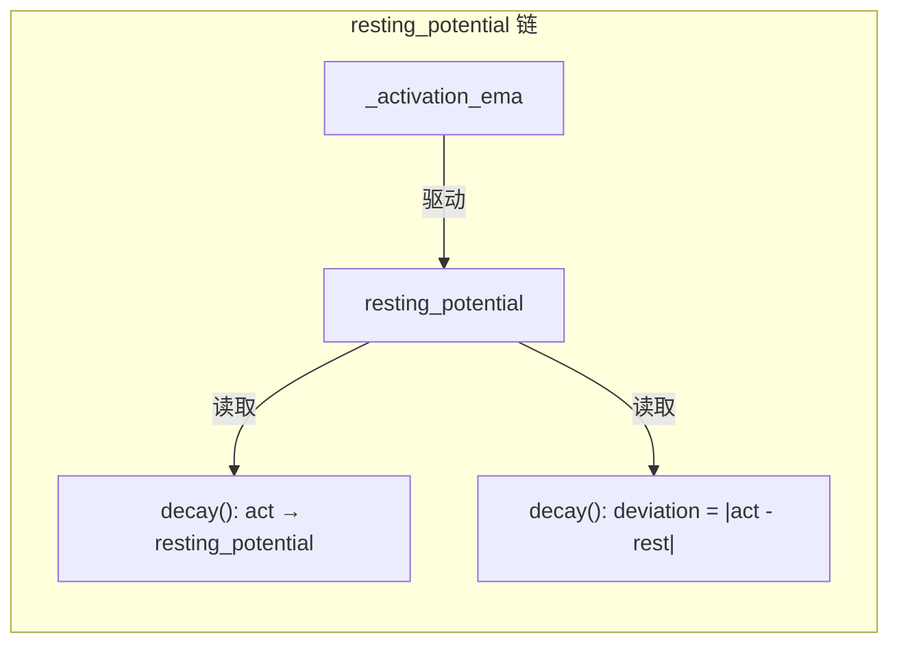
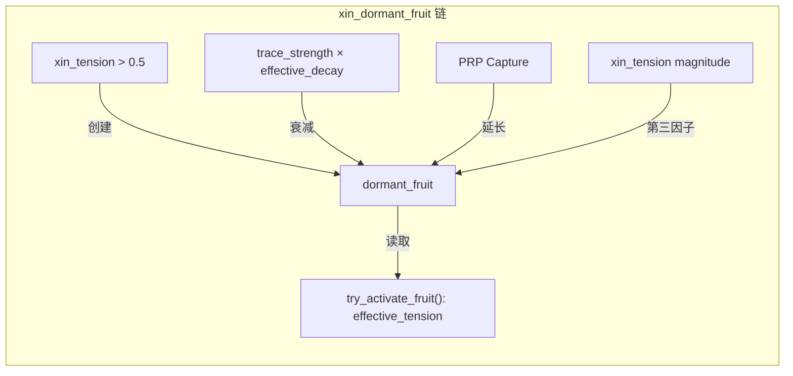

# 动力学因果链路追踪 — 从元结构出发

> 追踪规则：每个字段必须有 **写入点 → 读取点 → 下游效应** 的完整链条。
> 链条断裂 = 动力学不完整。

## MetaNeuron 字段链路

### ✅ 完整链路



| 写入点 | 读取点 | 下游效应 | 状态 |
|--------|--------|---------|:----:|
| `activate()` L173-178 | `decay()` L203 | → resting_potential 目标 | ✅ |
| | `activate()` L184 | → calcium 积分 | ✅ |
| | `decay()` L204 | → potential 积累 | ✅ |
| | `decay()` L216 | → _activation_ema 更新 | ✅ |
| | `decay()` L237 | → inertia 稳定/波动 | ✅ |
| | `maintain()` L943 | → Column suppression force | ✅ |
| | `stdp_update()` L349 | → LTP/LTD 计算 | ✅ |
| | `activate()` L187-189 | → energy 消耗, heat_output | ✅ |

---



| 写入点 | 读取点 | 下游效应 | 状态 |
|--------|--------|---------|:----:|
| `activate()` L184 | `decay()` L248-252 | → threshold 适应 | ✅ |
| | `maintain()` L948-953 | → PRP emission 门控 | ✅ |
| | `maintain()` L934 | → suppression field_strength | ✅ |
| | `decay()` L227 | → energy recovery rate | ✅ |
| | `decay()` L269 | → prp_threshold 适应 | ✅ |

---



| 写入点 | 读取点 | 下游效应 | 状态 |
|--------|--------|---------|:----:|
| `decay()` L227-228 | `is_alive()` L319 | 死亡判定 | ✅ |
| `activate()` L189 | | | ✅ |
| `transport()` L696-699 / L724-727 | | | ✅ |

---



---



---



---



---

### MetaSynapticBundle 字段链路



---

## 断裂链路修复状态

### 1. ~~`heat_output`~~ — ✅ **已修复 v40.7d**

```
写入: activate() L188: self.heat_output = cost
读取: maintain() L1075: tick_neuron_heat += n.heat_output
下游: _total_heat → _temperature → lateral_inhibition strength
```

链路: `activate() → heat_output → maintain() → _total_heat → _temperature → _apply_lateral_inhibition()`

### 2. ~~`activation_count`~~ — ✅ **已修复 v40.7d**

```
写入: activate() L180: self.activation_count += 1
读取: try_mature() L290: if self.activation_count < 20: return
下游: 门控 spine→column 和 column→area 的成熟
```

链路: `activate() → activation_count++ → try_mature() gate → maturation → 所有 Column 特权`

### 3. ~~`plasticity`~~ — ✅ **已修复 v40.7d**

```
定义: L142-144: {"spine": 0.18, "column": 0.01, "area": 0.001}
读取: stdp_update() L414: avg_post_plasticity = sum(pn.plasticity...) / 0.18
下游: A_plus *= plasticity, A_minus *= plasticity
```

链路: `maturation → plasticity → stdp_update() → ÇW 缩放 → Column 学习更慢`

### 4. `proxy_for` / `is_proxy_host` — 🟡 **PLACEHOLDER**

明确标记为架构预留位，无动力学耦合。待实现代理委托机制时连接。

### 5. `degraded_features` — 🟢 **ANNOTATION_ONLY**

明确标记为结构性元数据，不参与计算。这是可接受的。
