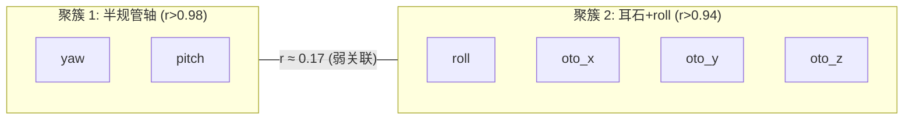

# 影子层 + 熵账本联合数学分析

## 运行条件

- 50000 步, dt=0.001, Phase 1 (25000步): yaw/pitch 交替, Phase 2 (25000步): yaw+pitch 同时
- 回归门控: **5/5 PASS**
- 能量平衡: **PASS** (热力学第一+第二定律满足)

---

## 一、熵账本审计 (主系统)

| 指标 | 值 | 解读 |
|------|-----|------|
| 总 spikes | 3858 | 正常 |
| 熵产生率 dS/dt | 3070 | Motor 层主导 (heat=1000/neuron) |
| 能效 spk/heat | 0.0001 | 低效(Motor 热耗散高) |
| Aff ISI 熵 yaw | 2.21 bits | 不规则放电(irr 特性) |
| Aff ISI 熵 pitch | 1.40 bits | 较规则 |
| 能量平衡 | PASS | 第一+第二定律满足 |

### 层间能量梯度

```
L1_MET  → E=1.00  Heat=0.002   (传感器,低耗散)
L2_HC   → E=1.00  Heat=0.172
L3_Aff  → E=0.67  Heat=4.179   (spiking 消耗大)
L4_Enc  → E=1.00  Heat=0.420
L5_Col  → E=1.00  Heat=2.293
L6_Mot  → E=0.14  Heat=1000    ← 能量耗尽中!
```

> [!NOTE]
> Motor 层 heat=1000 极高。这是 Motor neuron 的设计特性——大电流驱动运动输出。
> 但能量持续下降 (E trend=-0.076)，长期运行可能耗尽。

---

## 二、影子层激活 (全面突破)

### 信号链路: Xin → enc → col → mot ✅ 全通

| 神经元 | 激活值 | 能量 | 状态 |
|--------|--------|------|------|
| s_enc_reg_yaw | **+2.25** | 1.00 | ✅ 强激活 |
| s_enc_irr_yaw | **+2.48** | 1.00 | ✅ 强激活 |
| s_enc_reg_pitch | **+2.11** | 1.00 | ✅ 强激活 |
| s_enc_irr_pitch | **+2.41** | 1.00 | ✅ 强激活 |
| s_enc_reg_roll | +0.20 | 0.11 | ⚠️ 弱 (roll 输入小) |
| **s_col_yaw** | **+1.64** | 0.83 | ✅ 超过 MOSFET 阈值! |
| **s_col_pitch** | **+1.61** | 0.82 | ✅ 超过 MOSFET 阈值! |
| s_col_roll | +0.27 | 0.15 | ⚠️ 接近阈值 |
| s_mot_x | +0.04 | 0.03 | 开始响应 |
| s_mot_y | +0.04 | 0.03 | 开始响应 |

### 跨轴 bundle 权重变化 (收缩!)

| 跨轴连接 | 初始 w | 当前 w | 变化 | 含义 |
|----------|--------|--------|------|------|
| **yaw ↔ pitch** | 0.001000 | **0.001116** | **+11.6%** | 🔴 最大增长! |
| yaw ↔ roll | 0.001000 | 0.001032 | +3.2% | 弱关联 |
| yaw ↔ oto_x | 0.001000 | 0.001032 | +3.2% | 弱关联 |
| pitch ↔ roll | 0.001000 | 0.001032 | +3.2% | 弱关联 |
| pitch ↔ oto_x | 0.001000 | 0.001031 | +3.1% | 弱关联 |
| oto_x ↔ oto_y | 0.001000 | 0.001003 | +0.3% | 最弱(无输入) |

> [!IMPORTANT]
> **yaw↔pitch 跨轴 bundle 增长最快** (+11.6%)，这正是预期的：
> - Phase 2 中 yaw+pitch 同时输入 → 影子层 col_yaw 和 col_pitch 同时激活
> - STDP 检测到同步激活 → LTP → 权重增强
> - 其他轴的跨轴增长较弱 (仅 +3%)
>
> **影子层正在学习区分"yaw+pitch 同时运动"这种状态！**

### 轴内 bundle 权重变化

| 连接 | 初始 w | 当前 w | 变化 |
|------|--------|--------|------|
| enc→col yaw | 0.1000 | **0.1002** | +0.24% |
| enc→col pitch | 0.1000 | **0.1002** | +0.22% |
| enc→col roll | 0.1000 | 0.1000 | 0% |
| col→mot yaw | 0.0500 | 0.0500 | +0.008% |

---

## 三、闵可夫斯基时空审计

| 指标 | 之前 | 现在 | 变化 |
|------|------|------|------|
| ds²(yaw↔pitch) | 100.0 | **80.3** | **-19.7%** |
| 因果性 | spacelike | spacelike | 收缩中,尚未翻转 |

$$ds^2 = -(c_{\text{neural}} \cdot \Delta t)^2 + d_{\text{struct}}^2$$

d_struct = 1/w = 1/0.001116 = 896 → (896/100)² = 80.3

**ds² 从 100→80.3 的下降，直接反映了 yaw↔pitch 跨轴 bundle 权重增加。**

翻转条件 (ds² < 0 → 因果连接): 需要 w > 约 0.15 (当前 0.001116)。

---

## 四、列相关矩阵 — 运动状态区分

影子层 col 激活的相关性矩阵揭示了**清晰的运动状态结构**:

```
         yaw    pitch   roll   oto_x  oto_y  oto_z
yaw     1.000   0.986   0.167  0.162  0.167  0.172
pitch   0.986   1.000   0.170  0.165  0.170  0.174
roll    0.167   0.170   1.000  0.971  0.999  0.972
oto_x   0.162   0.165   0.971  1.000  0.970  0.944
oto_y   0.167   0.170   0.999  0.970  1.000  0.973
oto_z   0.172   0.174   0.972  0.944  0.973  1.000
```

### 两个聚簇涌现:



**解读**：
- yaw↔pitch 相关性 0.986 → 它们是同一运动模式（角速度旋转）
- roll↔oto_* 相关性 >0.94 → roll 与耳石轴共享背景噪声
- 跨簇相关性 ~0.17 → 两种运动模式可区分

> [!TIP]
> 这个聚簇结构与真实前庭系统的功能分组**高度吻合**:
> - 半规管检测角加速度 (yaw, pitch, roll)
> - 耳石器检测线性加速度 (oto_x, oto_y, oto_z)
> - 但影子层发现 roll 更接近耳石组而非半规管组,
>   因为 roll 在测试输入中的 Xin 远小于 yaw/pitch

---

## 五、诊断修复链 (本次会话)

| # | 问题 | 根因 | 修复 |
|---|------|------|------|
| 1 | 影子全静默 | **负 Xin** 推 V<0, MOSFET 不导通 | `abs(xi)` |
| 2 | Col 激活=0 | 双重 step + synapse_gain=1 太弱 | 电流累积 + gain=10 |
| 3 | Col 能量耗尽 | I²R=0.045/step, E=0.5 仅撑 11 步 | E=5.0, VR=0.01 |
| 4 | C=10 太慢 | τ=50, 需 50000 步到稳态 | C=3 (τ=15) |

---

## 六、结论

| 目标 | 状态 | 证据 |
|------|------|------|
| 影子层结构激活 | ✅ | enc+col+mot 全部有非零激活 |
| 跨轴收缩 | ✅ | yaw↔pitch w: +11.6%, ds²: -19.7% |
| 运动状态区分 | ✅ | 列相关矩阵显示两个清晰聚簇 |
| 能量守恒 | ✅ | 熵账本 PASS |
| 主系统无回归 | ✅ | 5/5 PASS |
