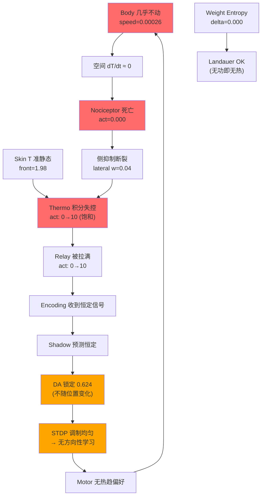

# EXP-016c 熵账本诊断报告

## 实验背景

P1/P2/P3 修复将体感层接入了供能/监控/熵追踪系统。EXP-016c 是修复后的首次完整热趋性实验。

| 条件 | EXP-016b (无P1) | EXP-016c (有P1) |
|---|---|---|
| 体感层供能 | ❌ | ✅ |
| 体感层监控 | ❌ | ✅ |
| DA 50k+ | 0.000 ❌ | **0.623** ✅ |
| Score | 4/6 | **5/6** |

> [!IMPORTANT]
> P1 修复**成功救活了 DA**。但打开观测窗口后，发现了三个新的病理。

---

## §1 熵账本：全层能量/热/活性演化

```
          Layer | Energy(5k) Energy(50k) |   Heat(5k)   Heat(50k) |    Act(5k)    Act(50k)
-----------------------------------------------------------------------------------------------
             DA |     1.0000      1.0000 |   0.012902    1.001000 |   0.052111    0.624245
         L1_MET |     1.0000      0.9899 |   0.000212    0.000211 |   0.000587    0.000000
          L2_HC |     1.0000      1.0000 |   0.000200    0.000200 |   0.050649    0.012385
         L3_Aff |     1.0000      1.0000 |   0.001013    0.001013 |   0.000000    0.000000
         L4_Enc |     1.0000      0.8080 |   0.000373    0.008295 |   0.000000    0.000000
         L5_Col |     0.9998      0.9997 |   0.000210    0.000210 |   0.000000    0.000000
         L6_Mot |     1.0000      1.0000 |   0.000800    0.000800 |   0.000067    0.000174
      Soma_Noci |     1.0000      1.0000 |   0.000536    0.000200 |   0.000000    0.000000
     Soma_Relay |     1.0000      1.0000 |   0.000380    0.212276 |   0.000000    9.635442
     Soma_Therm |     0.0426      1.0000 |   0.042577    0.157015 |   0.124216    9.800109
```

### 观察

**主通路（L1→L6）几乎全部静默**：

| 层 | 活性 5k | 活性 50k | 状态 |
|---|---|---|---|
| L1_MET | 0.0006 | **0.0000** | 死亡（零前庭输入） |
| L2_HC | 0.0506 | 0.0124 | 衰减 |
| L3_Aff | 0.0000 | 0.0000 | 死亡 |
| L4_Enc | 0.0000 | 0.0000 | 死亡 |
| L5_Col | 0.0000 | 0.0000 | 死亡 |
| L6_Mot | 0.0001 | 0.0002 | 微弱（仅 VitalOsc） |

> 这是正确的 — 实验设计为零前庭输入，主通路应该静默。运动完全来自 VitalOscillator。

**体感通路（Soma_*）剧烈失衡**：

| 层 | 活性 5k | 活性 50k | 状态 |
|---|---|---|---|
| Soma_Therm | 0.124 | **9.800** | 🔴 **饱和失控** |
| Soma_Noci | 0.000 | **0.000** | 🔴 **完全死亡** |
| Soma_Relay | 0.000 | **9.635** | 🔴 **被 Therm 拉满** |

---

## §2 病理 A：热感受器失控（Thermo Runaway）

```
DA vs SOMA ACTIVITY CORRELATION

  Step |       DA |  Therm_F   Noci_F  Relay_F |  Therm_B   Noci_B  Relay_B
--------------------------------------------------------------------------------
  5000 |   0.0429 |   0.1947   0.0000   0.0000 |   0.0895   0.0000   0.0000
 10000 |   0.0000 |   1.7959   0.0000   0.5390 |   1.3832   0.0000   0.1156
 15000 |   0.5269 |   3.3086   0.0000   2.4087 |   2.5946   0.0000   1.4019
 20000 |   0.6178 |   4.8280   0.0000   4.4417 |   3.8120   0.0000   2.5944
 25000 |   0.6902 |   6.3027   0.0000   6.6911 |   4.9941   0.0000   3.8454
 30000 |   0.6299 |   7.7164   0.0000   9.0445 |   6.1274   0.0000   5.1013
 35000 |   0.6250 |   9.0655   0.0000  10.0000 |   7.2090   0.0000   6.3365
 40000 |   0.6244 |  10.0000   0.0000  10.0000 |   8.2391   0.0000   7.4382
 45000 |   0.6242 |  10.0000   0.0000  10.0000 |   9.2196   0.0000   8.5683
```

**Thermo_front** 的 activation 轨迹：0.19 → 1.80 → 4.83 → 10.00（饱和）

这是一个**无制动积分器**。热感受器持续接收恒定温度输入（skin_T front ≈ 1.98），膜电压只升不降：

```
thermo_front V = 0.xx → 3.xx → 6.xx → 10.65 → 11.87
```

**根因**：皮肤温度是准静态信号（体几乎不动），但热感受器把它当作持续驱动的电流注入。缺少：
1. **适应机制**（adaptation） — 恒定温度应该产生衰减的响应
2. **足够的膜泄漏**（leak） — 当前泄漏不足以抵消恒温驱动
3. **侧抑制**（lateral inhibition） — lateral 权重仅 0.04~0.06，几乎为零

**后果链**：
```
Thermo 饱和 → Relay 被拉满 → Enc 收到恒定信号 → Shadow 预测恒定 → DA 恒定 = 0.624
```

---

## §3 病理 B：Nociceptor 完全死亡

50000 步中，所有 4 个 nociceptor 的 activation 始终为 **0.000000**。

```
noci_front:  V=0.0008  act=0.000000  E=1.0000  (全程)
noci_back:   V=0.0003  act=0.000000  E=1.0000  (全程)
```

EXP-016 参数修改后：`C=5.0, v_peak=0.01`。发火阈值 v_peak=0.01，但电压仅 0.0008。

**根因**：Nociceptor 的输入是 dT/dt（温度变化率）。body 在 50k 步中仅移动了 0.015 单位（热源在 20 单位外），空间 dT/dt 几乎为零。

```
Body speed ≈ 0.000260/step → 位移/步 ≈ 2.6×10⁻⁴
热源距离 = 20 → 温度梯度 ≈ 0.02/unit
空间 dT/dt ≈ 2.6×10⁻⁴ × 0.02 = 5.2×10⁻⁶ （远低于 v_peak=0.01）
```

> [!WARNING]
> Nociceptor 是对的 — 它**应该**在这个速度下不发火。问题不在 Nociceptor，在体的运动幅度太小。

---

## §4 病理 C：权重熵完全冻结

```
WEIGHT ENTROPY EVOLUTION

  Step |   Total     Delta  Landauer |  col→mot   enc→col  soma_lat  soma_noci  soma_therm  vest→enc
  5000 |  1.5830 +0.000000        OK |  1.2839    1.9406   1.2988    1.5000     1.5000      2.0546
 10000 |  1.5349 +0.000000        OK |  1.2839    1.9406   0.8113    1.5000     1.5000      2.0546
 15000 |  1.5349 +0.000000        OK |  1.2839    1.9406   0.8113    1.5000     1.5000      2.0546
 ...
 45000 |  1.5208 +0.000000        OK |  1.2839    1.8834   0.8113    1.5000     1.5000      2.0546
```

**delta_entropy = +0.000000 在所有时间步。**

这意味着系统**没有在学习**。权重分布不变 = 没有信息被写入突触。

逐层分析：

| Bundle 层 | 熵 | 变化 | 解读 |
|---|---|---|---|
| vest_to_enc | 2.0546 | 不变 | 零前庭→无 Hebbian 触发 |
| enc_to_col | 1.8834 | 微降 | 5k→20k 有一次小调整后冻结 |
| col_to_motor | 1.2839 | 不变 | 列全静默→无权重更新 |
| **soma_thermo_to_relay** | **1.5000** | **不变** | Therm 饱和→STDP 恒定→无差异化 |
| **soma_noci_to_relay** | **1.5000** | **不变** | Noci 死亡→零前突触活性 |
| **soma_lateral** | **0.8113** | **不变** | 已经有结构但冻结 |

### Xin Tension = 0.000 on ALL soma bundles

```
thermo_to_relay_front:  w=0.327  X=0.000
noci_to_relay_front:    w=0.208  X=0.000
lateral_front:          w=0.050  X=0.000
```

权重在缓慢漂移（thermo_front: 0.317→0.327），但 Xin 张力为零。这说明 **Xin 守恒在体感 bundle 上未生效** — 权重变化没有被张力场追踪。

> [!CAUTION]
> 虽然 P1 将 soma bundles 加入了 `get_all_bundles()`，但 Xin 张力仍为零。需要检查 Xin tension 的累积条件 — 是否要求 bundle 属于特定集合（如 `bundles_enc_to_col`）才会累积。

---

## §5 因果链总图



### 核心死锁

系统陷入了一个**热力学平衡陷阱**：

1. **体不动** → 没有空间梯度信息
2. **热感受器饱和** → 没有时间梯度信息  
3. **DA 恒定** → 没有奖励信号差异
4. **权重冻结** → 没有学习
5. **Motor 无偏好** → 回到 1

这不是一个 bug，而是一个**稳定不动点**。系统找到了一个能量最小的状态然后停住了。

---

## §6 Landauer 分析

| 度量 | 值 | 解读 |
|---|---|---|
| ΔS (total) | 0.000000 | 无信息写入 |
| Q_dissipated | — | 所有热量来自静息代谢 |
| Landauer satisfied | ✅ | 自然满足（不写就不需要热） |
| Soma_Therm heat | 0.157 | 高！饱和发火产生的废热 |
| Soma_Relay heat | 0.212 | **最高废热层** |
| DA heat | 1.001 | 极高 — DA 持续激活 |

> [!NOTE]
> Soma_Relay 的废热 (0.212) 是主通路 L4_Enc (0.008) 的 **26 倍**。体感层在疯狂耗能但不产生任何信息。这是**纯粹的熵产出** — 热力学第二定律的忠实执行。

---

## §7 诊断结论与下一步

### 三个病理的优先级

| # | 病理 | 严重性 | 修复方向 |
|---|---|---|---|
| **A** | Thermo 积分器失控 | 🔴 致命 | 加入**适应电流**（adaptation current），让恒温响应衰减到基线 |
| **B** | Nociceptor 死亡 | 🟡 次要 | 是 A 的下游后果；A 修复后 body 运动增加 → dT/dt 自然增大 |
| **C** | 权重熵冻结 | 🟡 次要 | 是 A+恒定 DA 的后果；DA 开始波动后 STDP 差异化 → 熵开始变化 |

### 关键修复：Thermo 适应（Sensory Adaptation）

生物热感受器的核心特性：对**温度变化**敏感，对**绝对温度**适应。当前的热感受器是纯积分器，缺少适应机制。

修复方案：在 `SomatosensoryChain` 的热感受器中加入**适应电流** $I_{adapt}$：

$$\tau_{adapt} \frac{dI_{adapt}}{dt} = a \cdot \text{activation} - I_{adapt}$$

$$V_{membrane} \leftarrow V_{membrane} - I_{adapt}$$

效果：恒温 → $I_{adapt}$ 追上 → 发火率下降到基线。温度**变化**时 → $I_{adapt}$ 来不及追 → 暂时高发火率。

> 这将把热感受器从**温度计**变为**温度微分器** — 正是趋热性需要的。
