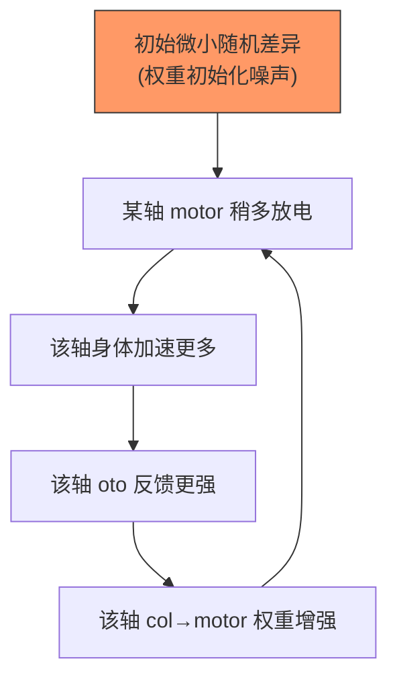

# 三个问题的深度分析

## 问题 1：DA 为什么卡在 1.0？（"惊喜"机制）

### 之前的错误判断

我之前说"Xin≈0，没有惊喜"。**完全错误**。

### 实际情况

```
Xin timeline:
  step  1000: |xin| =  0.27
  step  2000: |xin| =  2.62
  step  5000: |xin| = 15.25   ← 阈值(0.5)的30倍！
  step 10000: |xin| = 25.16   ← 还在涨
```

**Xin 是太高，不是太低。DA 不是没被触发，而是永远被满载驱动。**

### 根因：otolith 慢性预测误差

```
hc_to_aff_oto_y:  +25.83   ← 耳石器→传入束，预测误差巨大
hc_to_aff_oto_x:  +22.70
hc_to_aff_oto_z:  +19.79

相比之下：
hc_to_aff_yaw:    +1.20    ← 前庭轴，误差很小
enc_to_col_pitch:  -0.01   ← 编码→列，几乎完美预测
```

**为什么 otolith 的 Xin 永远很大？**

$$\text{oto\_input}(t) = \text{acceleration}(t) \times 500$$

加速度来自 motor output → muscle → body.step()。这是一个**闭环**：


otolith 的预测目标是"下一步的加速度"。但加速度是**脉冲式**的（motor spike 来一个突然加速，然后衰减），这种脉冲模式对线性权重预测来说是**不可学会的**。

> **类比**：你站在一个随机抖动的电梯里，试图预测下一秒你会感受到多大的力。电梯的抖动来自你自己踩地板的反作用力——你的预测改变了你的行为，你的行为改变了预测目标。这个循环让预测误差永远不为零。

### DA 的饱和机制

$$\sum |\xi_i| \approx 150 \xrightarrow{\text{inject}} V_{cap} \to \text{clamp}(1.0) \xrightarrow{\text{MOSFET}} I = 0.45 \xrightarrow{\text{每步释放}} DA \to 1.0$$

DA 浓度被持续的高 Xin 推到上限，**失去了动态范围**。

### 解法方向

**真实大脑**的 DA 编码 **δξ**（误差的变化），不是 |ξ|（误差的绝对值）。Schultz(1997) 经典发现：

$$\Delta DA \propto \frac{d|\xi|}{dt}, \quad \text{not} \propto |\xi|$$

这样：
- 持续的预测误差 → $d|\xi|/dt = 0$ → DA 不变（习惯化）
- 突然变化 → $d|\xi|/dt$ 飙升 → DA 释放（惊喜！）

---

## 问题 2：振荡能否作为 Xin？

### 你的直觉

系统有内在振荡器，它们调制 Afferent 膜电压。如果振荡频率与输入频率不同步，产生的**拍频**（beat）蕴含时间信息。这种信息是否能驱动 Xin？

### 数学

$$V_{aff}(t) = V_{base}(t) \times [1 + A_{osc} \sin(2\pi f_{osc} t)]$$

$$\text{拍频} = |f_{osc} - f_{input}|$$

如果下游的预测器只用了 $V_{base}$ 来预测，那 $A_{osc} \sin(\cdot)$ 的调制就是一个**不可预测的分量**，会产生持续的 $\xi$。

### 当前的问题

1. $A_{osc} \approx 0.01$（振幅太小）
2. 振荡器作用在 Afferent 层（L3），但 Xin 计算发生在 L3→L4, L4→L5 等层间
3. Aff→Enc 的传递增益是 0.34（衰减 66%），所以振荡信号到达 Xin 计算点时只剩 $0.01 \times 0.34 = 0.0034$
4. 这远小于 oto 的 Xin（25.83），被完全淹没

### 理论上的可能

如果 oto 的慢性 Xin 被修复（DA 改为 δξ 编码），那么振荡的贡献**可能**变得可见。但需要：
- 增大振荡幅度（A_osc → 0.1）
- 或让 Xin 计算区分"可预测的"和"不可预测的"分量

---

## 问题 3：系统偏科（对称性自发破缺）

### 数据

即使给完全相同的输入（yaw = pitch = roll = 0.3×sin(t)），50k 步后：

```
move_x:  3832 spikes
move_y:  6605 spikes  ← 是 z 的 3 倍
move_z:  2268 spikes
```

### 硬件检查

三个 motor 的配置**完全相同**：
```
C=0.01  R=5.0  v_peak=0.2  bc=0.032  ch_vth=0.15
```

### 偏科的原因：对称性自发破缺



正反馈闭环将微小的初始差异**指数放大**，最终锁定在某个轴上。

> **物理类比**：一根完美对称的铅笔竖立在桌面上。物理学告诉我们，铅笔最终**必然倒下**，而且倒向的方向取决于微小的初始扰动（一个空气分子的碰撞、桌面的微微倾斜）。这就是**对称性自发破缺**（spontaneous symmetry breaking）。

$$V(\phi) = -\mu^2 \phi^2 + \lambda \phi^4 \quad \text{（墨西哥帽势）}$$

系统"坐"在帽子顶部（对称状态不稳定），滚下到某个谷底（选择某个轴）。哪个谷底取决于初始噪声。

### 这是 bug 还是 feature？

**这是 feature**。真实大脑也有这种现象：
- **惯用手**（右手/左手偏好）就是运动皮层的对称性自发破缺
- **眼优势**（dominant eye）同理
- 初始的微小不对称通过 Hebbian 学习的正反馈被放大、锁定

真正的问题不是偏科本身，而是偏科的**方向**是否合理。在当前系统中，move_y 占优是因为随机种子决定的，换个种子可能 move_x 占优。
