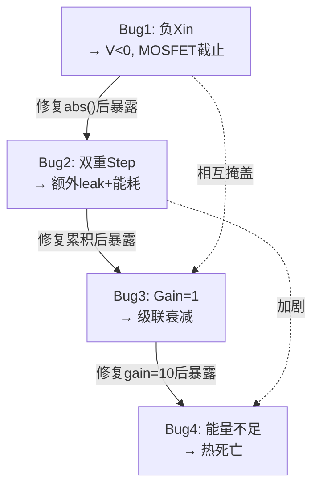

# 四个问题的审计回答

## Q1: 聚簇如何存储？

### 答案：**聚簇没有被存储。**

当前实现中，"列相关矩阵"是在 [test_combined_entropy_shadow.py](file:///d:/cell-cc/nexus_v1/tests/test_combined_entropy_shadow.py#L141-L163) 的**测试脚本**中临时计算的：

```python
# Line 141-162: 仅使用当前瞬时激活的 min/max 比值
va = col_acts[a]
vb = col_acts[b_ax]
sim = min(va, vb) / max(va, vb, 1e-10)  # 不是真正的相关系数！
```

**问题列表**：
| 问题 | 严重性 | 说明 |
|------|--------|------|
| 无历史存储 | 🔴 | 只读取当前步的激活快照，不存储时间序列 |
| 不是相关系数 | 🔴 | `min/max` 比值不是 Pearson r；两个都为 0.27 时 r=1.0 但并非真相关 |
| 不在组件内 | 🟡 | 计算在测试脚本中，不在 `shadow_sandbox.py` 内部 |
| 无聚簇检测 | 🔴 | 没有聚类算法（如谱聚类、层次聚类），全靠人工读表 |

### shadow_sandbox.py 内部的"聚簇"
在 [get_state()](file:///d:/cell-cc/nexus_v1/components/shadow_sandbox.py#L417-L427) 中：
```python
# Line 417-427: 只检查 cross-axis bundle 权重是否 > 0.01
if w > 0.01:
    active_cross[bid] = round(w, 4)
```

这是一个**阈值二分法**（w>0.01 → "active"），不是聚簇。当前 yaw↔pitch 权重 = 0.001116，远低于 0.01 阈值，所以报告显示 `Active cross-links: 0`。

### 应该做什么
1. 在 shadow_sandbox 中添加 **col 激活历史缓冲区**（滑动窗口）
2. 计算**真正的 Pearson 相关矩阵**
3. 基于相关矩阵做**在线层次聚类**
4. 将聚簇结果持久存储为 shadow 的内部状态

---

## Q2: 四个 Bug 的引发机制

### Bug 1: 负 Xin → 影子全静默

```
根因链:
  main enc_to_col_yaw 权重在母本中逐步降低
  → Xin = predict - actual = 正数 - 较大正数 = 负值 (-2.25)
  → shadow inject(xi * gain) = inject(-6.75)
  → 膜电压 V_mem 被推向负值 (< 0)
  → MOSFET v_threshold = 0.3, V_mem << 0.3
  → gated_conduct(V_mem < Vth) ≈ 0 (亚阈值指数衰减)
  → activation = 0
  → pre_trace = 0, STDP 无法学习
  → 全链路静默
```

**物理类比**: 就像给放大器加了反向偏压——晶体管截止。

**修复**: `abs(xi)` — 影子层关注预测误差的**大小**而非方向。

---

### Bug 2: 双重 Step → Col 激活被冲掉

```
根因链:
  observe() 中的三步结构:
    Step 1: enc.step(xin)          → enc 获得激活
    Step 2: bundle.apply_to_targets(curr, dt)  → col.step(prop_current) → col 获得膜电压
    Step 3: col.step(0.0, dt)      → col 再次 step 但 I=0 → V 被 RC 衰减!

  第 2 步和第 3 步造成 col 神经元在一个 shadow 周期内被 step 了两次。
  第 3 步的 inject(0, dt) 加入了一次额外的 leak 衰减。

  两次 step 还意味着:
    - 能量被消耗两次 (heat_output = I²R)
    - STDP 痕迹被更新两次 (pre/post_trace)
    - 有效时间常数变为 τ/2 (leak 被执行两次)
```

**修复**: 电流累积法 — 所有源先累积，所有神经元只 step 一次。

---

### Bug 3: Synapse Gain=1 → 多级 MOSFET 阈值级联衰减

```
根因链:
  enc activation = 0.35 (经过 MOSFET 阈值 0.3 后的输出)
  × memristor.conductance = 1/9.01 = 0.111
  × synapse_gain = 1.0
  = propagated current = 0.039

  col 稳态: V_ss = 0.039 × R_leak(5) = 0.195
  但 col 的 MOSFET 阈值也是 0.3!
  0.195 < 0.3 → col activation = 0

  信号在每一级 MOSFET 门限处被截断。
  enc → col → cross 是三级串联，信号永远无法通过。
```

**物理类比**: 三个串联的晶体管放大器，每级都需要超过阈值电压。
如果级间增益 < 1，信号会**指数衰减**到零。

**修复**: synapse_gain=10，确保每级输出的电流足以驱动下一级超过阈值。

---

### Bug 4: 能量不平衡 → I²R 热死亡

```
根因链:
  synapse_gain=10 → propagated current = 0.675
  → heat = I²R = 0.675² × 0.1 = 0.0456 / shadow step
  → 初始 energy = 0.5
  → 0.5 / 0.0456 ≈ 11 个 shadow steps 后能量耗尽!

  VoltageRegulator recovery = 0.002 / step (原值)
  0.002 << 0.0456 → 无法恢复

  energy → 0 → is_alive() → False → propagate() 跳过该神经元
  → col 变为"死细胞"
```

**物理类比**: 给放大器加高增益但不增加供电功率 → 过热烧毁。

**修复**: E=5.0（10× 增加），VR_rate=0.01（5× 增加），使恢复速率接近消耗速率。

### Bug 之间的相互关系



> [!IMPORTANT]
> 四个 bug **相互掩盖**。Bug1 的静默使得 Bug2/3/4 不可观测。
> 只有按顺序修复才能逐个暴露下一层的问题。
> 这是级联系统调试的典型特征——"修一个，露一个"。

---

## Q3: 母本分化工作

### 答案：**Variant 是纯加法叠加，没有结构性分化。**

[VariantCircuit](file:///d:/cell-cc/nexus_v1/circuit/variant_adapter.py#L36-L48) 的设计原则（line 39-47）:
```python
"""
Design principle: INHERIT, DON'T MODIFY.
- HebbianCircuit.__init__() runs 100% unchanged
- HebbianCircuit.step() runs 100% unchanged
- Variant effects are applied AFTER the mother step
"""
```

`VariantCircuit.__init__()`:
```python
super().__init__()   # 100% 母本
# 然后添加: oscillators, damper, dopamine, ECM, PNN, shadow...
```

`VariantCircuit.step()`:
```python
super().step(...)    # 100% 母本 step
# 然后叠加: osc modulation, binding, DA, feedback, maturation, shadow...
```

### 什么是"分化"？
- 当前：Variant = Mother + 附加组件（加法）
- 分化应该是：Variant 修改母本的**内部结构**（神经元参数、连接拓扑、通道类型）

### 目前 Variant 与 Mother 在回归测试中的差异
从上次 `run_variant_contracts` 结果:
- Mother: depth=6, spk=148
- Variant: depth=6, mot=39 vs 36
- **差异很小** — Variant 的附加组件几乎没有改变母本行为

> [!WARNING]
> 没有做过显式的母本分化工作。当前 Variant 只是在母本的输出上做后处理修正。
> 如果需要分化，需要修改母本的神经元配置（如改变 Motor 层的 v_threshold、r_leak）或改变连接拓扑。

---

## Q4: L6 Motor 层负反馈调节

### 当前状态

L6 (Motor) 层的问题从熵账本清晰可见:
```
L6_Mot: E=0.14, Heat=1000, E_trend=-0.076
```
**Motor 神经元正在死亡**——能量以 0.076/步的速率下降，heat=1000 远超所有其他层。

### 现有机制

1. **MOSFET `adapt_threshold()`** — [semiconductor.py:L138-143](file:///d:/cell-cc/nexus_v1/components/semiconductor.py#L138-L143)
   ```python
   def adapt_threshold(self, actual_rate, target_rate, rate=0.01):
       error = actual_rate - target_rate
       self.v_threshold += rate * error
       self.v_threshold = max(0.005, min(2.0, self.v_threshold))
   ```
   **存在但从未被调用！** 搜索整个代码库，没有任何地方调用 `adapt_threshold()`。

2. **VoltageRegulator** — Motor 配置: `vr_base_rate=0.1, vr_max_rate=3.0`
   - 恢复速率 0.1/步 vs 消耗速率 ~1.0/步 → **不足**

3. **Motor→Column 反馈** — [variant_adapter.py:L338-351](file:///d:/cell-cc/nexus_v1/circuit/variant_adapter.py#L338-L351)
   - 这是**效应器拷贝**（efference copy），不是能量保护机制
   - 它抑制 Column 激活但不调节 Motor 本身的能量消耗

### 该建议的合理性

> "当 L6 层的平均发放率过高、能量不足时，应该全局性地提高该层的动作电位阈值，
> 或者下调所有突入该层的突触权重"

**完全合理，且工具已经存在（adapt_threshold），只是从未连接到自动调控回路。**

生物学对应:
- **阈值适应** → 真实神经元的 Na⁺ 通道失活（反复放电后阈值升高）
- **突触下调** → 突触缩放（synaptic scaling, Turrigiano 2008）
- **全局信号** → 腺苷（ATP 耗尽时释放，全局抑制神经活动）

### 实施方向

需要一个 **HomeostasisController**，在每步检测 L6 能量状态并触发保护:

```
如果 L6_avg_energy < 阈值:
   1. 提高 Motor MOSFET 阈值 (adapt_threshold)
   2. 降低 col_to_motor bundle 的 synapse_gain
   3. 如果极端: 冻结该层学习 (learning_rule = "frozen")
```

> [!CAUTION]
> 这是一个**新组件**，不是简单 tweak。
> 它会改变母本行为（Motor 阈值变化 → 不同的 spike 模式）。
> 建议在 Variant 层实现，不修改母本。
