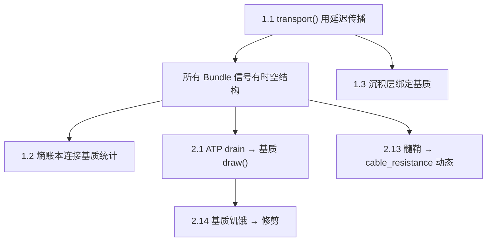

# 项目缺口审计 — v42.0 之后

## 已恢复 (RECOVERED)
| # | 项目 | 状态 |
|---|------|------|
| 1 | 轴突传导延迟 | ✅ `cable_length + pulse_queue` |
| 2 | 基质热力学/能量传输 | ✅ `SubstrateNetwork` |
| 3 | CPG 半中心互抑 | ✅ 从公式→Bundle 延迟传播 |
| 4 | BCM 学习规则 | ✅ 已有 |
| 5 | STDP 突触级时序 | ✅ `_arrival_trace` |

---

## Tier 1: 架构级缺口（影响 T/O/P/R/Xin 递归链）

### 1.1 transport() 仍然是即时传播
> [!CAUTION]
> `transport()` 中的 `bundle.propagate()` 是**即时**的——信号一步到达目标。
> Bundle 虽然有了 `inject_pulse/deliver_pulses`，但 transport() 没有使用它们。
> 只有 `_cpg_step()` 内部用了延迟传播。

**影响**: 整个编码层、层间传播都是零延迟，时空结构在 CPG 之外不存在。

**修正**: `transport()` 应改为 `inject_pulse + deliver_pulses` 流程。

### 1.2 外部熵账本未连接到基质
> [!IMPORTANT]
> `_entropy_ledger_proxy` 存在但从未被 SubstrateNetwork 使用。
> v34 蓝图要求：熵账本**只读审视**内部状态，不写入内部状态。
> 当前：基质能量流和外部账本完全断开。

**修正**: 每 tick 从基质统计 (total_energy, gradient, dissipation) → 写入熵账本。

### 1.3 影子/沉积 → 基质连接缺失
> [!WARNING]
> `_sediment_step()` 和 `_compress_to_shadow()` 存在，但它们：
> - 不消耗基质能量（深度记忆应消耗维持能量）
> - 不受空间位置约束（沉积应在低能量区域）
> - 沉积层有基质节点 (`sed_sub`) 但没有绑定神经元

---

## Tier 2: 结构级 DEGRADED（需要物理化）

| # | DEGRADED 项 | 当前代理 | 物理化方向 |
|---|------------|---------|-----------|
| 2.1 | ATP/ADP 循环 (L128) | 线性 drain | 基质 `draw()` 替代 |
| 2.2 | 离子通道适应 (L232) | EMA | 阈值动力学 + 钙 |
| 2.3 | NMDA Mg²⁺ 电压门控 (L446) | sigmoid proxy | 已有 propagate() 中 |
| 2.4 | 突触囊泡动力学 (L637) | 指数恢复 | 短期可塑性 |
| 2.5 | 皮层层级身份 (L840) | float 字段 | 分化区域 |
| 2.6 | 胃肠吸收 (L1047) | 单室模型 | 可接受的简化 |
| 2.7 | 骨骼肌 ATP (L1049) | 二次成本 | 可接受的简化 |
| 2.8 | 关联皮层动力学 (L1085) | 共激活矩阵 | Column 涌现 |
| 2.9 | GABAergic 代谢敏感 (L1320) | F-scaled σ | 抑制性 Bundle |
| 2.10 | 预测编码层级 (L1624) | 激活传递 | 前馈/反馈 Bundle 延迟差 |
| 2.11 | 篮状细胞抑制 (L2234) | 钙缩放阈值 | 抑制性 Bundle |
| 2.12 | 蛋白扩散 (L2269) | 直接发射 | 基质扩散动力学 |
| 2.13 | 髓鞘形成 (L2391) | delta 门控恢复 | cable_resistance 动态降低 |
| 2.14 | 补体介导修剪 (L2428) | 能量阈值 | 基质饥饿 → 修剪 |
| 2.15 | 睡眠记忆重激活 (L2557) | CPG tonic proxy | 低代谢态 + 沉积重播 |

---

## Tier 3: Runner 级缺口

| # | 项目 | 说明 |
|---|------|------|
| 3.1 | CPG pacemaker (runner L217) | 仍标记 DEGRADED，但 v42 已部分恢复 → 更新标注 |
| 3.2 | 6-axis 前庭 (runner L420) | 标量 lever rate → 缺 6DOF |
| 3.3 | 运动皮层层级 (runner L509) | 单层 flat → SMA/PMC/M1 层级 |
| 3.4 | 反馈权重 (L3416) | 均匀初始 → 应从 STDP 涌现 |
| 3.5 | 基底神经节门控 (L2842) | 环流阈值 proxy |

---

## Tier 4: 不需要修正（合理简化）

- 胃排空模型 (单室 dS/dt) → 足够
- 运动二次开销 → 足够
- glucose transporter → 已通过基质 draw() 部分恢复
- 全局温度 (local PDE → global sum) → INTENTIONAL_SIMPLIFICATION

---

## 优先修正建议

**最高优先级**: **1.1** — 让 `transport()` 使用 `inject_pulse/deliver_pulses`。
这是一切的前提：没有延迟的信号传播，STDP arrival_trace 在编码层中永远不会被使用。
