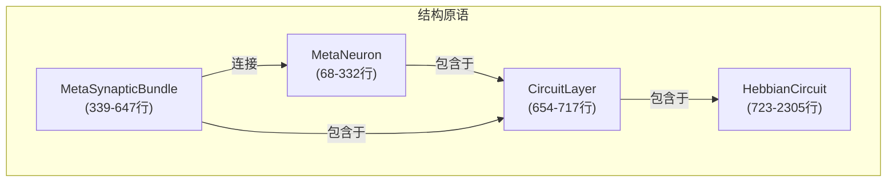
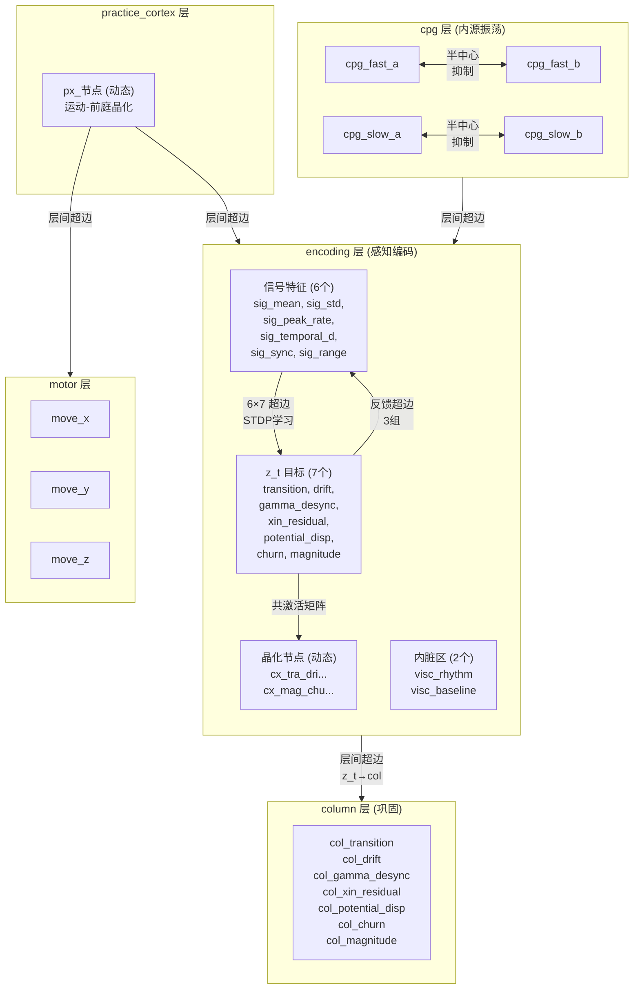
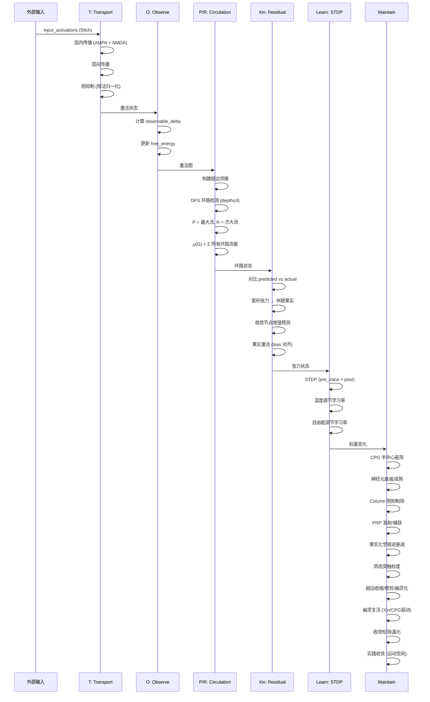

# 赫布超图完整内部结构

> **hebbian_circuit.py** — 2395 行, 117 KB
> 4 个结构原语, 15+ 生物机制, 26 个降级标注

---

## 一、四层原语架构



---

## 二、MetaNeuron — 计算节点 (68-332行)

每个 MetaNeuron 有 **18 个动态字段**：

```
┌─────────────────────────────────────────────┐
│ MetaNeuron                                  │
├─────────────── Core ────────────────────────┤
│ activation        float  当前激活值          │
│ resting_potential  float  静息电位 (适应性)   │
│ potential          float  累积历史 (成熟门控)  │
│ inertia            float  抗变能力 (围神经网)  │
├─────────────── STDP ────────────────────────┤
│ pre_trace          float  突触前定时标记       │
│ post_trace         float  突触后定时标记       │
│ trace_tau_pre      float  衰减时间常数 20ms   │
│ trace_tau_post     float  衰减时间常数 20ms   │
├─────────────── Homeostasis ─────────────────┤
│ target_rate        float  目标平均激活率       │
│ calcium            float  Ca²⁺ 慢整合器       │
│ calcium_tau        float  整合时间 (动态)      │
│ threshold          float  动态阈值 (适应)      │
│ threshold_adapt_rate float 适应速度           │
├─────────────── Metabolism ──────────────────┤
│ energy             float  代谢能量 [0,1]      │
│ heat_output        float  每 tick 热耗散      │
│ _metabolic_recovery_rate float 恢复速度      │
├─────────────── Maturation ──────────────────┤
│ maturation    spine→column→area              │
│ stdp_ltp_boost  1.0 / 2.0 / 3.0            │
│ lateral_suppression_radius  0 / 3 / 5       │
│ prp_emission    PRP 蛋白水平                 │
│ prp_threshold   PRP 发射阈值                 │
└─────────────────────────────────────────────┘
```

### 成熟阶梯 (Spine → Column → Area)

| 属性 | Spine | Column | Area |
|---|---|---|---|
| plasticity | 0.18 | 0.01 | 0.001 |
| decay_rate | 0.025 | 0.005 | 0.001 |
| STDP LTP boost | 1.0× | 2.0× | 3.0× |
| 侧抑制半径 | 0 | 3 | 5 |
| PRP 发射 | 无 | ✅ | ✅ |

---

## 三、MetaSynapticBundle — 超边 (339-647行)

```
┌──────────────────────────────────────────┐
│ MetaSynapticBundle                       │
│ {A,B,C} ──→ {D,E}  (超图边)              │
├─────────── Weights ──────────────────────┤
│ weights[i][j]     float[][]  权重矩阵     │
│ bundle_strength   float      聚合强度     │
│ bundle_inertia    float      抗变惯性     │
│ transport_cost    float      传播成本     │
├─────────── Learning ─────────────────────┤
│ learning_rule     "oja" / "frozen"        │
│ last_pre/post     float      最近激活     │
│ _conductance_history float   使用历史     │
│ _recent_delta     float      最近变化量   │
├─────────── Xin Tension ──────────────────┤
│ xin_tension       float      预测残差张力  │
│ xin_dormant_fruit Optional   休眠果实     │
│   ├─ tension_at_creation                 │
│   ├─ trace_strength (Ca²⁺衰减)           │
│   ├─ trace_decay = 0.995                 │
│   └─ state: dormant / activated          │
└──────────────────────────────────────────┘
```

### 传播路径 (propagate)

```
AMPA 线性求和:  target[j] = Σ_i w[i][j] × pre[i]
     ↓
NMDA 电压门控:  gain(v) = 1 + 0.3 / (1 + exp(-10(|v| - 0.005)))
     ↓
output[j] = target[j] × gain(v_post[j])
```

### STDP 更新 (stdp_update)

```
LTP = A+ × ltp_boost × pre_trace × |post_activation|
LTD = A- × post_trace × |pre_activation|
Δw = (LTP - LTD) / inertia

乘法依赖:
  Δw > 0: Δw *= (1 - w)    ← 接近 w_max 时减速
  Δw < 0: Δw *= w           ← 接近 0 时减速

w[i][j] = clamp(0, 1, w + Δw)
```

### 生命周期

```
活跃 → 收缩 (strength < 0.1: weights *= 0.99)
     → 修剪 (strength < 0.02 AND 无活动)
     → 幽灵 (ghost_strength, 0.01×, 1%/tick衰减)
     → 复活 (高 Xin tension 时重建)
```

---

## 四、CircuitLayer — 层 (654-717行)

```
┌──────────────────────────────────┐
│ CircuitLayer                     │
│ neurons: Dict[str, MetaNeuron]   │
│ bundles: List[MetaSynapticBundle]│
│ _ghost_bundles: List[Dict]       │
│ layer_temperature: float         │
│ layer_occupancy: float (EMA)     │
└──────────────────────────────────┘
```

---

## 五、HebbianCircuit — 完整系统 (723-2305行)

### 拓扑结构



### T/O/P/R/Xin 完整生命周期



---

## 六、15+ 生物机制清单

| # | 机制 | 位置 | 生物来源 |
|---|---|---|---|
| 1 | STDP | Bundle.stdp_update | Bi & Poo 1998 |
| 2 | NMDA 电压门控 | Bundle.propagate | Mg²⁺ 阻塞 |
| 3 | 除法归一化 | HC._apply_lateral_inhibition | Carandini & Heeger 2012 |
| 4 | 同态突触标度 | HC.maintain | Turrigiano 1998 |
| 5 | 同态阈值适应 | MN.decay | calcium error → threshold |
| 6 | 静息电位适应 | MN.decay | Desai 1999 |
| 7 | 惯性适应 (围神经网) | MN.decay | 围神经网形成 |
| 8 | Column 侧抑制 | HC.maintain | 篮状细胞 |
| 9 | PRP 发射/捕获 | HC.maintain | Frey & Morris 1997 |
| 10 | 休眠果实 | MSB | 突触标记 |
| 11 | 三因子学习 | HC.maintain | Gerstner 2018 |
| 12 | CPG 半中心振荡 | HC._cpg_step | Brown 1911 |
| 13 | 收敛检测/晶化 | HC._update_convergence | ACC |
| 14 | 实践收敛 | HC._detect_practice_convergence | SMA→M1 |
| 15 | 结构降级瀑布 | HC.maintain | 突触收缩→修剪→幽灵 |
| 16 | 幽灵复活 | HC.maintain | 睡眠重激活 |
| 17 | 代谢能量循环 | MN.decay | ATP合成 |
| 18 | LTP boost 疲劳 | MN.decay / MSB.stdp | 囊泡池回收 |

---

## 七、26 个 DEGRADED 标注

| 降级代理 | 真实机制 |
|---|---|
| 外部熵账本 | 局部底物热力学 |
| EMA学习 | BCM学习规则 |
| 深度限DFS | 完整同调环路检测 |
| Top-2选择 | 全能量竞争 |
| MeasureCoordinate 保留 | 涌现坐标 |
| Ca²⁺标度阈推 | 篮状细胞动力学 |
| 直接发射/捕获 | 蛋白质合成与扩散 |
| Xin张力大小 | 多巴胺能调制 |
| 线性耗竭+指数恢复 | 囊泡池回收 |
| Ca²⁺比例恢复 | 线粒体ATP合成 |
| 激活方差 | 围神经网形成/降解 |
| 慢EMA | 电压门控离子通道重分布 |
| Mg²⁺ sigmoid | NMDA受体Mg²⁺电压依赖解阻 |
| 成熟标量 | NMDA受体密度调节 |
| 强度门控衰减 | 补体标记突触消除 |
| 代谢退出 | 代谢退出/突触沉默 |
| 衰减率门控 | 离子通道去敏感化 |
| 比例耗竭 | 树突ATP消耗 |
| 比例耗竭 | 轴突ATP消耗 |
| F标度σ | GABA能代谢敏感性 |
| delta门控恢复 | 少突胶质细胞髓鞘化 |
| 协激活矩阵 | 前扣带皮层收敛检测 |
| 激活传递 | 预测编码自上而下生成 |
| 恒定输入 | 持续性钠电流 I_NaP |
| CPG张力 | 睡眠依赖记忆重激活 |
| 单层px_ | 分层运动皮层规划 |

---

## 八、数据流总线

### 输入 (59 通道 → circuit)

```
sensory dict (59 channels) from PracticeEngine
    │
    ├── 原始: lever_*, dlever_*, received_*
    ├── 介质: gradient_*, work_*
    ├── 统计: energy, fano, sparseness, synchrony, spectral, autocorrelation
    ├── 前庭: vest_canal_*, vest_oto_*, vest_L_*, vest_omega_mag, vest_accel_mag, vest_gia_mag
    ├── 本体: proprio_spindle_*, proprio_golgi_*, proprio_angle_*, proprio_limit_*, proprio_energy
    ├── 运动: motor_*, delta_ke
    └── Origin: origin_*
    
    ↓ 映射到 encoding 层 neurons
    
encoding.neurons:
    sig_mean ← ???         ← ⚠️ 映射未定义!
    sig_std ← ???          ← ⚠️ 映射未定义!
    ...
```

> [!CAUTION]
> **核心问题**: sensory 59 通道 → encoding 层的 6 个 sig_ 神经元，
> 映射关系目前**由 runner 负责**，engine 和 circuit 之间没有直接连接。
> 这是管道畅通的关键断点。

### 输出 (circuit → motor)

```
motor 层: move_x, move_y, move_z
    ↓
circuit.layers["motor"].get_activations()
    ↓
返回给 runner → 传入 engine.step(circuit_motor)
```
