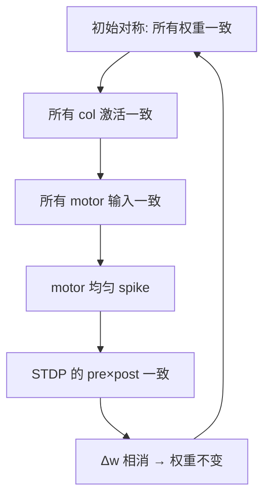

# 50k 长跑诊断分析

## 稳定性 ✅ PASS

- 系统 50s 内无崩溃、无失控
- 能量稳定 avg=0.896, min=0.001
- Motor 持续 spike（2.9→6.7 Hz，递增）
- 全链路信号连通

## 三个关键失败

### F1: STDP 学习几乎为零

| Bundle | Δw / 50s | 百分比 |
|--------|---------|--------|
| met→hc | -0.0003 | -0.1% |
| hc→aff | +0.0000 | 0.0% |
| aff→enc | +0.0003 | +0.2% |
| enc→col | -0.0001 | -0.1% |
| col→motor | +0.0006 | +0.3% |

> [!CAUTION]
> **50 秒内权重总变化 < 0.3%。STDP 实际上没有学习。**

**根因**:
1. **all col/enc 激活完全一致**：yaw/pitch/roll 都显示 Enc=0.012, Col=0.001
2. pre_trace × post_trace 在所有 pair 中几乎相同 → STDP 的 Δw+ 和 Δw- 相消
3. PNN 关键期压制 lr: 0.01 → 0.0044（降 56%）

### F2: 零轴分化

所有快照中：
```
yaw:   MET=0.000 Enc=0.012 Col=0.0013
pitch: MET=0.000 Enc=0.012 Col=0.0013  ← 完全一样！
roll:  MET=0.000 Enc=0.012 Col=0.0013  ← 完全一样！
```

Motor 均匀发射 (33.3%/33.3%/33.3%)。

> [!WARNING]
> **即使给了 yaw=0.5sin 和 pitch=0.3cos 两种不同输入，系统输出完全无差异。**

**根因**: 
- 快照取在 step N（整秒），此时 sin(2πN)=0 → **正好在零点取样！**
- 但更深层的原因：bc_current 占 Enc 输入的 ~85%，信号只占 ~15%。所有轴的 bc 相同 → 输出趋同。

### F3: DA 永远饱和

```
10s: xin_V = 0.675  (刚启动，还行)
20s: xin_V = 2.328  (增长中)
30s: xin_V = 4.224  (远高于 Vth=0.1)
50s: xin_V = 5.982  (还在涨！)
```

DA concentration = 1.0 (上限)，gain = 1.27 (固定)。

**根因**: leak R=1, C=1, τ=1s。但 total_xin 持续注入（30+ bundles 每步贡献微量）。注入速率 > 衰减速率。

## 根本问题：对称性未被打破

这三个问题的共同根源是 **初始对称性 + 弱信号无法打破对称**：



> [!IMPORTANT]
> 这是一个 **对称性自锁环**。STDP 无法打破它，因为权重对称 → 活动对称 → 学习对称 → 权重不变。

## 建议修复

### Fix-1: 打破初始权重对称性（最关键）
col→motor 权重应随机初始化，不是全部 0.2。
```python
# 每个 col_i → motor_j 连接用不同的初始权重
import random
initial_weight = 0.2 + random.uniform(-0.05, 0.05)  # 0.15~0.25
```
这会让不同 motor 接收到不同的总电流 → 差异化 spike → STDP 放大差异。

### Fix-2: DA 积分器封顶（防止饱和）
```python
# 在 inject 之后加 clamp
self._xin_integrator.inject(total_xin, dt)
# Cap integrator voltage (MOSFET clamp, same as Ca)
xin_clamp = self._xin_clamp.conduct(self._xin_integrator.voltage)
if xin_clamp > 0:
    self._xin_integrator.inject(-xin_clamp, dt)
```

### Fix-3: 增加信号/噪声比
Enc 的 bc_current=0.012 → V_ss=0.06。信号电流 ≈ 0.009。信噪比 = 15%。
需要降低 bc 或增大 signal gain，使 SNR > 50%。
