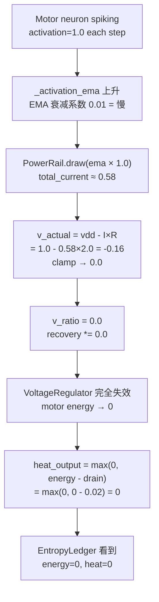

# L6_Mot Energy=0 诊断报告

## 现象

EntropyLedger 报告 Motor 层 (L6_Mot):
```
avg_energy = 0.000
avg_heat   = 0.000
avg_act    = 0.591
```

Motor neuron **有活跃度但零能量** — 这意味着它们在"无能量"状态下运行。

---

## 因果链追踪



### 步骤级数据

| Step | Energy | Heat | EMA | Rail V | Spiked |
|---|---|---|---|---|---|
| 0 | 0.025 | 0.020 | 0.020 | 0.960 | True |
| 5 | 0.058 | 0.054 | 0.114 | 0.773 | True |
| 10 | 0.064 | 0.064 | 0.198 | 0.603 | True |
| 15 | 0.048 | 0.048 | 0.275 | 0.450 | True |
| 1000 | **0.000** | **0.000** | 0.583 | **0.000** | False |

### 关键数据 (1000 步后)

```
cumulative_heat_out  = 3.570  (motor 消耗了 3.57 单位能量)
cumulative_energy_in = 2.501  (只恢复了 2.50 单位)
deficit              = 1.069  (永久亏损)

PowerRail v_actual   = 0.000  ← 根因!
VR recovery          = 0.100  (VR 想给, 但被 v_ratio=0 乘掉)
actual recovery      = 0.000

config.energy (init) = 1.000
basal_metabolic_cost = 0.0008/step
```

---

## 根因分析

### PowerRail R_internal 设定过大

[hebbian.py L292-295](file:///d:/cell-cc/nexus_v1/circuit/hebbian.py#L292-L295):
```python
self._motor_power_rails: Dict[str, PowerRail] = {
    'x': PowerRail(vdd=1.0, r_internal=2.0),  # ← 问题在这里
    ...
}
```

PowerRail 的物理含义：`v_actual = vdd - I × r_internal`

当 **3 个同轴 motor neuron** 各有 EMA ≈ 0.58 时：
```
total_current = 3 × 0.58 × 1.0 = 1.74
v_actual = 1.0 - 1.74 × 2.0 = -2.48 → clamp → 0.0
```

即使只有 **1 个 motor neuron** EMA > 0.5：
```
total_current = 0.5 × 1.0 = 0.5
v_actual = 1.0 - 0.5 × 2.0 = 0.0 → 刚好零!
```

> [!CAUTION]
> **Motor EMA > 0.5 就触发 PowerRail 崩溃**。正常运行中 motor EMA ≈ 0.58 — 永远超过此阈值。

### 为什么之前没发现?

1. Motor 的 `activation` 是 0 或 1（spiking），`_activation_ema` 是慢均值
2. EntropyLedger 之前**从未安装**，没有人追踪过 Motor 的 energy
3. Noether probe 检查的是 `energy_in - energy_out` 的**比值**，energy=0 时比值反而趋于 0（满足约束）
4. Motor neuron 即使 energy=0 也能接收 synaptic input（energy 只影响 VR 恢复和 PowerRail）

---

## 修复选项

### Option A: 降低 R_internal (最小改动)

```python
# 从 r_internal=2.0 → 0.3
# v_actual = 1.0 - 0.58×0.3 = 0.826 (健康)
PowerRail(vdd=1.0, r_internal=0.3)
```

**优点**: 最小改动，一行  
**缺点**: 竞争效应减弱（Phase 3b 的设计目的是同轴竞争）

### Option B: 用 EMA clamp + R_internal 调整

```python
# 1. clamp EMA 贡献到合理范围
total_current = min(mot._activation_ema * 1.0, 0.3)  # cap current draw
# 2. 适当降低 R_internal
PowerRail(vdd=1.0, r_internal=0.5)
```

**优点**: 保持竞争效应，但不崩溃  
**缺点**: 引入新的 magic number (0.3 cap)

### Option C: 切换到 capacity-based 竞争

```python
# 不用 v_actual = vdd - IR 模型
# 改用 shared capacity pool: 每步 recovery 从共享池扣除
# 池有限 → 竞争自然发生，但不会导致 v_actual=0
```

**优点**: 物理上更合理（能量守恒）  
**缺点**: 需要更多改动

---

## 影响范围

- Motor neuron energy=0 → VR recovery=0 → **motor 永远无法恢复能量**
- 但 motor 仍然 spiking（接收 synaptic input 不需要 energy）
- 这意味着 **Motor layer 的 energy 从未参与系统动力学** — 一直是虚设
- Apoptosis 检查 energy < 0.05 for 30k steps — **motor 应该全部 apoptosis**
  - 但 variant_adapter 的 `_check_apoptosis` 可能有保护逻辑？需确认

## 推荐

**Option A** 作为紧急修复。R_internal 从 2.0 降到 0.3，使 PowerRail 在正常运行范围内提供合理的 v_actual。竞争效应通过 R_internal=0.3 仍然存在但不致命。

后续如果需要更精细的竞争，再考虑 Option C。
