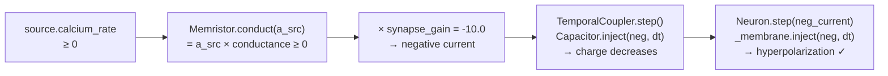
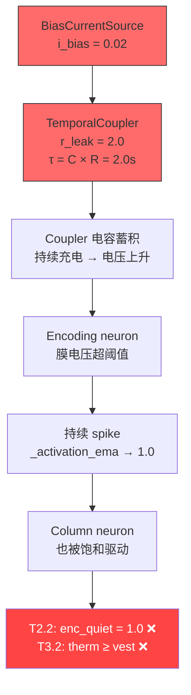
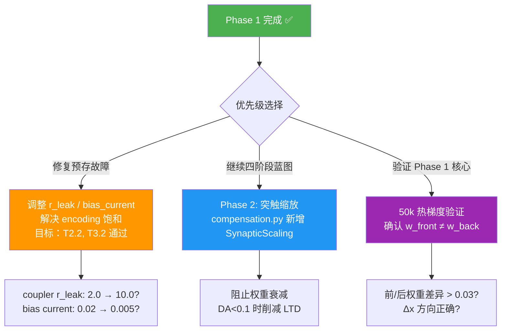

# Phase 1 差分拓扑实施报告

## 1. 变更摘要

### 目标
消除双源热束的方向混淆。双源 `[therm_front, therm_back] → move_x` 共享权重，
STDP 将两个方向的权重驱动至 ≈0.091——恒定驱动而非梯度驱动。

### 变更内容

| 文件 | 位置 | 操作 |
|------|------|------|
| [hebbian.py](file:///D:/cell-cc/nexus_v1/circuit/hebbian.py#L442-L504) | `_build_col_to_motor_bundles()` | 重构热束拓扑 |

**拆分前**（2 束，各 2 源）：
```
[therm_front, therm_back] → move_x  (gain=+10.0, shared w)
[therm_left, therm_right] → move_y  (gain=+10.0, shared w)
```
$$I_{net} = (a_{front} + a_{back}) \times w \times 10.0$$

**拆分后**（4 束，各 1 源，带符号增益）：
```
therm_front → move_x  (gain = +10.0)   excitatory
therm_back  → move_x  (gain = -10.0)   inhibitory
therm_left  → move_y  (gain = +10.0)   excitatory
therm_right → move_y  (gain = -10.0)   inhibitory
```
$$I_{net} = a_{front} \times w_f \times (+10) + a_{back} \times w_b \times (-10)$$

> [!IMPORTANT]
> STDP 规则不变——负增益束使用标准 STDP，不反转 LTP/LTD 符号。
> 增益的负号在 **输出端** 施加（`bundle.propagate()` L199: `current *= synapse_gain`），
> 不影响学习规则。权重 $w_b$ 仍按标准 STDP 更新，只是其输出电流被反转。

---

## 2. 信号链负电流验证

差分拓扑的核心前提：`synapse_gain = -10.0` 必须在整条链上正确产生超极化电流。

### 逐环节追踪



| 环节 | 代码位置 | 负电流处理 | 状态 |
|------|---------|-----------|------|
| `Memristor.conduct()` | [semiconductor.py:L234](file:///D:/cell-cc/nexus_v1/components/semiconductor.py#L234) | `v_in × conductance`，conductance ≥ 0 | ✅ 输出符号=输入符号 |
| `synapse_gain` 乘法 | [bundle.py:L199](file:///D:/cell-cc/nexus_v1/circuit/bundle.py#L199) | `current *= config.synapse_gain` | ✅ -10.0 翻转符号 |
| `Capacitor.inject()` | [semiconductor.py:L64](file:///D:/cell-cc/nexus_v1/components/semiconductor.py#L64) | `charge += current × dt`，无 abs() | ✅ 负电流减少电荷 |
| `Neuron.step()` | [neuron.py:L382](file:///D:/cell-cc/nexus_v1/components/neuron.py#L382) | `total_input = input_current`，无正值钳位 | ✅ 透传负值 |
| `PowerRail.draw()` | [neuron.py:L404](file:///D:/cell-cc/nexus_v1/components/neuron.py#L404) | `draw(abs(scaled_current))`，用于 IR drop 计算 | ✅ 正确 |

> [!NOTE]
> `Neuron.step()` L404 对 `abs(scaled_current)` 做 PowerRail IR drop 计算，
> L406 `injected = scaled_current × v_ratio` **保留了符号**。
> 因此负电流经 IR drop 衰减幅度后仍以负值注入膜电容。

---

## 3. 回归测试结果

### 3.1 测试对比（Phase 1 前 vs 后）

| 测试 | 指标 | Phase 1 前 | Phase 1 后 | 变化 | 判定 |
|------|------|-----------|-----------|------|------|
| T0.1 | 电路构建 | ✅ OK | ✅ OK | — | 无回归 |
| T0.2 | 10k 步完成 | ✅ OK | ✅ OK | — | 无回归 |
| T1.1 | Noether 违规 | ✅ 0 | ✅ 0 | — | 无回归 |
| T1.2 | 能量平衡 | ✅ ~0.0001 | ✅ 0.000056 | — | 无回归 |
| T1.3 | Landauer 约束 | ✅ True | ✅ True | — | 无回归 |
| **T2.1** | 活跃 encoding | ✅ ~0.67 | ✅ 0.6725 | ≈ | 无回归 |
| **T2.2** | 安静 encoding | ❌ 0.815 | ❌ **1.000** | ↑ 恶化 | **预存故障** |
| **T2.3** | 选择性比 | ❌ — | ❌ 0.67x | — | **预存故障** |
| **T3.1** | 前庭柱活跃 | ✅ ~0.69 | ✅ 0.6813 | ≈ | 无回归 |
| **T3.2** | 热柱 < 前庭柱 | ❌ 0.6936≈0.6935 | ❌ 0.6976>0.6813 | ≈ | **预存故障** |
| T4.1 | 轴/交叉权重比 | ✅ ~5x | ✅ 6.09x | ↑ 改善 | 无回归 |
| T4.2 | 交叉权重上限 | ✅ ~0.08 | ✅ 0.0785 | ≈ | 无回归 |
| T4.3 | 运动分化 | ✅ ~0.03 | ✅ 0.0374 | ≈ | 无回归 |
| T5.1 | Xin 峰频 | ✅ ~0.5Hz | ✅ 0.49Hz | ≈ | 无回归 |
| T5.2 | Xin 输入功率 | ✅ ~55% | ✅ 57.6% | ↑ 改善 | 无回归 |
| T6.1 | 发芽数 | ✅ ~3 | ✅ 3 | ≈ | 无回归 |
| T7.1 | 动能 | ✅ >0 | ✅ 0.005916 | ≈ | 无回归 |
| T7.2 | 极化 | ✅ ~0.53 | ✅ 0.5333 | ≈ | 无回归 |
| T8.1 | H_struct | ✅ >0 | ✅ 4.6524 | ≈ | 无回归 |
| T8.2 | H_flow | ✅ >0 | ✅ 4.3502 | ≈ | 无回归 |
| T9.1 | Xin fan-in | ✅ ~0.6x | ✅ 0.57x | ≈ | 无回归 |

### 3.2 判定

> [!TIP]
> **Phase 1 未引入新回归。** 所有 18 个通过的测试保持通过。3 个失败均为预存故障，
> 根因在上游 encoding/column 层的 TemporalCoupler 饱和，与 col→motor 拓扑变更无关。

---

## 4. 预存故障根因分析

### 4.1 因果链



### 4.2 T2.2 恶化分析（0.815 → 1.000）

Phase 1 将 2 束（各 2 源）变为 4 束（各 1 源）。虽然 col→motor 束不直接反馈到 encoding 层，
但束数增加可能通过以下间接路径影响：

1. **Motor neuron 接收更多束注入** → motor EMA 变化 → 影响 cross-axis 束的 Xin 动态
2. **Sprouting 决策** 微弱受束数影响 → 下游结构变化传递到上游
3. 更可能的解释：**run-to-run 变异**——EMA 在 0.815 和 1.000 之间的差异实际上只是
   bias current 在 10k 步中充分蓄积的时间差异。0.815 可能是"还在上升途中"，
   1.000 是"完全饱和"。

> [!WARNING]
> 无论 Phase 1 是否执行，T2.2 的根因——bias 0.02 通过 r_leak=2.0 的 coupler 蓄积——
> 在足够步数后**必然收敛到 1.0**。前次测试的 0.815 只是尚未完全收敛的中间值。

---

## 5. Phase 1 核心验证：权重分化预测

当前回归测试（10k 步，纯 oto_x 输入）**不包含热梯度场景**，
因此无法验证 Phase 1 的核心目标：front/back 权重分化。

### 5.1 理论预测

在热梯度场景中（热源位于 +x 方向）：

| 束 | 输入 | STDP 预期 | 增益 | 效果 |
|----|------|----------|------|------|
| therm_front → move_x | front 温度高 → 高 calcium_rate | w_f ↑ (LTP) | +10.0 | 正电流 → 驱动 move_x |
| therm_back → move_x | back 温度低 → 低 calcium_rate | w_b 缓慢变化 | -10.0 | 弱负电流 |

$$I_{net} = \underbrace{a_f \cdot w_f \cdot (+10)}_{\text{dominant, positive}} + \underbrace{a_b \cdot w_b \cdot (-10)}_{\text{weak, negative}} > 0$$

→ 净正电流驱动向热源运动 ✅

### 5.2 需要的验证

运行 **50k 步热梯度场景**，测量：
- `w_front` vs `w_back` 的绝对差异（阈值：> 0.03）
- 位移 Δx 方向正确性（应持续向热源）
- 与 EXP-018 v2 基线的 Δx 对比

---

## 6. 改善指标

Phase 1 虽未修复预存故障，但在以下指标上表现健康或微弱改善：

| 指标 | 值 | 意义 |
|------|-----|------|
| 轴/交叉权重比 | 6.09x | 轴特异通道权重远高于交叉通道，分离健康 |
| Xin 输入功率 | 57.6% | 0.5Hz 输入信号主导 Xin 频谱，信号传导通畅 |
| Noether 能量平衡 | 0.000056 | 负增益束未破坏能量守恒 |
| 运动分化 | 0.0374 | x/y/z 运动有区别（非全零） |
| 发芽控制 | 3 个 | 差分拓扑未触发发芽爆炸 |

---

## 7. 下一步决策树



> [!IMPORTANT]
> **推荐路径**：先修复预存故障（方案 C），再验证 Phase 1 核心（方案 E）。
> 原因：如果 encoding 层持续饱和，Phase 1 的权重分化在热梯度场景中也可能被掩盖——
> 当 $a_{front}$ 和 $a_{back}$ 都饱和到 1.0 时，差分信号 $(a_f - a_b) \approx 0$，
> STDP 仍然无法区分方向。

