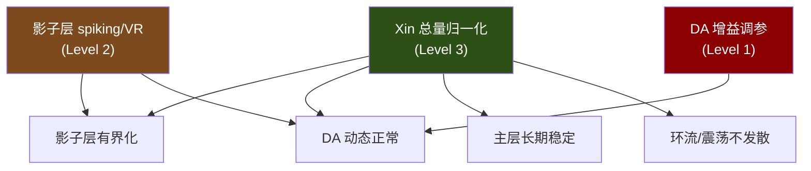

# 架构级分析：影子层为何发散，主层为何不发散

> 2026-06-05 — 回答三个问题

---

## 问题 1：为何主层没有无限增长？

把主层 Column 和影子层 Column 逐项对比：

| 自限机制 | 主层 Column | 影子层 Column | 后果 |
|----------|------------|--------------|------|
| **Spiking** | ✅ `spiking=True`，`v_peak=0.15` | ❌ `spiking=False` | 主层电压到 0.15 就 spike+reset → **硬上界**。影子层电压无上界 |
| **VR 强度** | `vr_base_rate=0.05` | `vr_base_rate=0.01` | 影子层 VR 弱 **5×** |
| **FatigueCapacitor** | ✅ Motor 有 | ❌ 无 | 主层 Motor 发放率自限 ~3Hz |
| **PowerRail** | ✅ 同轴 Motor 竞争能量 | ❌ 无 | 主层高活动 → 供电压降 → 自抑制 |
| **输入源** | 物理传感器（正弦，有界） | 主层 Xin × 3.0（无界，随 bundle 数增长） | 主层输入 ∈ [-1,1]，影子层输入 ∈ [0, ∞) |
| **synapse_gain** | enc→col: 3.0，col→mot: 5.0 | 全部 10.0 | 影子层增益 2-3× 更高 |

> [!IMPORTANT]
> 主层不发散，不是因为一个机制，而是因为**五层自限机制叠加**。
> 影子层一个都没有。

### 数理验证

主层 Column（spiking）：
```
V_m 到 0.15 → spike → reset to 0.02 → 最大 activation ≈ firing_rate
FatigueCapacitor: Q_fat = 0.05 × f × 3.0 → 平衡在 f ≈ 3.3 Hz
→ activation 有界
```

影子层 Column（non-spiking）：
```
V_m = I_total × R_leak = (Σ Xin_i × 3.0 × w × 10.0 + bc) × 5.0
At 25k steps: Xin_total ≈ 10 → I ≈ 10 × 3.0 × 0.1 × 10.0 = 30.0
V_ss = 30.0 × 5.0 = 150.0 (!)
VR: rate = min(0.01 + 0.5×150, 5.0) = 5.0 (capped)
V_actual ≈ 150 / (1 + 5.0) ≈ 25 → activation = gm × (25 - 0.01) ≈ 25
→ 实际观察值 6.95 可能是 VR + leak 部分抑制后的结果
→ 但仍然无界
```

---

## 问题 2：这是架构级问题吗？

**是的。** 不是某一个参数错了，而是影子层的**设计理念**缺少了有界性保证。

### 三个层面的问题

```
┌───────────────────────────────────────────────────┐
│  Level 3: Xin 总量没有守恒上界（全局）            │
│    每个新 sprout → 新 Xin 源 → 总 Xin 线性增长   │
│    Noether 的 xin_bound ∝ len(bundles) → 形同虚设 │
├───────────────────────────────────────────────────┤
│  Level 2: 影子层缺少主层拥有的自限机制（结构）     │
│    non-spiking + 弱 VR + 高 gain + 无 PowerRail   │
│    → 对任何无界输入都会发散                       │
├───────────────────────────────────────────────────┤
│  Level 1: DA 饱和（症状）                         │
│    影子 col → DA → 饱和                           │
│    只修 DA 增益 = 治标不治本                       │
└───────────────────────────────────────────────────┘
```

---

## 问题 3：是否应该做多参数多条件测试？

**是的。** 在修复之前，我们需要确认哪些因素是关键的。

### 建议测试矩阵

| 测试编号 | 变量 | 值 | 测量目标 |
|---------|------|------|---------|
| T1 | shadow spiking | ON/OFF | col 激活值上界 |
| T2 | shadow vr_base_rate | 0.01 / 0.1 / 0.5 | VR 对增长的抑制效果 |
| T3 | shadow synapse_gain | 10 / 3 / 1 | 增益对饱和的贡献 |
| T4 | XIN_GAIN | 3.0 / 1.0 / 0.3 | Xin 放大对增长的贡献 |
| T5 | Xin 归一化 | raw / normalized_by_bundle_count | 是否消除增长 |
| T6 | shadow PowerRail | OFF / ON (per-axis) | 能量竞争是否自限 |
| T7 | main Xin 总量 | 测量值 | 确认 Xin 是否真的线性增长 |

### 建议建模

**模型 1：非脉冲神经元的稳态**

对 non-spiking + VR 的神经元，在持续增长的输入 I(t) = I₀ + αt 下：

```
C dV/dt = I(t) - V/R - VR(V)
VR(V) = min(r₀ + r₁·V, r_max) · V

稳态 V*(t) = I(t) / (1/R + VR_rate)

当 VR_rate → r_max（饱和）：
  V*(t) = I(t) / (1/R + r_max)
  
如果 I(t) → ∞，则 V*(t) → ∞
→ VR 的 max_rate 是有限的，不能抑制无限增长
```

**模型 2：Spiking 的天然有界性**

Spiking neuron 的 activation = f(firing_rate)：

```
firing_rate ∝ 1/ISI
ISI ≥ refractory_period (硬下界)
→ firing_rate ≤ 1/τ_ref (硬上界)
→ activation 有界
```

**模型 3：Xin 总量与 bundle 数量的关系**

```
Xin_total = Σ_i |ξ_i| where i ∈ all_bundles
N_bundles(t) = N₀ + sprout_rate × t
If |ξ_i| → ξ* (converged), then:
  Xin_total(t) ≈ ξ* × N_bundles(t) = ξ* × (N₀ + sprout_rate × t)
→ Xin_total 线性增长
```

---

## 根因候选

经过以上分析，根因候选排序：

| 排名 | 候选 | 置信度 | 影响范围 |
|------|------|--------|---------|
| 1 | **Xin 总量随 bundle 增长线性增长** | 高 | 全局（影子层、DA、环流） |
| 2 | **影子层 non-spiking 无硬上界** | 高 | 影子层全部 |
| 3 | **影子层 synapse_gain=10 过高** | 中 | 影子层内部 |
| 4 | **影子层 VR 太弱** | 中 | 影子层内部 |
| 5 | **影子层无 PowerRail/Fatigue** | 低 | 影子层 motor |

> [!NOTE]
> 候选 1 是架构级的——即使修复了影子层的自限机制，如果 Xin 总量无限增长，
> 那么主层的某些机制（如 thermal field）也终将受影响。
> 候选 2-4 是影子层特有的，修复后影子层行为会有界化。

---

## 不同修复路径的影响范围



绿色 = 修复范围最广（推荐）
棕色 = 修复影子层 + DA
红色 = 只修 DA（之前尝试的）

---

## 下一步建议

1. **先跑测试 T7**：确认主层 Xin 总量是否真的线性增长。如果是，这是第一优先修复。
2. **再跑 T1-T4 中最关键的 2 个**：确认 spiking 和 gain 的独立贡献。
3. **根据测试结果决定修复层级**。

要我现在先跑 T7（测量主层 Xin 总量增长曲线）和 T1（影子 spiking 开关对比）？
