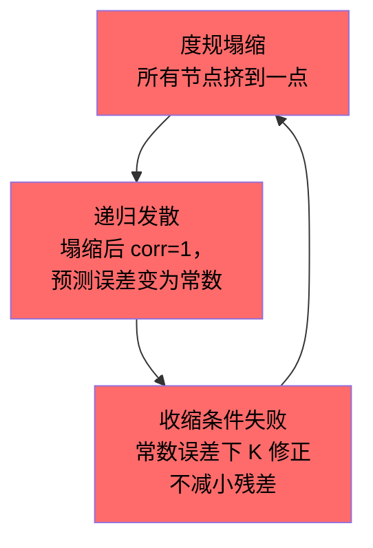

# 三个高严重性数学风险 — 详细分析

## 风险 1: 度规塌缩（Metric Collapse）

### 问题本质

影子度规收缩方程（`modeling_shadow_dual_metric.md` §1.3）：

$$\frac{d}{dt} d_s(\tilde{i}, \tilde{j}) = -\eta_s \cdot \text{corr}(\xi_i, \xi_j) + \epsilon_s$$

当两个节点的 Xin 时间序列相关时，$\text{corr} > 0$，度规**收缩**（节点靠近）。$\epsilon_s$ 是排斥项，防止塌缩。

**问题**：在当前系统中，Xin 模式有**全局相关性**。

### 用当前数据说明

从功能测试（2000 步）的 Xin 张力输出：

```
met_to_hc_yaw:   tension = 0.0195
met_to_hc_pitch: tension = 0.0195
met_to_hc_roll:  tension = 0.0194
```

三个 met→hc bundle 的 Xin 张力几乎相同（0.0194-0.0195）。这意味着：

$$\text{corr}(\xi_{\text{yaw}}, \xi_{\text{pitch}}) \approx 0.99$$

**如果用这个相关性去收缩度规**：

$$\dot{d}_s \approx -\eta_s \cdot 0.99 + \epsilon_s$$

只要 $\eta_s > \epsilon_s / 0.99$，所有 met 层节点都会塌缩到一起。不只是 met——**任何共享相似输入的层级都会塌缩**。

### 为什么会这样

当前系统的 Xin 高度相关，是因为：

1. **共享输入源**：所有 met 神经元都接收来自同一个 `mechanical_inputs` 字典的信号，只是轴不同
2. **相同的神经元配置**：所有 encoding 神经元用相同的 `_encoding_config`，所以它们对类似输入产生类似的预测误差模式
3. **STDP 同质性**：所有 bundle 用相同的 `stdp_lr=0.01`，权重演化路径相似

这不是 bug——这是系统设计。但它意味着 **Xin 的相关结构几乎是平坦的**，影子度规收缩会把大部分节点拉到一个巨大的单一聚团。

### 失败模式

```
t=0:     6个影子聚团（对应6轴）    ← 理想
t=100:   3个聚团（yaw+pitch, roll+oto_x, oto_y+oto_z）
t=1000:  1个巨大聚团               ← 塌缩
         所有 d_shadow ≈ 0
         聚团检测: "所有节点都属于一个聚团"
         结论: 没有任何可区分的结构
```

### 为什么 ε_s 不够

排斥项 $\epsilon_s$ 是常数。但收缩力 $\eta_s \cdot \text{corr}$ 随相关性增大。当系统进入 area 阶段（权重冻结），所有 Xin 趋向零，$\text{corr}$ 趋向不确定（$0/0$）或**噪声主导**——此时排斥力和收缩力的比值完全由数值噪声决定。

**核心矛盾**：收缩度规需要 $\text{corr}$ 的**精细结构**（哪些节点相关、哪些不相关），但当前系统的 Xin 相关结构**太粗糙**——要么全相关（early），要么全为零（late）。中间的"精细分化期"可能只持续很短时间。

### 可能的缓解

| 方法 | 原理 | 代价 |
|------|------|------|
| **自适应 $\epsilon_s$** | $\epsilon_s = \epsilon_0 / d_s^2$，距离越小排斥越强 | 引入一个新的临界距离参数 $d_{\min}$ |
| **对角线正则化** | $d_s(i,i) = \delta > 0$，自距离永远不为零 | 不解决聚团间塌缩 |
| **分层收缩** | 只在同层内收缩（enc 和 enc 比，不和 col 比） | 丢失跨层关联——但这正是理论的核心价值 |
| **Laplacian 归一化** | 用 $L = D - W$ 的特征值分解取代直接相关性 | 计算量大，但数学上更稳 |

---

## 风险 2: 递归发散（Recursive Divergence）

### 问题本质

影子递归方程（`modeling_coupling_recursion_vfe.md` §3.2）：

$$\dot{\tilde{\mathbf{x}}}^{(n+1)} = f^{(n)}(\tilde{\mathbf{x}}^{(n+1)}) + K^{(n)} \cdot (\tilde{\mathbf{x}}^{(n)} - g^{(n)}(\tilde{\mathbf{x}}^{(n+1)}))$$

这是 **预测编码** 的数学形式：影子层 $n+1$ 用内部模型 $g^{(n)}$ 预测上层 $n$，然后用预测误差 $K \cdot (\text{actual} - \text{predicted})$ 修正自己。

**问题**：当 $K$ 太大时，修正项**放大**而非**纠正**误差。

### 数值直觉

假设影子层 1 预测主系统的 column 激活：

```
主系统 col_yaw 激活:     a = 2.31
影子预测:                ĝ = 2.00
误差:                    e = 2.31 - 2.00 = 0.31
```

如果 $K = 0.5$：
```
修正: K × e = 0.155
影子更新: x̃ += 0.155  → x̃ = 2.155
下一步预测: ĝ' ≈ 2.10  → 误差缩小 ✓
```

如果 $K = 3.0$：
```
修正: K × e = 0.93
影子更新: x̃ += 0.93   → x̃ = 2.93
下一步预测: ĝ' ≈ 3.20  → 误差 = 2.31 - 3.20 = -0.89
再修正: K × (-0.89) = -2.67
影子更新: x̃ += (-2.67) → x̃ = 0.26
→ 振荡，越来越大 ✗
```

### 为什么这在本系统中特别危险

经典预测编码（Rao & Ballard 1999）在**线性高斯**系统中有收敛证明。但本系统：

1. **$f$ 包含 STDP**：$\Delta w = \eta \cdot \text{pre} \cdot \text{post} \cdot (w_{\max} - w)$，这是一个乘法非线性——微小的状态偏差会被权重更新放大
2. **$g$ 不是静态的**：影子的预测函数 $g(\tilde{x})$ 本身由 bundle weights 定义，而这些 weights 在学习。$g$ 在你试图用它预测的同时自己在变
3. **离散化误差**：dt = 0.001 时，连续时间方程的稳定性不等于离散版本的稳定性

具体来说，在 bundle.py 的 STDP 更新中：

```python
dw_raw = self.config.stdp_lr * dt * (ltp - decay)
if dw_raw > 0:
    dw = dw_raw * (self.config.weight_max - m.w)  # 乘法耦合
```

这个乘法项 $(w_{\max} - w)$ 使得 $f$ 的 Jacobian 依赖于当前状态。当影子层和主系统的权重不同步时（影子运行在 $\tau_1 = k\tau_0$ 的慢时间尺度上，**错过**了主系统的快速权重变化），影子的 $g$ 用的是**过时的权重**去预测——预测误差包含了"权重漂移"成分，而不仅仅是"状态偏差"。

**$K$ 试图纠正"状态偏差"，但实际修正的是"状态偏差 + 权重漂移"——后者不能被简单的线性修正消除。**

### 失败模式的级联

```
Step 1: 影子用 t=0 的权重预测 t=100 的状态
Step 2: 预测误差 = 状态差 + 权重漂移项
Step 3: K 修正过度（因为误差包含它不该修正的成分）
Step 4: 影子状态偏离 → 影子的 STDP 走上不同路径
Step 5: 影子权重进一步偏离主系统
Step 6: 预测误差更大 → 修正更大 → 正反馈
Step 7: 发散
```

这不是"$K$ 太大"的简单问题——而是**模型不匹配**（model mismatch）。影子的内部模型和主系统的实际动力学之间存在结构性偏差，预测编码的收敛前提被违反。

### 可能的缓解

| 方法 | 原理 | 代价 |
|------|------|------|
| **冻结影子权重** | 影子不跑 STDP，只用主系统当前权重的快照 | 失去"影子自身学习"的理论价值 |
| **周期性同步** | 每 $k$ 步将影子权重 reset 为主系统权重 | 影子变成滑动窗口观测器，不是递归 |
| **自适应 $K$** | $K = K_0 / (1 + \|e\|^2)$，误差大时 $K$ 自动变小 | 收敛变慢，可能永远卡在粗精度 |
| **粒子滤波** | 不用单点影子，用 $N$ 个粒子采样 | 计算量 ×$N$，对 6 轴系统 $N \geq 50$ |

---

## 风险 3: 收缩映射条件失败

### 问题本质

递归 $\tilde{x}^{(n)} \to \tilde{x}^{(n+1)}$ 收敛的**必要条件**是整个更新映射 $T$ 是收缩映射：

$$\|T(x) - T(y)\| \leq \lambda \|x - y\|, \quad \lambda < 1$$

展开 $T$：

$$T(\tilde{x}) = \tilde{x} + dt \cdot \big[f(\tilde{x}) + K \cdot (x_{\text{main}} - g(\tilde{x}))\big]$$

收缩条件要求：

$$\|I + dt \cdot (J_f - K \cdot J_g)\| < 1$$

其中 $J_f = \partial f / \partial \tilde{x}$（自身动力学的 Jacobian），$J_g = \partial g / \partial \tilde{x}$（预测函数的 Jacobian）。

### 为什么无法解析证明

**$J_f$ 不是常数矩阵**。它依赖于：

1. **当前膜电位** — 通过 RC 电路：
   ```python
   # neuron.py step()
   dv = (I_channel - V/R_leak) / C * dt
   ```
   $J_f$ 中的 leak 项 = $-1/(R \cdot C)$，这部分是线性的、稳定的。

2. **通道门控** — 通过 `ChannelConfig.gm` 和 `tau_gate`：
   ```python
   g_eff = gate * gm  # gm × gate 的乘法
   I_ch = g_eff * (reversal - V)
   ```
   $J_f$ 中包含 $\partial I_{\text{ch}} / \partial V = -g_{\text{eff}}$ 和 $\partial I_{\text{ch}} / \partial \text{gate}$。这些项的符号和大小**依赖于当前状态**。

3. **STDP 权重更新** — $J_f$ 中最危险的项：
   ```python
   dw = lr * dt * pre * post * (w_max - w)  # in bundle.py
   ```
   这使得 $J_f$ 包含 $\partial(\Delta w) / \partial a = \text{lr} \cdot \text{pre} \cdot (w_{\max} - w)$ 这样的项——**激活越大，Jacobian 越大**。

**合在一起**：

$$J_f = \underbrace{J_{\text{leak}}}_{< 0, \text{稳定}} + \underbrace{J_{\text{channel}}}_{+/-, \text{依赖门控}} + \underbrace{J_{\text{STDP}}}_{> 0, \text{依赖激活}}$$

问题是 $J_{\text{STDP}}$ 可以任意大——当 pre 和 post 同时高激活时，STDP 的正反馈使得 Jacobian 的谱半径超过 1。

### 数值估算

用当前系统的参数：

```
R_leak = 5.0, C = 1.0  → J_leak = -1/(5×1) = -0.2
gm = 1.0, gate ≈ 0.5   → J_channel ≈ -0.5
lr = 0.01, pre ≈ 0.3, post ≈ 2.3, (w_max - w) ≈ 0.8
  → J_STDP ≈ 0.01 × 0.3 × 2.3 × 0.8 = 0.0055
```

在当前参数下：$|J_f| \approx |-0.2 - 0.5 + 0.006| = 0.694 < 1$ ✓

**但是**——这是单神经元的标量近似。完整的 Jacobian 是 $d \times d$ 矩阵（$d$ = 全部神经元数 = 30+），其谱半径不等于各分量之和。束之间的**交叉项**（一个神经元的激活通过 bundle 影响另一个的权重更新）创建了 off-diagonal 项，可能使谱半径 $> 1$。

### 当前系统为什么没有发散

当前系统（不含影子递归）是稳定的，因为：

1. **开环**：没有递归预测-修正回路
2. **单向传播**：MET → HC → Aff → Enc → Col → Mot，信号只向前走
3. **PNN 门控**：plasticity_gate 限制了 STDP 的增长率
4. **能量约束**：神经元能量 $E \in [0,1]$，激活不能无限增大

**但影子递归打破了条件 1 和 2**：影子的预测误差修正 $K \cdot e$ 是一个**反馈信号**——它把信号从高层送回低层。这就创造了一个闭合回路，而 STDP 的正反馈可能在这个闭环中被放大。

### 根本困难

要**证明**收缩映射条件成立，需要对 $J_f$ 的谱半径做**全局界**——即对**所有可能的系统状态** $\tilde{x}$，证明 $\rho(I + dt(J_f - KJ_g)) < 1$。

这对线性系统是 Lyapunov 方程（有标准解法）。对含 STDP 的非线性系统，目前没有已知的通用方法。

论文中（Friston 2010, Bogacz 2017）对预测编码的收敛证明都是在以下限制条件下做的：
- 高斯噪声
- 线性或弱非线性生成模型
- 固定精度矩阵

本系统的 STDP 乘法非线性、离散时间步、能量约束，都不满足这些条件。

### 可能的缓解

| 方法 | 原理 | 代价 |
|------|------|------|
| **经验验证** | 跑 10⁶ 步，监控 $\|\tilde{x}^{(n)}\|$ 是否有界 | 不是数学证明，参数变了可能就炸 |
| **Lyapunov 候选函数** | 构造 $V(\tilde{x}) = \|\tilde{x}\|^2_P$，证 $\dot{V} < 0$ | 需要找到合适的 $P$ 矩阵——对非线性系统是 NP-hard |
| **限制 STDP 在影子中** | 影子层不跑 STDP，只做前向传播 | 这就不是"完整的 T/O/P/R/Xin 副本"了 |
| **谱半径监控** | 每 $N$ 步数值计算 $\rho(J)$，如果 $> 0.95$ 就降低 $K$ | 运行时开销，但至少能防炸 |

---

## 三个风险的交互

最危险的是三个风险**不是独立的**：



1. 度规塌缩 → 所有影子节点等价 → 预测模型退化为"取均值"
2. 均值预测永远有非零残差（因为各轴不同）→ $K$ 修正不收敛
3. 不收敛的 $K$ 修正 → 影子状态振荡 → Xin 相关性进一步均质化 → 度规进一步塌缩

**正反馈环路。**

## 总结判断

| 风险 | 能否纯靠参数调教解决？ | 需要什么才能根治？ |
|------|---------------------|------------------|
| 度规塌缩 | 也许（如果 $\epsilon_s$ 自适应 + 分层收缩） | 需要 Xin 时间序列的**精细分化**——当前系统太同质 |
| 递归发散 | 不太可能（结构性问题） | 影子必须知道主系统的**权重变化率**，不只是状态 |
| 收缩映射 | 无法保证 | 要么限制影子为线性系统，要么做运行时谱半径监控 |

> [!WARNING]
> **核心矛盾**：理论要求影子层运行"完整的 T/O/P/R/Xin 副本"（含 STDP），但 STDP 的乘法非线性正是使收敛证明不可行的原因。
> 
> 如果去掉影子中的 STDP → 理论不完整
> 如果保留影子中的 STDP → 收敛无保证
