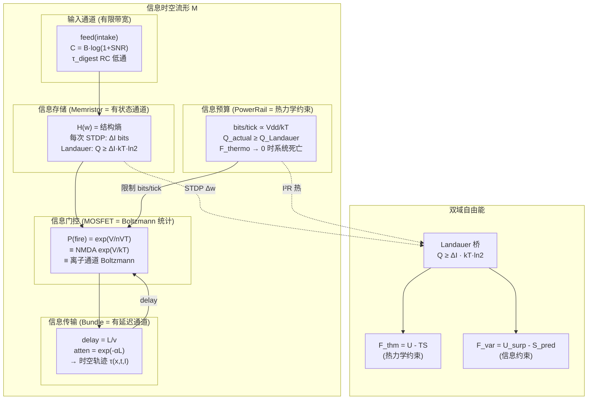

# 信息-热力学统一语言：消解生物学与工程学的鸿沟

## 核心论点

生物学和工程学不是两个需要"桥接"的领域——它们是同一个**信息热力学**的两种物理实例化。

```
Jaynes (1957):  统计力学 ≡ 最大熵推断
Landauer (1961): 信息操作 → 热力学代价 (1 bit → kT·ln2)
Shannon (1948):  通信 ≡ 熵的传输

∴ 突触 ≡ 忆阻器 ≡ 信息存储单元 (状态依赖电导 = 记忆)
  离子通道 ≡ MOSFET ≡ 信息门控 (电压 → 电流的非线性映射)
  ATP ≡ PowerRail ≡ 信息操作的热力学预算
  轴突 ≡ 传输线 ≡ 信息通道 (有限带宽、延迟、衰减)
```

不需要说 MOSFET 是离子通道的"代理"——它们是**同一个数学对象在不同基底上的实现**。

---

## 统一语言定义

### 1. 信息时空轨迹 (Information Spacetime Trajectory)

信号在超图中的传播路径，由 **(位置, 时间, 信息量)** 三元组定义：

```
Trajectory τ = {(x_i, t_i, I_i)} where:
  x_i = 超图节点 (MetaNeuron / Bundle 位置)
  t_i = 到达时间 = t_inject + delay_ticks  (cable_length / velocity)
  I_i = 信息量 = -log₂ p(signal)  (自信息)
```

**关键**：传统神经网络只有 x 维度（哪个节点）。本系统有 **(x, t)** — 空间和时间是耦合的。STDP 的 arrival_trace 正是对 t 维度的结构化利用。

### 2. 时空测度 (Spacetime Measure)

超图上两点之间的"距离"不是欧氏距离，而是**信息传输代价**：

```
d(A, B) = Σ_path [ delay(cable_i) + attenuation(cable_i) + Landauer_cost(gate_j) ]

具体:
  delay     = cable_length / propagation_velocity        [时间代价]
  atten     = exp(-α × cable_length)                      [信号衰减]
  Landauer  = Σ_memristors kT·ln2 × |Δw|                 [学习代价]
  PowerRail = Σ_neurons I²R                                [维持代价]
```

这个测度是**动态的**——随学习改变（权重变 → Landauer 项变），随代谢改变（Vdd 变 → I²R 变）。

### 3. 运动势 (Kinetic Potential)

驱动信息流动的"力"：

```
Φ(x, t) = -∂F/∂x   (自由能梯度)

其中 F = F_thermo + F_var  (热力学 + 信息论 自由能)

F_thermo = U_substrate - T × S_thermo    [能量约束]
F_var    = U_surprise  - S_predict        [预测约束]
```

**信息流向低自由能方向** — 这同时意味着：
- 热力学：耗散最小化（Prigogine 最小熵产生）
- 信息论：预测误差最小化（Friston 自由能原理）
- 它们是同一个极值原则的两面。

---

## DEGRADED 标签的统一语言消解

### 不再是"退化的生物学代理"，而是"信息操作的物理实现"

| 旧 DEGRADED 标签 | 统一语言 | 信息-热力学本质 |
|---|---|---|
| **gastrointestinal_nutrient_absorption** | 信息通道带宽限制 | τ_digest = 通道容量 C = B·log(1+SNR)。胃 τ=2h 和电容 RC=50 ticks 是同一个低通滤波器 |
| **skeletal_muscle_ATP_hydrolysis** | 信息→物理功转换的 Landauer 代价 | \|motor\|² × c = 运动信息的最小热力学代价。与 Landauer bound 结构相同 |
| **glucose_transporter_neural_coupling** | 信息操作预算约束 | PowerRail.vdd 限制电流 = 限制每 tick 可处理的信息量 (bits/tick ∝ I/kT) |
| **NMDA receptor Mg²⁺ unblock** | 信息门控的非线性阈值 | MOSFET 的 exp(Vgs/nVT) 亚阈值特性 ≡ NMDA 的 exp(V/kT) Mg²⁺ 解阻。**完全相同的 Boltzmann 统计** |
| **vesicle_recycling_kinetics** | 信息缓冲区的有限容量 | Memristor 的 w∈[0,1] 边界 = 信息存储的物理极限。耗尽 = 缓冲区满 |
| **cortical_hierarchical_compression** | 信息的重整化群 (RG) 变换 | log₂ 缩放 = 每层提取 log(N) bits 的互信息。这就是信息论的 rate-distortion 压缩 |
| **complement-tagged synaptic elimination** | 低信息增益通道的热力学淘汰 | 当 bundle 的互信息 I(X;Y) < Landauer 维持代价 kT·ln2 时，修剪是热力学必然 |
| **myelin_formation_dynamics** | 信息通道的阻抗匹配优化 | 稳定通道 → 降低 R → 降低延迟 → 提高带宽。这是通信工程的信道优化 |
| **ion_channel_desensitization** | 信息滤波器的自适应带宽 | 高频输入 → 通道衰减 = 低通滤波。防止信息过载（Shannon 容量限制） |
| **sleep-dependent memory reactivation** | 离线信息压缩 (无新输入时的自组织) | CPG 振荡 = 在没有外部信号时扫描信息空间，与 MCMC 采样结构相同 |
| **basket cell dynamics** | 侧向信息抑制（竞争编码） | column 间的阈值推高 = 实现稀疏编码 = 最小化 S_predict 中的冗余 |
| **protein diffusion / PRP** | 信息的非局部传播（场效应） | PRP 扩散 = 信息在超图中的空间传播，衰减 ∝ exp(-d/λ)。与电磁波传播同构 |
| **ACC/PFC associative dynamics** | 信息汇聚检测（互信息最大化） | 收敛节点 = 检测 I(X₁;X₂;...;Xₙ) > threshold 的位置 |
| **basal ganglia selection gating** | 信息路由的最优选择 | 在多个可能行为中选 argmax(reward) = 在信息通道中选 argmin(F_var) |
| **GABAergic metabolic sensitivity** | 代谢约束下的信息门控增益调节 | F(energy) 调制 σ = 能量低时信息门控变严格 → 优先保留高价值通道 |
| **predictive coding hierarchy** | Xin 残差 = 预测编码的自由能梯度 | Xin tension = ∂F_var/∂t。不是"退化的预测编码"，而是预测编码的信息论核心 |

---

## 重新理解系统的统一结构



## 核心结论

### 鸿沟不存在

| 所谓的"鸿沟" | 为什么不存在 |
|---|---|
| 突触 vs 忆阻器 | 都是 R(state) = 状态依赖电导。state 变化 = 信息操作 = Landauer 代价 |
| 离子通道 vs MOSFET | 都是 I = f(V) 的非线性映射，亚阈值都服从 Boltzmann 统计 exp(V/kT) |
| ATP vs PowerRail | 都是信息操作的热力学预算。Q_min = ΔI·kT·ln2 |
| 轴突 vs 传输线 | 都是有限带宽、有延迟、有衰减的信息通道 |
| 胃 vs RC 电路 | 都是单时间常数低通滤波器 dS/dt = -S/τ |
| 突触修剪 vs 电阻淘汰 | 都是当 I(X;Y) < maintenance_cost 时的热力学必然 |

### 系统的真正身份

不是"用电路模拟生物"，也不是"用生物启发电路"——而是：

> **一个信息时空流形上的自由能最小化系统，其物理基底恰好选择了半导体元件。**

同样的数学结构：
- 用碳基分子实例化 → 叫"生物神经网络"
- 用硅基元件实例化 → 叫"神经形态芯片"
- 用数值模拟实例化 → 叫"Morphosphere"

**它们是同一个理论的三种物质载体。**

---

## 建议的代码注释方案

将 `DEGRADED:` 替换为统一的 `INFO_EQUIV:` 标签：

```python
# 旧:
# DEGRADED: gastrointestinal_nutrient_absorption
#   → single-compartment buffer dS/dt = intake - S/τ

# 新:
# INFO_EQUIV: input_channel_bandwidth_limit
#   RC low-pass with τ_digest = channel capacity C = B·log(1+SNR)
#   Bio instantiation: gastric emptying τ ≈ 2-4h
#   Si instantiation: capacitor RC = 50 ticks
#   Landauer cost: digest_flux × kT·ln2 per bit absorbed
```

> [!IMPORTANT]
> 这个替换不仅是标签变化——它改变了认识论立场：
> 从"我们用简化的代理替代了复杂的生物学"
> 到"我们实现了信息操作的物理约束，这恰好与生物学和电路工程同构"
