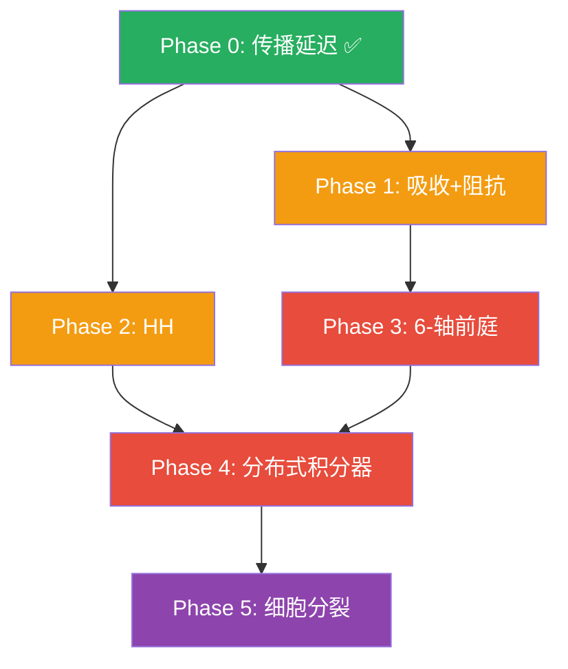

# Morphosphere 降级回升路线图

**目标**: 每次回升一个降级 → 测量对 DERC/偏好的影响 → 产出一篇论文  
**原则**: 按"科学杠杆率"排序（最小代码改动 → 最大预测变化）

---

## 回升状态总览

```
Phase 0  ████████████████████  传播延迟          ✅ 已完成 (v40.11)
Phase 1  ░░░░░░░░░░░░░░░░░░░░  介质吸收 + 阻抗    待启动
Phase 2  ░░░░░░░░░░░░░░░░░░░░  HH 离子通道       待启动
Phase 3  ░░░░░░░░░░░░░░░░░░░░  6-轴前庭          待启动
Phase 4  ░░░░░░░░░░░░░░░░░░░░  分布式积分器       待启动
Phase 5  ░░░░░░░░░░░░░░░░░░░░  细胞分裂动力学     待启动
```

---

## Phase 0: 传播延迟 ✅ 已完成

**回升**: `received_at()` 中 $t \to t_{ret} = t - r/v$

**结果**: DERC 曲线显著改变, n=3 反弹从 5.35 → 8.97 (+68%)

**论文**: 已包含在论文 2 数据中

---

## Phase 1: 介质吸收 + 阻抗匹配 (2 周)

### 回升内容

#### [MODIFY] [practice_engine.py](file:///D:/cell-cc/Morphosphere_v37_0_native_runtime_prototype_flat_complete/morphosphere_v2pp/engines/practice_engine.py)

**1a. 频率依赖吸收**
```python
# 当前:  Φ = A / r^n
# 回升:  Φ = A / r^n · exp(-α(ω) · r)
#
# α(ω) = α_0 · (ω / ω_ref)^β
#   acoustic:  α_0 = 0.01, β = 1.0  (空气中声波吸收 ∝ f)
#   thermal:   α_0 = 0.05, β = 0.5  (热扩散吸收 ∝ √f)
#   luminous:  α_0 = 0.001, β = 0    (光在空气中几乎不衰减)
```

**1b. 阻抗匹配**
```python
# 当前:  源振幅直接耦合到积分器
# 回升:  Φ_received = Φ_field · T(Z_source, Z_observer)
#        T = 2·Z_obs / (Z_obs + Z_src)  (透射系数)
#
# 当 Z_obs ≈ Z_src 时, T → 1 (完美匹配)
# 当 Z_obs ≪ Z_src 时, T → 0 (大部分被反射)
```

### 科学预测

> **假说 1.1**: 吸收项引入有效截止距离 $r_{cut} \sim 1/\alpha$。
> 当 $r > r_{cut}$ 时, 场为零 → DERC 曲线获得一个上界 $L_{max} = r_{cut}$。
>
> **假说 1.2**: 不同模态的 $\alpha$ 差异创造"感知半径"分化：
> acoustic 能感知到 $r_{cut}^{aco} \sim 100$，
> thermal 只能感知到 $r_{cut}^{the} \sim 20$。
>
> **假说 1.3**: 阻抗失配使积分器接收到更少信号 → E[L] 进一步增大。

### 验证方案

```python
# 实验: 扫描 α ∈ [0, 0.1], 测量 DERC 变化
# 对照: α=0 应复现 Phase 0 的结果
# 预测: 高 α 源的 E[L] 应该有上界
```

### 论文方向

> **Paper 3**: *"Absorption Radius and Impedance Matching: How Medium Properties Shape Behavioral Sensing Range"*

---

## Phase 2: Hodgkin-Huxley 离子通道 (3 周)

### 回升内容

#### [MODIFY] [physics_particle_system.py](file:///D:/cell-cc/Morphosphere_v37_0_native_runtime_prototype_flat_complete/morphosphere_v2pp/engines/physics_particle_system.py)

```python
# 当前:  LIF 模型
#   tau_m · dV/dt = -(V - V_rest) + R_m · I_ext
#   V > V_thresh → spike
#
# 回升:  HH 模型 (4 变量)
#   C_m · dV/dt = -g_Na·m³h·(V-E_Na) - g_K·n⁴·(V-E_K) - g_L·(V-E_L) + I_ext
#   dm/dt = α_m(V)·(1-m) - β_m(V)·m
#   dh/dt = α_h(V)·(1-h) - β_h(V)·h
#   dn/dt = α_n(V)·(1-n) - β_n(V)·n
```

### 科学预测

> **假说 2.1**: HH 的 spike 有形状（宽度、幅度），LIF 的 spike 是 delta 函数。
> HH spike 宽度 ∝ 1/temperature → 温度影响信号编码 → 温度影响偏好。
> **这创造了一个 thermal 源的间接反馈回路。**
>
> **假说 2.2**: HH 有不应期后的超极化 → 自发振荡。
> 这可能改变 CPG 的特性：从外加正弦 → 自发涌现节律。
>
> **假说 2.3**: 如果 spike 形状不影响偏好排序 → 证明偏好是"拓扑不变量"（只依赖 n，不依赖微观动力学）。

### 验证方案

```python
# 实验 A: LIF vs HH 在相同条件下的 DERC 比较
# 实验 B: 改变 HH 温度参数, 测量偏好变化
# 关键测试: 拉丁方 6/6 是否在 HH 下仍然成立?
```

### 论文方向

> **Paper 4**: *"Topological Invariance of Behavioral Preference: From LIF to Hodgkin-Huxley"*

### 工程挑战

- HH 需要 dt=0.01ms (当前 dt=0.1ms), 计算量 ×10
- 需要参数扫描找到稳定的 HH 参数组
- 可能需要 C 扩展或 numba 加速

---

## Phase 3: 6-轴前庭 (4 周)

### 回升内容

#### [MODIFY] [practice_engine.py](file:///D:/cell-cc/Morphosphere_v37_0_native_runtime_prototype_flat_complete/morphosphere_v2pp/engines/practice_engine.py)

```python
# 当前:  scalar lever rates (dlever/dt)
#
# 回升:  6-axis vestibular system
#   3 otolith organs:  a_x, a_y, a_z (线加速度)
#   3 semicircular:    ω_x, ω_y, ω_z (角速度)
#
# 需要追踪:
#   - 观察者的朝向 (quaternion q)
#   - 线加速度 = d²pos/dt² - g (减去重力)
#   - 角加速度 = dω/dt (从 q 的变化推导)
#
# 积分器输入从 scalar lever → 6D vestibular vector
```

### 科学预测

> **假说 3.1**: 旋转运动创造新的趋性行为：
> 当代理旋转时，不同源在不同方向"闪烁"进出视野 → 方向偏好。
>
> **假说 3.2**: 6-axis 输入增加积分器维度 → Origin 的结晶变得更难/更丰富。
>
> **假说 3.3**: 如果加入"倾斜-平移消歧"(Tier 3)，代理可以区分"自己在动"还是"场在变"→ 自我/环境区分的原型。

### 论文方向

> **Paper 5**: *"Rotational Vestibular Input Enables Directional Taxis in Embodied Agents"*

---

## Phase 4: 分布式积分器网络 (6 周)

### 回升内容

```python
# 当前:  每个模态 1 个 leaky integrator
#
# 回升:  NPH/MVN 风格的积分器网络
#   - 每个模态 N=10 个互连积分器
#   - 互抑制 + 自兴奋 → 线吸引子动力学
#   - 异质性: 每个积分器有不同的 τ_leak
#   - 群编码: 状态 = 群体活动向量, 不是单个标量
```

### 科学预测

> **假说 4.1**: 分布式编码提高噪声鲁棒性 → DERC 曲线的 σ_L 应该缩小。
>
> **假说 4.2**: 异质时间常数创造"多尺度记忆"：
> 快积分器追踪瞬时变化, 慢积分器编码长期均值 → E[L] 受历史影响。
>
> **假说 4.3**: 互抑制创造赢家通吃动态 → 可能打破三源共存, 出现"专注"行为。

### 论文方向

> **Paper 6**: *"Population Coding in Vestibular Integration: From Scalar to Distributed Preference"*

---

## Phase 5: 细胞分裂动力学 (8 周)

### 回升内容

```python
# 当前:  N 固定 = 30
#
# 回升:  N(t) 动态变化
#   - 分裂: 当 stress > threshold 时, 粒子一分为二
#   - 凋亡: 当 energy < threshold 时, 粒子消失
#   - 需要: 邻居重连, 弹簧重新分配, 质量守恒
```

### 科学预测

> **假说 5.1**: DERC 公式中 $\sqrt{N}$ 项变成 $\sqrt{N(t)}$ →
> 如果身体在 acoustic 场附近生长更快 → N↑ → L*↑ → 更远 → 更安全。
> **身体大小本身成为一种适应机制。**
>
> **假说 5.2**: 非对称生长 → 身体形状改变 → CPG 振幅改变 → 偏好改变。
> 这是"形态决定行为"的具身认知原型。

### 论文方向

> **Paper 7**: *"Growing Bodies, Changing Minds: How Cell Dynamics Reshape the DERC"*

---

## 依赖关系



## 时间线

```
     月1        月2        月3        月4        月5        月6
  ┌─────────┐
  │ Phase 1 │ Paper 3
  └─────────┘
       ┌──────────────┐
       │   Phase 2    │ Paper 4
       └──────────────┘
              ┌───────────────────┐
              │    Phase 3        │ Paper 5
              └───────────────────┘
                        ┌──────────────────────────┐
                        │       Phase 4            │ Paper 6
                        └──────────────────────────┘
                                    ┌───────────────────────────────┐
                                    │         Phase 5               │ Paper 7
                                    └───────────────────────────────┘
```

## 核心度量

每个 Phase 完成后，运行统一测试套件：

1. **DERC 曲线** (n=0.5→3.0) — 比较回升前后
2. **拉丁方 6/6** — 因果关系是否保持？
3. **E[L] 精度** — 理论预测匹配度变化
4. **σ_L** — 方差是否降低？
5. **反弹阈值 n*** — 反弹点是否移动？

> [!IMPORTANT]
> **每个 Phase 的核心问题**: 这个回升改变偏好排序了吗？
> - 如果**没改变** → 偏好是拓扑不变量（更强的论文）
> - 如果**改变了** → 发现了新的控制参数（不同的论文）
> 
> 两种结果都是正面的。
