# v41.3: Sediment Layer — 影子沉积网络

## 目标

将当前的 `_shadow_memory: List[Dict]` 替换为赫布超图中**真正的结构层**：
一组 sediment-maturation 的神经元，有自己的时间尺度、连接，并作为"深层内联网络"参与主环流。

---

## 核心设计

### 时空结构

```
                主环流 (tick 级 = 平坦时空)
                    │
         ┌──────────┤──────────┐
         ↓          ↓          ↓
    ghost_bundles  expired    shadow
    (被修剪的连接) (过期果实) (压缩z_t)
         │          │          │
         └──────────┤──────────┘
                    ↓
         ┌─────────────────────┐
         │   sediment 层       │ ← 时间膨胀：每 N tick 更新一次
         │   (maturation =     │    N = f(depth)，越深越慢
         │    "sediment")      │
         │                     │
         │  sed_transition     │ ← 对应 z_t 的每个维度
         │  sed_drift          │    但激活极慢、阈值极高
         │  sed_churn          │
         │  sed_...            │
         │                     │
         │  sed_novelty        │ ← 差异汇聚节点
         │  sed_recurrence     │ ← 重复模式汇聚节点
         └────────┬────────────┘
                  │
                  ↓ (极弱连接，w ≈ 0.001)
              主环流 encoding
```

### sediment 神经元特性

```python
maturation = "sediment"
# 新的 maturation → 新的物理属性：
plasticity:   0.001   # spine=0.18, column=0.01 → sediment 几乎不变
decay_rate:   0.001   # 极慢衰减（记忆持久）
inertia:      10.0    # 极高惯性（不易被激活）
threshold:    0.3     # 极高阈值（几乎沉默）
calcium_tau:  500.0   # 极慢整合
update_interval: 20   # 每 20 tick 才更新一次（时间膨胀）
lateral_suppression_radius: 0  # 无竞争
```

---

## 提议的变更

### 1. MetaNeuron — 添加 sediment maturation

#### [MODIFY] [hebbian_circuit.py](file:///D:/cell-cc/Morphosphere_v37_0_native_runtime_prototype_flat_complete/morphosphere_v2pp/engines/hebbian_circuit.py)

在 `plasticity` 和 `decay_rate` 属性中添加 `sediment`：

```python
@property
def plasticity(self) -> float:
    return {"spine": 0.18, "column": 0.01, "area": 0.001,
            "sediment": 0.001}.get(self.maturation, 0.18)

@property
def decay_rate(self) -> float:
    return {"spine": 0.025, "column": 0.005, "area": 0.001,
            "sediment": 0.001}.get(self.maturation, 0.025)
```

添加 `update_interval` 字段（时间膨胀因子）：

```python
update_interval: int = 1  # spine/column=1, sediment=20
```

---

### 2. HebbianCircuit — 沉积管道

#### [MODIFY] [hebbian_circuit.py](file:///D:/cell-cc/Morphosphere_v37_0_native_runtime_prototype_flat_complete/morphosphere_v2pp/engines/hebbian_circuit.py)

**a) 将 `_shadow_memory` 替换为对 sediment 层的引用**

```python
# 删除：
self._shadow_memory: List[Dict] = []
self._shadow_memory_cap: int = 200

# 保留内部缓冲，但作为沉积管道的输入队列：
self._sediment_inbox: List[Dict] = []  # 待沉积的 z_t 快照
```

**b) `_compress_to_shadow()` → `_enqueue_sediment()`**

不再直接存入列表，而是将 z_t 快照放入 inbox：

```python
def _enqueue_sediment(self, bundle, fruit):
    """将过期果实的 z_t 快照放入沉积队列。"""
    # ... (保留现有的 z_t 采集逻辑)
    self._sediment_inbox.append(descriptor)
```

**c) `_sediment_step()` — 沉积层更新（每 N tick 调用一次）**

```python
def _sediment_step(self):
    """在 maintain() 中调用。沉积层的时间膨胀更新。
    
    三个输入通道：
    1. _sediment_inbox (过期果实的 z_t 快照)
    2. ghost_bundles (被修剪的连接)  
    3. 编码层的低通滤波激活
    
    两个输出通道：
    1. 弱反馈 → encoding (sed_* → z_t，w ≈ 0.001)
    2. Column 前向模型读取 sed_novelty
    """
    sed = self.layers.get("sediment")
    if not sed or self.tick % 20 != 0:  # 时间膨胀
        return
    
    # === 输入通道 1：过期果实 ===
    if self._sediment_inbox:
        # 将 inbox 中的 z_t 快照叠加到对应的 sed_* 神经元
        for desc in self._sediment_inbox:
            z_t = desc.get("z_t", {})
            for dim, val in z_t.items():
                sed_n = sed.neurons.get(f"sed_{dim}")
                if sed_n:
                    # 累积：微量加到 resting_potential
                    # 这是"沉积"——改变的不是激活，而是静息电位
                    sed_n.resting_potential += val * 0.001
        self._sediment_inbox.clear()
    
    # === 输入通道 2：ghost_bundles ===
    for layer in self.layers.values():
        ghosts = getattr(layer, '_ghost_bundles', [])
        for g in ghosts:
            # ghost 的 src/tgt 对应的 sed 神经元之间创建弱连接
            # 这是"被修剪的连接的幽灵在深处重新连接"
            ...
    
    # === 输入通道 3：主环流低通 ===
    enc = self.layers.get("encoding")
    if enc:
        for nid, n in enc.neurons.items():
            if not nid.startswith("sig_") and not nid.startswith("visc_"):
                sed_n = sed.neurons.get(f"sed_{nid}")
                if sed_n:
                    # 极慢的跟随：sed 的 calcium 缓慢跟踪 enc 的 calcium
                    sed_n.calcium += (n.calcium - sed_n.calcium) * 0.001
    
    # === 差异检测 ===
    # sed_novelty：当 encoding 的 z_t 与 sediment 的积累模式不同时
    sed_nov = sed.neurons.get("sed_novelty")
    if sed_nov and enc:
        diff = 0.0
        n_dims = 0
        for nid, n in enc.neurons.items():
            sed_n = sed.neurons.get(f"sed_{nid}")
            if sed_n:
                diff += abs(n.activation - sed_n.resting_potential * 100)
                n_dims += 1
        if n_dims > 0:
            sed_nov.activation = diff / n_dims  # "有多不一样"
    
    # === 重复检测 ===
    # sed_recurrence：当 z_t 模式与沉积模式匹配时
    sed_rec = sed.neurons.get("sed_recurrence")
    if sed_rec and enc:
        match = 0.0
        n_dims = 0
        for nid, n in enc.neurons.items():
            sed_n = sed.neurons.get(f"sed_{nid}")
            if sed_n and abs(sed_n.resting_potential) > 0.0001:
                match += min(abs(n.activation), abs(sed_n.resting_potential * 100))
                n_dims += 1
        if n_dims > 0:
            sed_rec.activation = match / n_dims  # "有多像以前"
```

---

### 3. Pipeline — 构建 sediment 层

#### [MODIFY] [_phase5_pipeline.py](file:///D:/cell-cc/experiments/_phase5_pipeline.py)

在 `build_full_circuit()` 的 `practice_cortex` 之后添加：

```python
# sediment layer — deep memory substrate
sed = circuit.add_layer("sediment")
for c in z_t:
    n = sed.add_neuron(f"sed_{c}", maturation="sediment")
    n.inertia = 10.0
    n.threshold = 0.3
    n.target_rate = 0.001
    n.update_interval = 20
# 差异/重复检测节点
for special in ["sed_novelty", "sed_recurrence"]:
    n = sed.add_neuron(special, maturation="sediment")
    n.inertia = 5.0
    n.threshold = 0.1
    n.target_rate = 0.005

# 弱反馈：sediment → encoding
_ilb("sed_to_enc", [f"sed_{c}" for c in z_t], z_t[:3], 0.001)
# Column 读取 sediment 差异信号
_ilb("sed_novelty_to_col", ["sed_novelty"], ["col_misalign_acc"], 0.01)
```

---

### 4. maintain() — 集成沉积步骤

#### [MODIFY] [hebbian_circuit.py](file:///D:/cell-cc/Morphosphere_v37_0_native_runtime_prototype_flat_complete/morphosphere_v2pp/engines/hebbian_circuit.py)

在 `maintain()` 的 practice convergence 之后调用：

```python
# v41.3: Sediment layer update (time-dilated)
self._sediment_step()
```

---

## 联动图

```mermaid
graph TB
    subgraph 主环流
        ENC["encoding<br/>(z_t + sig)"]
        COL["column<br/>(BCM, forward model)"]
        CPG["cpg<br/>(gate)"]
        MOT["motor"]
    end
    
    subgraph 沉积通道
        GH["ghost_bundles<br/>(被修剪的连接)"]
        FR["expired fruits<br/>(过期预测误差)"]
        LP["低通滤波<br/>(encoding calcium)"]
    end
    
    subgraph 沉积层
        SED["sed_transition<br/>sed_drift<br/>sed_churn<br/>..."]
        NOV["sed_novelty<br/>(有多不一样)"]
        REC["sed_recurrence<br/>(有多像以前)"]
    end
    
    ENC -->|"BCM"| COL
    COL -->|"phase reset"| CPG
    CPG -->|"gate"| ENC
    
    ENC -->|"calcium (极慢)"| LP
    GH --> SED
    FR --> SED
    LP --> SED
    
    SED --> NOV
    SED --> REC
    
    NOV -->|"w=0.01"| COL
    SED -->|"w=0.001"| ENC
    
    style SED fill:#1a1a3e,stroke:#4a4a8e
    style NOV fill:#2a1a3e,stroke:#6a4a8e
    style REC fill:#2a1a3e,stroke:#6a4a8e
```



## 时间尺度层次

| 层 | 更新频率 | 引力红移类比 | 生物学 |
|---|---------|------------|-------|
| vestibular | 每 tick | 平坦时空 | 感觉外围 |
| encoding | 每 tick | 平坦时空 | 初级皮层 |
| column | 每 tick | 轻微膨胀 | 高级皮层 |
| cpg | 每 tick | 平坦时空 | 脊髓 |
| practice_cortex | 动态创建 | 变化中 | 前额叶 |
| **sediment** | **每 20 tick** | **强引力场** | **皮层深层 / 默认模式网络** |

## Open Questions

> [!IMPORTANT]
> **1. 沉积是改变 activation 还是 resting_potential？**
> 设计中选择了修改 `resting_potential`（静息电位）——这意味着沉积不是"激活记忆"，
> 而是"改变了神经元的基态"。就像海底沉积改变了地形。是否同意？

> [!IMPORTANT]
> **2. ghost_bundles 如何成为 sediment 连接？**
> 方案 A：ghost 的 src→tgt 映射到 sed_src→sed_tgt 的连接
> 方案 B：ghost 只影响 sed 节点的 resting_potential（不创建新连接）
> 推荐 B（更简单，先让系统运转）。

> [!IMPORTANT]
> **3. sediment → encoding 的反馈强度？**
> 太强会干扰主环流，太弱等于不存在。
> 初始设为 w=0.001（encoding 激活 ~0.01 级别，影响 ~0.001%）。
> 通过 STDP 自行调整？还是 frozen？

## Verification Plan

### Automated Tests
- 3-seed × 3000 tick 验证：
  - sediment 层 resting_potential 不为零（确认沉积发生）
  - sed_novelty 在主环流变化时有响应
  - 主环流指标（weights, intake, anomaly）不退化

### 观察
- sediment resting_potential 的分布是否与 encoding z_t 的长期平均一致
- sed_novelty 是否在信号变化时激活（而非恒常激活）
