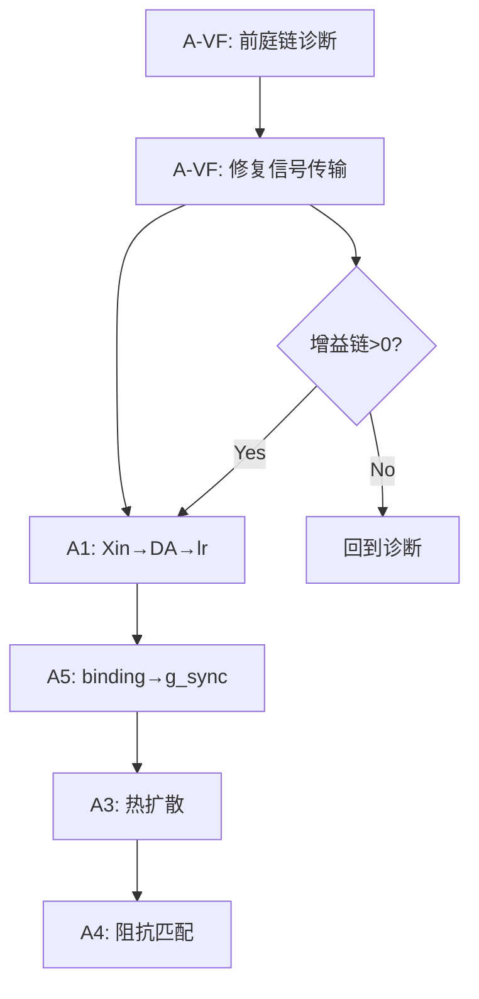

# 工程实施方案：G-001 v2.0 落地

> 从数学公式到代码的桥梁。每个问题给出：根因 → 改什么文件 → 改什么代码 → 怎么验证。

---

## 状态总览

| 问题 | 数学公式 | 代码现状 | 工程操作 |
|------|---------|---------|---------|
| ~~A2~~ | V_ss = I·R > V_th | **已修复** | bc_current 已提升 |
| A-VF | 前庭增益链=0 | HC→Aff 信号断裂 | **本次优先** |
| A1 | \|ξ\|→c_DA→α_lr→Δw | Xin 算了但没用 | 接线 |
| A5 | g_sync = Σa_bind/θ | binding 算了但没门控 | 接线 |
| A3 | ∂E/∂t = κΣ(Ej-Ei)/d² | 无扩散代码 | 新模块 |
| A4 | T = 2Z_b/(Z_b+Z_m) | body 无阻抗 | 新计算 |

---

## 问题 0：前庭增益链 = 0（A-VF，阻塞项）

### 根因诊断

增益链 `L1_MET→L2_HC: 0` 意味着 **MET 的 activation 没有传递到 HC**。

代码路径追踪：

```
chain.py L322:  met.step(deflection, dt)        → met.activation = ?
chain.py L325:  currents = bundle.propagate()     → 用 met.activation
chain.py L328:  hc.step(currents[0], dt)          → HC 多通道模式
chain.py L338:  hc.activation = hc.release_rate   → Ca²⁺ gate 输出
```

**断点 1: MET → HC bundle**

- MET 是多通道模式 (有 `channels=[ChannelConfig("default",v_th=0.001,...)]`)
- 但 MET 的 reversal=0.615，neuron.py L291: `i_channel = sign × g × (vm - reversal)`
- 当 `vm < 0.615` 时，`(vm - 0.615) < 0` → **电流为负** → HC 得到的是抑制电流
- HC 的 HH 通道有 K (抑制) + Ca (激发) + MET, leak_reversal=0.154
- 实际上整个 HC 电压动态走的是 L285-L312 (多通道),其 activation 来自 `vm` (L312)
- 但 L338 把 hc.activation 覆写为 release_rate (Ca²⁺ gate 输出)
- **如果 Ca voltage 太低，release_rate=0 → Aff 什么都收不到**

**断点 2: HC → Aff bundle**

- bundle propagate 用 `hc.activation`（即 release_rate）
- 但 release_rate 来自 `_ca_gate.conduct(ca_v)`
- ca_v 是 Ca capacitor voltage，需要 Ca 通道电流积分
- Ca 通道 v_th=0.308，需要 hc.vm > 0.308 才有电流
- 但 HC v_rest=0.115，从 0.115 到 0.308 需要强烈 MET 输入

### 工程操作

#### 修改 1：验证 MET→HC 电流方向

在 [chain.py L322-L330](file:///d:/cell-cc/nexus_v1/vestibular/chain.py#L322-L330) 插入诊断，确认电流值和方向：

```python
# 临时诊断代码（验证后删除）
if axis == "yaw" and tick % 1000 == 0:
    print(f"MET_yaw: act={met.activation:.6f} vm={met._membrane.voltage:.4f}")
    print(f"  bundle_current={currents[0]:.6f}")
    print(f"  HC_vm={hc._membrane.voltage:.4f} release={hc.release_rate:.6f}")
```

#### 修改 2：如果 Ca 通道需要更强驱动

两个选项：

**(A) 提高 MET→HC synapse_gain**（当前=5.0）

在 [chain.py L281](file:///d:/cell-cc/nexus_v1/vestibular/chain.py#L281)：
```python
synapse_gain=5.0,  # 候选: 提高到 10-20
```

用 modeler 预测需要多大的 gain：
```python
# I_needed = (V_Ca_th - V_rest) * C / (dt * N_steps)
# = (0.308 - 0.115) * 1.0 / (0.001 * 200) = 0.965
# I_met = met_act * G(0.5) * gain
# met_act ≈ 1.0 at full deflection
# G(0.5) = 0.5 * (1 - 0.5/1) * 2 = 0.5 → conduct(1.0) ≈ 0.96
# gain_needed = 0.965 / 0.96 ≈ 1.0 (current gain=5 should be MORE than enough)
```

→ 如果 gain 足够但仍然不工作，说明问题在 **电流方向**。

**(B) 检查 MET channel reversal potential**

在 [chain.py L76](file:///d:/cell-cc/nexus_v1/vestibular/chain.py#L76)：
```python
reversal=0.615,  # E_MET = 0 mV (normalized)
```

MET 是单通道模式 (channels list 只有 default)。neuron.py L279-284 走 simple mode：
```python
# Simple mode: single MOSFET, direct output
gate = self._channels["default"]
gate.update_gate(vm, dt)
self.activation = max(-10, min(10, gate.gated_conduct(vm)))
```

Simple mode **不用 reversal**！activation = `gated_conduct(vm)` = `m_gate * conduct(vm)`。
问题是 `conduct(0.005)` 在 v_th=0.001 下 = `1.0 * (0.005 - 0.001) = 0.004`。
这个值很小但非零。再乘 synapse_gain=5 → HC 收到 0.02 的电流。
HC 是多通道模式（3 个 channel），走 L285-L312。需要从 v_rest=0.115 升到 0.308。

**关键发现：MET 在无刺激时 activation ≈ 1.98**

因为 [test_met_range.py](file:///d:/cell-cc/nexus_v1/tests/test_met_range.py) 说：
> Even at input=0, MET output is ~1.98 because v_threshold=0.001

所以 `met.activation ≈ 2.0` → bundle current = `2.0 * G(0.5) * 5.0` = `2.0 * 0.96 * 5.0 = 9.6`

HC 收到 9.6 的电流！但 HC 是多通道模式，注入 L310: `self._membrane.inject(-i_total, dt)` 是**减去**离子电流。
HC 的 activation = vm (L312)，然后被 L338 覆写为 release_rate。

**结论：需要运行诊断确认 HC 的 ca_v、vm、release_rate 的实际值。**

#### 修改 3：工程诊断脚本

创建 `tests/test_vestibular_signal.py`，在 1000 步后打印每层的实际值：

```python
# 追踪信号流：input → MET → HC(vm, ca_v, release) → Aff(vm, spikes)
```

---

## 问题 1：A1 P→R 闭合（Xin→学习率）

### 数学
$$|ξ| → c_{DA} → α_{lr} → Δw$$

### 代码现状

- [bundle.py L297-318](file:///d:/cell-cc/nexus_v1/circuit/bundle.py#L297-L318): `compute_xin()` 计算了 ξ = predicted - actual，累加到 `config.xin_tension`
- [variant_adapter.py L428-430](file:///d:/cell-cc/nexus_v1/circuit/variant_adapter.py): `b.compute_xin(dt)` 每步调用 ✓
- DA 系统在 [variant_adapter.py L363-381](file:///d:/cell-cc/nexus_v1/circuit/variant_adapter.py#L363-L381): `dopamine.release()` + `dopamine.step()` + `da_gain` 已存在
- **但 Xin 和 DA 之间没有连线！** DA release 只由 motor spikes 触发（L368-370），不由 Xin 驱动

### 工程操作

在 [variant_adapter.py](file:///d:/cell-cc/nexus_v1/circuit/variant_adapter.py) 的 step() 中，§8 DA 更新部分，增加 Xin→DA 通路：

```python
# ── 8. Neuromodulator (DA) update ──
# 8a. Motor spikes → DA (existing)
...
# 8b. Xin tension → DA (NEW: §1E.5 P→R closure)
total_xin = sum(abs(b.config.xin_tension) for b in self.get_all_bundles())
xin_da_signal = min(total_xin * 0.01, 0.5)  # 线性映射, 饱和于 0.5
if xin_da_signal > 0.01:
    self.dopamine.release(xin_da_signal)
```

然后 DA gain 已经通过 L376-381 调制 column activation，间接影响 STDP 的 post trace。

**但这只是间接的。** 直接路径是 DA → learning rate：

```python
# 8c. DA-modulated learning rate (NEW: §1E.5)
da_lr_mod = self.dopamine.gain_factor()  # 1.0 = baseline, >1 = boosted
for b in self.get_all_bundles():
    if b.config.learning_rule != "frozen":
        # DA 调制 STDP lr: 三因子学习
        b._da_lr_modulator = da_lr_mod  # 存储，在 learn() 中使用
```

对应在 [bundle.py learn()](file:///d:/cell-cc/nexus_v1/circuit/bundle.py#L155) 中加入：
```python
# 在 dw 计算之后，应用 DA 调制
da_mod = getattr(self, '_da_lr_modulator', 1.0)
dw *= da_mod
```

### 验证

运行 `test_directional_learning.py`，检查：
1. Xin tension 非零
2. DA level 在 Xin 高时升高
3. 权重变化在 DA 高时加速

---

## 问题 2：A5 同步门控（binding→gate_sync）

### 数学
$$g_{sync} = \min(1, \sum a_{bind} / \theta_{sync})$$

### 代码现状

- [variant_adapter.py L328-343](file:///d:/cell-cc/nexus_v1/circuit/variant_adapter.py#L328-L343): binding activations 已计算 → 注入 motor
- 但 g_sync 没有作为学习门控使用

### 工程操作

在 [variant_adapter.py](file:///d:/cell-cc/nexus_v1/circuit/variant_adapter.py) 的 §12 PNN-gated learning 部分，加入 binding 同步门控：

```python
# ── 12b. Sync gate from binding layer (NEW: §1E.5) ──
total_bind_act = sum(a for a in binding_activations.values())
THETA_SYNC = 0.1  # 同步阈值
g_sync = min(1.0, total_bind_act / max(THETA_SYNC, 1e-8))

# 应用到 col→motor 学习
for b in self.bundles_col_to_motor:
    b.learn(dt, plasticity_gate=gate_col * g_sync)
```

### 验证

当 binding activation > θ_sync 时，col→motor 权重变化速度加快。

---

## 问题 3：A3 热扩散（近场物理）

### 数学
$$\frac{\partial E_i}{\partial t} = \kappa \sum_{j \in \mathcal{N}(i)} \frac{E_j - E_i}{d^2} - \lambda E_i$$

### 代码现状

- ECM 有 temperature 字段 ([ecm.py](file:///d:/cell-cc/nexus_v1/components/ecm.py))，但层间独立
- 没有邻域扩散
- 热只在同一个 ECM 池里平均

### 工程操作

在 [variant_adapter.py](file:///d:/cell-cc/nexus_v1/circuit/variant_adapter.py) 的 §5 ECM thermal field 部分，增加层间扩散：

```python
# ── 5b. Inter-layer heat diffusion (NEW: §1E.2) ──
# κ = thermal diffusivity, d = inter-layer distance (normalized to 1)
KAPPA = 0.01  # modeler.predict_penetration 标定
LAMBDA_DECAY = 0.001  # 辐射损失

ecm_list = [self.ecm_vestibular, self.ecm_encoding, self.ecm_column]
temps = [e.temperature for e in ecm_list]

for idx, ecm in enumerate(ecm_list):
    diffusion = 0.0
    for jdx, other_ecm in enumerate(ecm_list):
        if idx != jdx:
            diffusion += KAPPA * (other_ecm.temperature - ecm.temperature)
    # d² = 1 (normalized inter-layer distance)
    ecm._temperature += (diffusion - LAMBDA_DECAY * ecm.temperature) * dt
```

### 参数标定

用 governance modeler 已有的 `predict_penetration(m, k, gamma)`：
```python
# L_pen = sqrt(κ/γ) = sqrt(0.01/0.001) ≈ 3.16 (层)
# 3层结构，穿透深度 > 层数 → 热量可到达所有层 ✓
```

### 验证

1. 加热一个层，观察相邻层温度上升
2. 稳态时所有层温度趋同

---

## 问题 4：A4 阻抗匹配

### 数学
$$T = \min\left(1, \frac{2 Z_{body}}{Z_{body} + Z_{medium}}\right)$$

### 代码现状

- [world.py Body](file:///d:/cell-cc/nexus_v1/components/world.py) 有 mass, velocity, position
- 无 stiffness (k) 或 damping 参数
- 没有 impedance 计算
- 信号传输没有 impedance gate

### 工程操作

#### 修改 1：给 Body 加物理参数

在 [world.py Body](file:///d:/cell-cc/nexus_v1/components/world.py)：
```python
@dataclass
class Body:
    mass: float = 1.0
    stiffness: float = 1.0     # 弹性系数 k (NEW)
    damping: float = 0.1       # 阻尼系数 (NEW)
    ...

    @property
    def impedance(self) -> float:
        """Z = sqrt(k*m) / d² (d=1 normalized)"""
        return math.sqrt(self.stiffness * self.mass)
```

#### 修改 2：在传感链中应用 T 系数

在 [variant_adapter.py](file:///d:/cell-cc/nexus_v1/circuit/variant_adapter.py) 的 thermal sensing 部分：
```python
# ── 0c. Impedance-matched signal transmission (NEW: §1E.3) ──
Z_body = self.world.body.impedance
Z_medium = 1.0  # 介质阻抗 (标定参数)
T = min(1.0, 2 * Z_body / (Z_body + Z_medium + 1e-8))
# T 系数衰减输入信号
mechanical_inputs = {k: v * T for k, v in mechanical_inputs.items()}
```

### 验证

T 值在 [0, 1] 范围内，质量大/刚度大的 body 信号传输更好。

---

## 执行顺序



**理由：A-VF 是阻塞项。** 没有前庭信号，Enc/Col 的激活只来自 bias current（无方向性）→ STDP 学不到方向信息 → P→R 闭合和 binding 门控都没意义。

---

## 开放问题

> [!IMPORTANT]
> **问题 1**: A3 热扩散中的 κ 和 λ 是否应该由 governance modeler 自动标定？还是手动设定？
>
> **问题 2**: A4 阻抗匹配中的 Z_medium 应该是常数还是依赖 ECM 温度？（Paper 3 暗示介质性质与温度相关）
>
> **问题 3**: A-VF 前庭链如果确认是电流方向问题，修复方案是 (A) 修改 reversal potential 还是 (B) 重新校准 synapse_gain？

