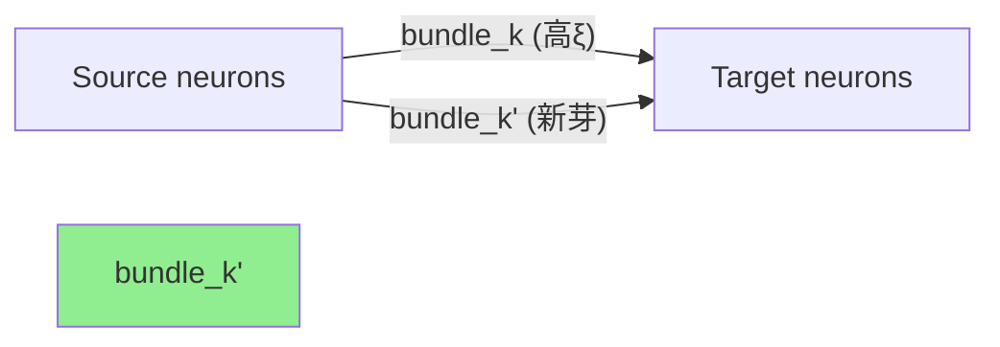
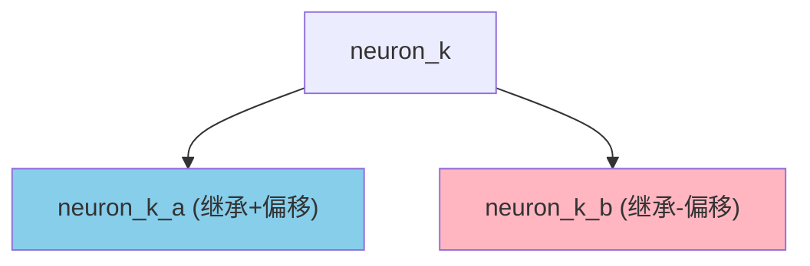
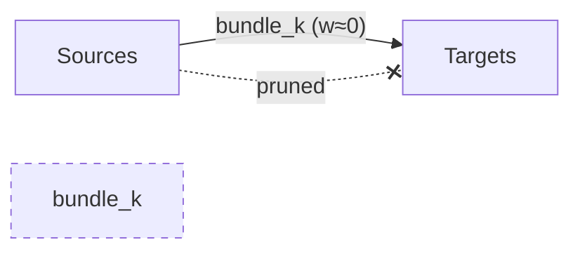
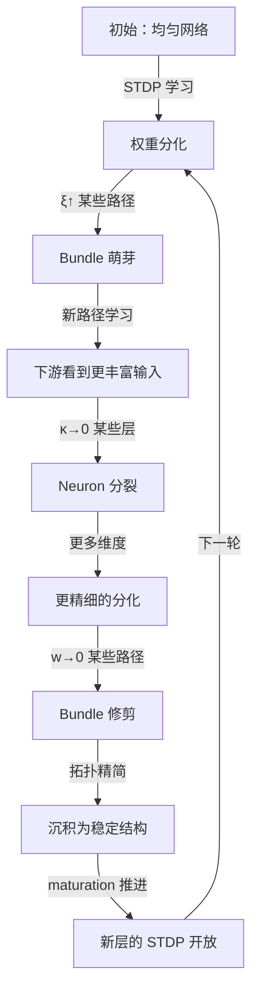

# 递归分化沉积：结构生长建模

## 核心问题

当前系统 = **固定拓扑 + 可变权重**。STDP 只能调整已有连接的强度，不能：
- 创建新连接（无法发现新路径）
- 分裂神经元（无法增加表征容量）
- 修剪死连接（无法释放资源）

要实现递归分化，需要 **拓扑可塑性**：结构本身成为可学习的变量。

## 数学框架提供的触发条件

项目自身的度量体系已经包含了结构生长的触发信号：

### 触发 1: ξ (Xin 预测张力) → 需要新路径

```
ξ_k = Σ_j (ŷ_j - a_j)   对 bundle k
```

**语义**：当 ξ 持续高 → 当前 bundle 的权重**无法解释**目标的行为。这意味着：
- 输入模式比当前连接能表达的更丰富
- 需要一个**新的并行 bundle** 来捕获遗漏的模式

**映射**：ξ > ξ_sprout → **Bundle 萌芽**（sprouting）

### 触发 2: κ → 0 (状态空间收缩) → 需要更多维度

```
κ = std(activations) / mean(activations)
```

**语义**：当 κ→0 → 所有神经元激活趋同 → 表征退化为一维。这意味着：
- 当前神经元数量不够
- 需要**新的神经元**来增加表征维度

**映射**：κ < κ_split → **Neuron 分裂**（splitting）

### 触发 3: w → 0 (权重衰减至零) → 可以修剪

```
mean_weight(bundle_k) < w_prune  持续 T_prune 步
```

**语义**：STDP 持续削弱一个 bundle → 这条路径不传递有用信息。

**映射**：w < w_prune for T_prune → **Bundle 修剪**（pruning）

## 三个生长操作

### 操作 A: Bundle 萌芽 (Sprouting)



**时机**：当 |ξ_k| > ξ_sprout 且 fruit_state = "active"（§7.3 的 fruit 机制）

**操作**：
1. 从 bundle_k 的 source/target 继承
2. 新 bundle 的权重 = parent 权重 × 随机扰动
3. 新 bundle 从 maturation_stage=0 开始（最高可塑性）
4. Parent 的 ξ 减半（张力释放）

**组件实现**：
```python
def sprout(parent_bundle: SynapticBundle) -> SynapticBundle:
    """母本分化：从 parent bundle 生成子 bundle。"""
    child_config = copy(parent.config)
    child_config.bundle_id = f"{parent.id}_sprout_{tick}"
    child_config.initial_weight = parent.mean_weight() * 0.5  # 从半强度开始
    child_config.xin_tension = 0.0  # 清零张力
    child_config.maturation_stage = 0  # 最高可塑性
    
    child = SynapticBundle(child_config, parent.sources, parent.targets)
    parent.config.xin_tension *= 0.5  # 张力释放
    return child
```

**能量成本**：sprouting 消耗 source neurons 的 energy（§2.2）

### 操作 B: Neuron 分裂 (Splitting)



**时机**：当 neuron 的 activation_variance > σ_split 且 energy > E_min

**操作**：
1. neuron_k → neuron_k_a + neuron_k_b
2. 两个子神经元继承 parent 的膜参数
3. 子 A 的 bias 略增，子 B 的 bias 略减（互补调谐）
4. 所有连接到 parent 的 bundle 分裂为连接到 A 和 B 的两个
5. Parent 被移除

**组件实现**：
```python
def split(parent: Neuron) -> Tuple[Neuron, Neuron]:
    """母本分化：从 parent neuron 生成两个子 neuron。"""
    cfg_a = copy(parent.config)
    cfg_b = copy(parent.config)
    cfg_a.neuron_id = f"{parent.config.neuron_id}_a"
    cfg_b.neuron_id = f"{parent.config.neuron_id}_b"
    # 互补偏移
    cfg_a.bc_current = parent.config.bc_current * 1.1
    cfg_b.bc_current = parent.config.bc_current * 0.9
    # 继承膜电压
    child_a = Neuron(cfg_a)
    child_b = Neuron(cfg_b)
    child_a._membrane.discharge_to(parent._membrane.voltage)
    child_b._membrane.discharge_to(parent._membrane.voltage)
    return child_a, child_b
```

### 操作 C: Bundle 修剪 (Pruning)



**时机**：mean_weight < w_prune 且持续 T_prune 步

**操作**：
1. 移除 bundle 及其所有 Memristor
2. 释放 transport_cost 回源神经元 energy
3. 记录修剪事件到 governance ledger

## 递归分化的涌现过程



**这个循环就是"递归分化沉积"**：
1. **分化** = STDP + sprouting + splitting 创造差异
2. **沉积** = maturation + pruning 固化结构
3. **递归** = 每一轮的结果成为下一轮的输入

## 规模评估

### 最小可涌现规模

| 参数 | 当前 | 需要 | 理由 |
|------|------|------|------|
| 可生长 bundle 数 | 0 | ~10-20 | 足够覆盖 3 层 × 6 轴的路径探索 |
| 可分裂 neuron 数 | 0 | ~5-10 | Enc/Col 层各分裂 1-2 次 |
| 总 neurons（上限） | 48 | ~80-100 | 避免计算爆炸 |
| 总 bundles（上限） | 30 | ~60-80 | 同上 |

### 时间尺度

| 过程 | 时间尺度 | 对应步数 |
|------|---------|---------|
| STDP 权重学习 | ~10s | ~10k |
| Bundle 萌芽 | ~30s | ~30k |
| Neuron 分裂 | ~100s | ~100k |
| Bundle 修剪 | ~50s | ~50k |
| Maturation 关闭可塑性 | ~200s | ~200k |
| **一轮完整递归** | **~300s** | **~300k** |

> [!IMPORTANT]
> 按当前运行速度（50k 步 ≈ 60s 实际时间），一轮完整递归 ≈ 6 分钟计算时间。这是可行的。

## 实施路径

### Phase 1: Bundle 萌芽（最小可行）

只实现操作 A。这是最简单也最有影响力的操作：
- 不需要修改 Neuron 类
- 只在 HebbianCircuit / VariantCircuit 的 step() 中添加萌芽检查
- 利用已有的 ξ（Xin tension）和 fruit 机制作为触发

#### 需要修改的文件

| 文件 | 修改 |
|------|------|
| [hebbian.py](file:///d:/cell-cc/nexus_v1/circuit/hebbian.py) | 添加 `_check_sprouting()` 方法 |
| [variant_adapter.py](file:///d:/cell-cc/nexus_v1/circuit/variant_adapter.py) | 在 step() 末尾调用萌芽检查 |
| [bundle.py](file:///d:/cell-cc/nexus_v1/circuit/bundle.py) | 添加 `sprout()` 工厂方法 |
| [RULES_STRUCTURAL_COMPUTATION.py](file:///d:/cell-cc/nexus_v1/RULES_STRUCTURAL_COMPUTATION.py) | 添加结构生长规则 |

#### 触发条件（保守）

```python
SPROUT_INTERVAL = 10000   # 每 10k 步检查一次
XI_SPROUT = 2.0           # |ξ| > 2.0 才萌芽
MAX_BUNDLES = 80          # 总 bundle 数上限
SPROUT_ENERGY_COST = 0.1  # 每次萌芽消耗 source 能量
```

### Phase 2: Bundle 修剪

权重衰减到零的 bundle 被移除。这与萌芽形成动态平衡。

### Phase 3: Neuron 分裂

当 κ 测量显示某一层退化时，分裂该层的神经元。这是最复杂的操作，因为需要重新布线。

## 验证计划

### 验证指标

1. **Bundle 数量动态**：应先增长（萌芽），后稳定（修剪平衡）
2. **权重多样性**：std(weights) 应持续增长
3. **κ 涌现**：应从 0 变为非零
4. **Motor 分化**：不同输入 → 不同 motor 响应
5. **总能量守恒**：生长消耗的能量 = governance 追踪的 E_remodel

### 测试方案

- 100k 步（Phase 1 验证）
- 300k 步（一轮完整递归验证）
- 多模态输入（同时给 yaw + pitch + thermal）
