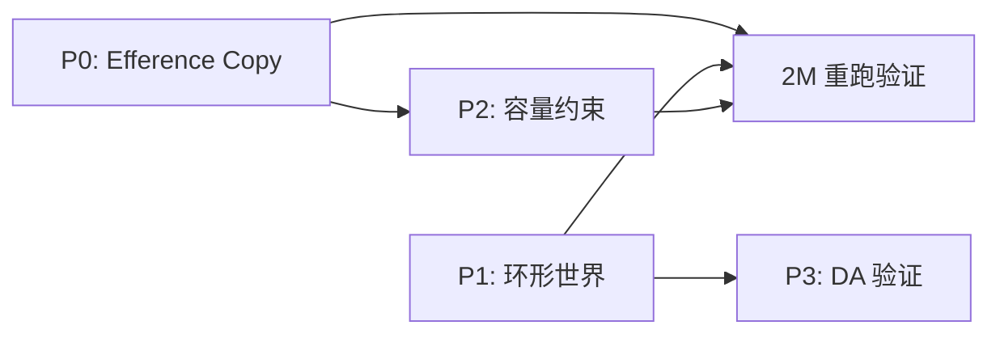

# 改进方案：基于 2M 实验的四个优先修复

## 背景

2M 实验暴露了四个问题，按严重度排序：

1. **Motor 退化增殖**：3→286 个 motor，权重熵=0，全是无功能克隆
2. **Body 撞墙卡死**：body 到达 [100,100,100] 后永久停止，Oto Xin 塌缩
3. **缺乏通路容量约束**：motor 可以无限增殖，无空间/能量限制
4. **DA 无动态**：DA 始终=0.1（baseline），从未被触发

---

## P0：修复 Motor 退化增殖（最紧急）

### 问题根因

Mitosis 触发条件只看 **fatigue voltage**（放电太频繁 → V_fat 升高 → 分裂）。但分裂后的子代继续接收同样的驱动信号 → 继续放电 → 继续疲劳 → 继续分裂。

没有任何机制检查"分裂是否有用"。

### 修复：Efference Copy 反馈抑制无效 Mitosis

**原理**：如果 motor 放电但 body 没有产生预期的加速度变化（efference copy mismatch），则降低该 motor 轴的驱动增益。

#### [MODIFY] [variant_adapter.py](file:///d:/cell-cc/nexus_v1/circuit/variant_adapter.py)

```python
# 在 section 0b (closed sensorimotor loop) 之后新增：

# ── 0c. Efference copy: predict acceleration from motor output ──
# BIO: cerebellum computes expected sensory consequence of motor command.
# If predicted acc ≈ actual acc → "reafference" (expected, suppress).
# If predicted acc ≠ actual acc → "exafference" (unexpected, amplify).
for i, axis in enumerate(['x', 'y', 'z']):
    predicted_acc = axis_acts[i] * self._efference_gain[axis]
    actual_acc = self.world.body.acceleration[i]
    mismatch = abs(actual_acc - predicted_acc)
    
    # Update efference gain estimate (slow learning)
    self._efference_gain[axis] += 0.0001 * (actual_acc - predicted_acc)
    
    # If mismatch is low (motor is ineffective), suppress mitosis drive
    # by reducing the fatigue accumulation rate for motors on this axis
    if mismatch < 0.01:  # motor output has no effect
        self._motor_efficacy[axis] *= 0.999  # slow decay
    else:
        self._motor_efficacy[axis] = min(1.0, 
            self._motor_efficacy[axis] + 0.001)
```

#### [MODIFY] [hebbian.py](file:///d:/cell-cc/nexus_v1/circuit/hebbian.py) `_check_mitosis()`

```python
# 在 mitosis 检查中加入 efficacy 门控：
def _check_mitosis(self):
    to_split = []
    for key, neuron in self.motor_neurons.items():
        if neuron.should_split():
            axis = self._motor_axis(key)
            efficacy = getattr(self, '_motor_efficacy', {}).get(axis, 1.0)
            if efficacy > 0.5:  # only split if motor is effective
                to_split.append((key, neuron))
            else:
                # Reset mitosis counter — don't waste energy splitting
                neuron._mitosis_counter = 0
```

**效果**：body 卡住后 efficacy→0 → mitosis 停止。

---

## P1：修复 Body 边界

### 问题

World 边界是硬墙 + 弹回（bounce×0.5），body 到角落后净力=0，永久卡住。

### 修复：环形拓扑（Toroidal World）

```python
# [MODIFY] world.py Body.step()
# 替代硬墙弹回：环形边界（从一边出去，从另一边进来）
for i in range(3):
    if self.position[i] < 0:
        self.position[i] += 100.0  # wrap around
    elif self.position[i] > 100.0:
        self.position[i] -= 100.0  # wrap around
    # velocity preserved — no energy loss at boundary
```

**效果**：body 永远不会卡住，otolith 反馈永远有效。

> [!IMPORTANT]
> 环形拓扑 vs 弹性边界的选择：环形拓扑更物理（无穷大空间的周期性近似），弹性边界更生物（有机体有运动范围限制）。建议先用环形测试。

---

## P2：通路容量约束

### 问题

Motor 可以无限分裂，没有"头骨"限制。

### 修复：每轴最大 motor 数 + 能量竞争

```python
# [MODIFY] hebbian.py — 新增常量
MAX_MOTORS_PER_AXIS: int = 20  # 最多 20 个 motor/axis

# [MODIFY] _check_mitosis() — 加入容量检查
axis = self._motor_axis(key)
current_count = sum(1 for k in self.motor_neurons if axis in k)
if current_count >= self.MAX_MOTORS_PER_AXIS:
    neuron._mitosis_counter = 0  # cap reached, suppress
    continue
```

**效果**：每轴最多 20 个 motor，总计最多 60 个（而不是 286）。

---

## P3：DA 惊喜门控

### 问题

DA 编码改为 |dξ/dt| 后，在恒定输入下 dξ/dt≈0，DA 永远停在 baseline。这是正确的行为，但意味着 DA 对 Fruit/学习没有任何调制作用。

### 修复：不是 DA 的问题，是输入的问题

DA 在恒定输入下回到 baseline 是**正确的**。要让 DA 有动态，需要**输入模式的变化**。

建议在 P0+P1 修复后重新测试——环形世界中 body 会持续运动，otolith 信号会持续变化，dξ/dt 不再为零。

> [!NOTE]
> 如果 P1（环形世界）后 DA 仍然无动态，再考虑将振荡器的拍频纳入 Xin 计算。

---

## 修改优先级与依赖



| 优先级 | 文件 | 改动量 | 风险 |
|--------|------|--------|------|
| **P0** | variant_adapter.py + hebbian.py | ~30 行 | 低 |
| **P1** | world.py | ~5 行 | 低 |
| **P2** | hebbian.py | ~10 行 | 低 |
| **P3** | 不改代码，重新测试 | 0 行 | — |

## 验证计划

修改完成后跑 2M 步观察：
1. Motor 数量是否收敛到稳定值？
2. Body 是否持续运动？
3. Oto Xin 是否维持动态？
4. DA 是否出现非 baseline 的波动？
5. 四条通路的宽度比是否趋向稳定常数？
