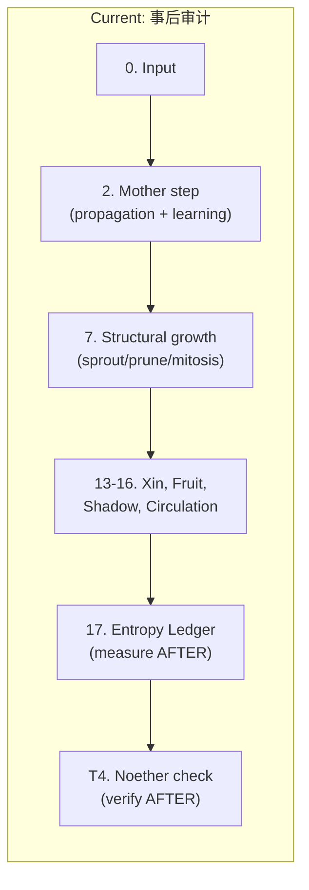
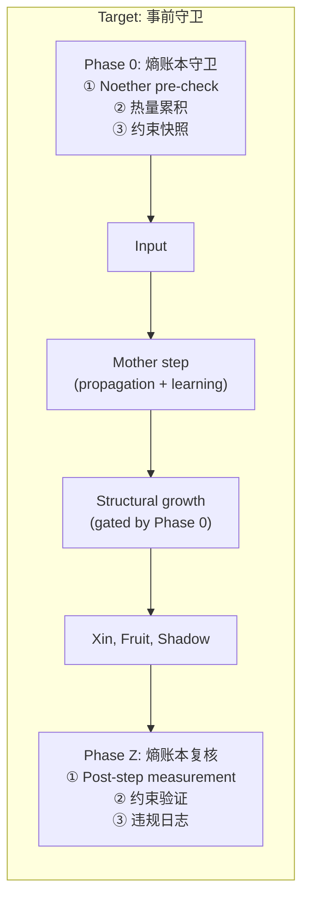

# 熵账本系统前置化 — 实施计划

## 目标

把熵账本系统的运行入口从 **事后审计**（main step 之后的 Phase 17）移到 **事前守卫**（main step 之前的 Phase 0），使得后续所有构建工作在执行前先经过规则检查。

## 当前架构问题



问题：结构修改（sprout/prune/mitosis）在 ledger 检查**之前**执行。违规只能在下一个 100 步周期才被发现，此时结构已经改变。

## 目标架构



---

## Proposed Changes

### [variant_adapter.py](file:///d:/cell-cc/nexus_v1/circuit/variant_adapter.py)

#### Step 1: 提取 `_entropy_ledger_pre_step()` 方法

新方法，在 `step()` 的最前面调用（在 oscillators 之前）。

```python
def _entropy_ledger_pre_step(self, tick: int, dt: float):
    """Phase 0: 熵账本守卫 — runs BEFORE all computation.
    
    Three responsibilities:
      1. Noether pre-check: verify conservation invariants hold
         BEFORE this step modifies anything
      2. Heat accumulation: collect heat from PREVIOUS step
         (each neuron's heat_output is still from last step)
      3. Constraint snapshot: capture current state bounds
         that structural operations must respect
    """
```

**职责 ①：Noether pre-check**
- 将 `self._noether_probe.check()` 从 Phase T4（step 后）移到 Phase 0（step 前）
- 检查的是**上一步结束时**的状态 → 在本步修改前发现违规
- 如果发现违规，设置 `self._structural_freeze = True`（冻结结构修改）

**职责 ②：热量累积（每步）**
- 将 `self._entropy_probe.accumulate_heat()` 从 Phase 17 移到 Phase 0
- 累积的是**上一步**的 heat_output（已计算好）

**职责 ③：约束快照**
- 捕获当前 weight entropy、Xin 总量、DA 浓度等
- 存入 `self._ledger_constraints` 供结构操作读取

#### Step 2: 提取 `_entropy_ledger_post_step()` 方法

保留 ledger 的测量功能（Phase 17 → Phase Z），但定位为**复核**而非首次检查。

```python
def _entropy_ledger_post_step(self, tick: int, dt: float):
    """Phase Z: 熵账本复核 — post-step measurement and logging.
    
    Runs AFTER all computation. Records what actually happened.
    Violations found here are logged but were already prevented
    by Phase 0 freeze gate.
    """
```

#### Step 3: 结构操作门控

修改 `_structural_growth()`（hebbian.py L467-469）和 `_check_mitosis()`（L475-477），在执行前检查 `self._structural_freeze`：

```python
# In HebbianCircuit.step():
# ── 7. Structural growth (RULE S2) ──
if self._step_count % self.SPROUT_INTERVAL == 0:
    if not getattr(self, '_structural_freeze', False):
        self._structural_growth(dt)
    else:
        self._growth_log.append(
            f"FREEZE step={self._step_count} "
            f"reason=noether_violation")
```

---

### [MODIFY] [variant_adapter.py](file:///d:/cell-cc/nexus_v1/circuit/variant_adapter.py)

#### Step flow reorganization:

| 旧位置 | 内容 | 新位置 |
|--------|------|--------|
| Phase 17 (L852-866) | Entropy ledger (measure + heat) | **Phase 0** (step 入口) |
| Phase T4 (L868-870) | Noether check | **Phase 0** (step 入口) |
| Phase 17 | Post-step measurement | **Phase Z** (step 出口，复核) |
| Phase 7 (hebbian L467) | Structural growth | 加门控 `_structural_freeze` |
| Phase 9 (hebbian L475) | Mitosis check | 加门控 `_structural_freeze` |

### [MODIFY] [hebbian.py](file:///d:/cell-cc/nexus_v1/circuit/hebbian.py)

- `step()`: 在 structural growth 和 mitosis 前检查 `_structural_freeze` flag
- 加 `_structural_freeze: bool = False` 属性

---

## 设计决策

> [!IMPORTANT]
> **Pre-step 检查的是上一步的结果**。Phase 0 在本步计算前运行，所以它检查的是 `t-1` 的状态。这在时序上是正确的——违规在 `t-1` 产生，在 `t` 步开始前被发现，阻止 `t` 步的结构修改。

> [!IMPORTANT]  
> **Ledger 仍然是 read-only**。Phase 0 不修改任何物理状态——它只设置一个 boolean flag。结构操作自己检查 flag 并决定是否执行。这保持了"纯观察者"原则。

> [!WARNING]
> **结构冻结是临时的**。`_structural_freeze` 每步重新计算——如果下一步 Noether 通过，冻结自动解除。不是永久禁止。

## Open Questions

> [!IMPORTANT]
> **冻结范围**：Noether 违规时，应该冻结哪些操作？
> - 选项 A：只冻结 sprout（新增）
> - 选项 B：冻结 sprout + prune（所有结构修改）
> - 选项 C：冻结 sprout + prune + mitosis（所有结构事件）
> 
> 建议选 C — 最保守，任何结构事件都会改变 Noether 的 weight/energy 账本。

## Verification Plan

### Automated Tests
- 50k 步测试（同 test_differentiation.py）
- 验证 Noether 0 violations 在前置化后仍然保持
- 验证 structural freeze 在违规时正确触发

### Manual Verification
- 查看 growth_log 中是否有 FREEZE 事件
- 确认正常运行时 _structural_freeze 从未触发（当前系统无违规）
