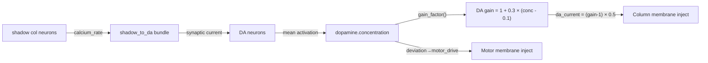

# Phase P0-P2: DA 系统稳定化 + 热趋性前置

按文档 5 审慎路线执行。目标：为 100k 热趋性大考搭建全部前置条件。

---

## Phase 0: 冻结先天通路 (Freeze Innate Pathways)

**问题**: `shadow_to_da` 和 `xin_to_da` 的 STDP 持续衰减先天权重 (EXP-006: 0.042→0.019)。DA 调制会随时间死亡。

**原因**: shadow col 高频 spiking → DA neuron 也活跃 → post_trace > pre_trace 占多数时间 → LTD > LTP → 权重衰减。这些通路是**硬连线的先天弧** (hypothalamus → VTA)，不应被 STDP 可塑。

### 修改

#### [MODIFY] [variant_adapter.py](file:///d:/cell-cc/nexus_v1/circuit/variant_adapter.py)

**L1357-1381**: 将两个 DA 输入 bundle 的 `learning_rule` 改为 `"frozen"`

```diff
 cfg_shadow = BundleConfig(
     bundle_id="shadow_to_da",
     initial_weight=0.05,
-    stdp_lr=0.005,
+    stdp_lr=0.005,        # retained for reference but unused
+    learning_rule="frozen",  # INNATE: hypothalamus→VTA hardwired
     synapse_gain=1.0,
     ...
 )

 cfg_xin = BundleConfig(
     bundle_id="xin_to_da",
     initial_weight=0.1,
-    stdp_lr=0.003,
+    stdp_lr=0.003,        # retained for reference but unused
+    learning_rule="frozen",  # INNATE: prediction error→VTA hardwired
     synapse_gain=0.5,
     ...
 )
```

**L924**: `bundle.learn()` 调用保持不变 — `learn()` 内部检查 `learning_rule == "frozen"` 直接 return（[bundle.py L248](file:///d:/cell-cc/nexus_v1/circuit/bundle.py#L248)）。

> [!IMPORTANT]
> 仅冻结权重。`compute_xin()` 和 `update_fruit()` 仍然运行 — Xin 预测误差仍被追踪，但不再改变突触强度。

---

## Phase 1: DA→Motor 开环标定

**问题**: DA 到底影不影响 Motor 输出？如果影响，符号对不对？

### 当前 DA→Motor 效应链追踪



**效应链有两条**：
1. **间接 (DA→Col→Motor)**: DA 调制 Column gain → L928-936 → Column activity 变化 → Col→Motor STDP 传递变化 → Motor 输出变化
2. **直接 (Deviation→Motor)**: L667-679 — `deviation > 0.1` 时直接注入 motor 电流

**标定方法**: 写一个脚本，手动设置 DA 浓度为 [0.0, 0.1, 0.3, 0.5, 0.8, 1.0]，测量对应的 motor EMA 和 body speed。验证：
- DA ↑ → motor ↑ (正相关 — 正确方向)
- 或 DA ↑ → motor ↓ (反相关 — 需要翻转符号)

#### [NEW] `scratch/calibrate_da_motor.py`

标定脚本：
1. 构建 VariantCircuit，跑 5k 步热身
2. 对每个 DA 水平：冻结 DA 浓度 → 跑 2k 步 → 记录 motor EMA / body speed / rho_homeo
3. 输出 DA-Motor 静态特性曲线
4. 判定反馈符号

### 验收标准

- DA 0.0→1.0，motor output 有**单调**响应 (任一方向)
- 符号确认：DA ↑ 应对应 motor ↑ (逃跑驱动增强)
- 如果符号反转，需修改 [L932](file:///d:/cell-cc/nexus_v1/circuit/variant_adapter.py#L932) 的 `(da_gain - 1.0) * 0.5` 前面加负号

---

## Phase 2: 热趋性闭环验证

> [!WARNING]
> 依赖 Phase 0 和 Phase 1 的完成。EXP-009 已证明当前热趋性不工作（热源下小车随机游走）。

### 当前缺失链路

```
热源 → body_temp ↑ → thermal_stability ↓ → deviation ↑ → DA ↑
  → Column gain ↑ → Motor ↑ → body moves → body_temp ↓ → deviation ↓ → DA ↓
  → Column gain ↓ → Motor ↓ → stabilize
```

**已有的**:
- ✅ `thermal_stability` → `deviation` (circulation_proportion)
- ✅ `deviation` → `da_current` (C3', L658-665)
- ✅ `deviation` → `motor_drive` (C.04, L667-679)
- ✅ DA neuron → `dopamine.concentration` (L916-920)
- ✅ `dopamine.gain_factor()` → Column inject (L928-936)

**可能缺失的**: Phase 1 标定将揭示

### 验收标准

- 热源 200 距离，小车从 (0,0,0) 出发
- 10k 步后 body→heat_source 距离 > 初始距离 (远离热源)
- DA 在热源靠近时升高，远离时回落 (负反馈确认)

---

## Open Questions

> [!IMPORTANT]
> **Q1**: Phase 1 标定中，是否需要同时考虑 deviation→motor 的直接路径 (C.04)？当前 C.04 的增益 `DEVIATION_MOTOR_GAIN = 0.05` 可能太弱，是否需要调高？
>
> **Q2**: Phase 0 冻结后，DA 输入权重永远固定在 0.05 (shadow) 和 0.1 (xin)。这些初始值是否合适？还是应该先跑一段让 STDP 优化到某个稳态值再冻结？

## Verification Plan

### Phase 0 验证
- 回归测试 21/21
- 确认 shadow_to_da 和 xin_to_da 权重在 10k 步后不变 (delta < 1e-10)

### Phase 1 验证
- DA-Motor 静态特性曲线单调递增
- Motor EMA 对 DA 的响应范围 > 0.1 (有意义的调制)

### Phase 2 验证
- 热趋性：10k 步后小车远离热源
