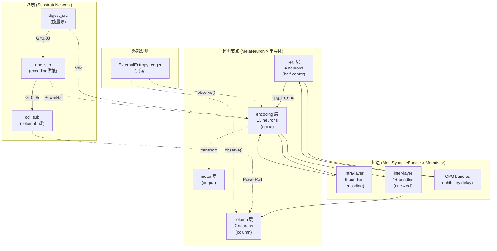
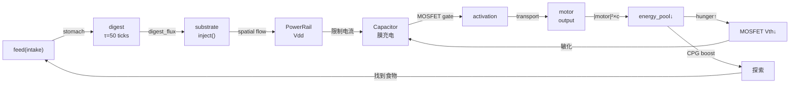

# 赫布超图 — 完整结构 (v42.0 半导体化)

## 总览

赫布超图不是一个扁平网络，而是一个**分层、空间化、有物理约束的超图**。



## 1. 超图节点 (MetaNeuron)

每个节点 = 1 Capacitor + 1 MOSFET + 1 PowerRail

| 层 | 神经元数 | 成熟度 | Vdd来源 | 角色 |
|------|---------|--------|---------|------|
| **encoding** | 13 | spine | enc_sub (2.0) | 感觉编码 + 熵通道 |
| **column** | 7 | column | col_sub (1.5) | 不变量提取 (BCM) |
| **cpg** | 4 | spine | — | 节律产生 |
| **motor** | N | spine | — | 运动输出 |

### encoding 层详细

| 神经元 | 功能 | 类型 |
|--------|------|------|
| sig_mean, sig_std, sig_peak_rate, sig_temporal_d, sig_sync, sig_range | 6 信号特征 | 感觉输入 |
| z_transition, z_drift, z_gamma, z_xin, z_potential, z_magnitude, z_visual | 7 z_t 代价 | 判别输出 |

### column 层详细

| 神经元 | 功能 |
|--------|------|
| col_transition, col_drift, col_gamma_desync, col_xin_residual, col_potential_disp, col_magnitude, col_visual_change | 7 柱状体 (BCM学习规则) |

### 半导体物理

```
信号 → PowerRail.draw(I) → Capacitor.inject(I_avail)
                                    ↓
                           Capacitor.voltage (膜电位)
                                    ↓
                      MOSFET.conduct(Vm) → activation
                      [Vm > Vth → I_out = gm × (Vm - Vth)]
                      [Vm ≤ Vth → I_out = 0 (亚阈值泄漏)]
```

## 2. 超边 (MetaSynapticBundle)

每条超边 = N×M Memristor 阵列 + 延迟线缆

| 属性 | 描述 |
|------|------|
| `_memristors[i][j]` | Memristor 阵列, w∈[0,1], R=Rmin+ΔR(1-w) |
| `cable_length` | 拓扑长度 |
| `propagation_velocity` | 信号速度 |
| `delay_ticks` | = ⌈length/velocity⌉, 最少 1 tick |
| `_pulse_queue` | (arrival_tick, attenuated_signal) 队列 |
| `_arrival_trace` | STDP 到达时间戳 (衰减) |

### 实测数据

| 类型 | 数量 | Memristor数 | 延迟 | 衰减 | 学习规则 |
|------|------|------------|------|------|---------|
| encoding intra | 9 | 63 (9×7) | 1t | 0.98 | oja/STDP |
| enc→col inter | 1 | 49 (7×7) | 1t | 0.98 | STDP |
| CPG inhibitory | 4 | — | 2-4t | — | frozen |
| **总 Memristor** | — | **105** | — | — | — |

### 信号流

```
source.activation → bundle.propagate() [Memristor.conduct()]
    → bundle.inject_pulse(tick) [入队]
    → [等待 delay_ticks]
    → bundle.deliver_pulses(tick) [出队 + 衰减]
    → target.activate(delivered_signal)
```

## 3. 基质网络 (SubstrateNetwork)

```
digest_src ────G=0.08────→ enc_sub ────G=0.05────→ col_sub
(3.0 cap)                  (2.0 cap)               (1.5 cap)
  ↑                          ↓ (bind 13)             ↓ (bind 7)
feed()→stomach→digest    encoding PowerRails     column PowerRails
```

| 节点 | 容量 | 当前能量 | 绑定神经元 | 角色 |
|------|------|---------|-----------|------|
| digest_src | 3.0 | 2.92 | 0 | 消化输出注入点 |
| enc_sub | 2.0 | 2.00 | 13 | encoding 层供能 |
| col_sub | 1.5 | 1.50 | 7 | column 层供能 |

**空间梯度**: digest_src → enc_sub → col_sub，越远能量越低。

## 4. 半导体元件总账

| 元件 | 数量 | 位置 |
|------|------|------|
| Capacitor | 20 | 每个 MetaNeuron._membrane |
| MOSFET | 20 | 每个 MetaNeuron._gate |
| PowerRail | 20 | 每个 MetaNeuron._power |
| Memristor | 105 | 所有 Bundle._memristors |
| **总计** | **165** | — |

## 5. 外部熵账本 (ExternalEntropyLedger)

只读审视，每 tick 采集 12 个热力学指标：

| 指标 | 实测值 | 含义 |
|------|--------|------|
| substrate_total | 4.18 | 基质总能量 |
| substrate_gradient | 0.22 | 空间能量不均匀度 |
| dissipation | 226.1/tick | 总耗散 (I²R + transport) |
| entropy_rate | 3.19/tick | dS/dt = Q/T |
| cumulative_entropy | 159.7 | ∫dS (50 ticks) |
| free_energy | -6.29 | F = E - TS (负值=消耗超过储存) |
| structural_entropy | 1.32 | Shannon(bundle strengths) |

## 6. 环流链路



### 验证结果

| 测试 | 结果 |
|------|------|
| regression 5/5 | ✅ |
| e2e semiconductor 3/3 | ✅ |
| STDP arrival trace | ✅ |
| entropy ledger | ✅ |
| **run_v40_integrated.py** | ✅ Discrimination YES, cosine=0.999 |
| threshold→gate sync | ✅ 5/5 处已同步 |
