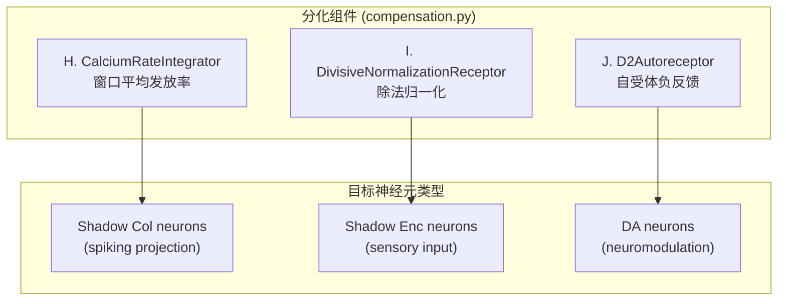

# 母本分化实施 — Walkthrough

## 概述

实施了"引导性构建"的核心原则：**每种特殊结构有对应的特殊分化元组件**。创建了 3 个新的分化组件，各自只存在于特定类型的神经元中（而非全局应用），并在 50k 步测试中通过了所有 Noether 守恒检查。

## 变更总览



---

## 文件变更

### 1. [compensation.py](file:///d:/cell-cc/nexus_v1/components/compensation.py) — 3 个新组件

#### H. CalciumRateIntegrator
- 将离散 spike 事件转换为连续的、有界的钙速率信号 ∈ [0,1]
- 使用 Capacitor 积分 + Zener MOSFET 钳位（防止饱和）
- BIO: CaMKII 浓度 ∝ 平均发放率
- 仅用于 **spiking projection neurons**（shadow col）

#### I. DivisiveNormalizationReceptor
- 提供输入范围自适应：`output = raw / (σ + pool)`
- pool 是近期输入的 RMS 估计（通过 Capacitor 低通滤波）
- BIO: 视网膜/耳蜗的增益控制（Carandini & Heeger 2012）
- 仅用于 **sensory-input neurons**（shadow enc）

#### J. D2Autoreceptor
- DA 浓度 → GIRK K⁺ 电流 → 超极化 → 抑制 DA 释放
- 使用 MOSFET (Shockley diode equation) + Capacitor (local [DA] integrator)
- BIO: VTA DA 神经元的 D2 自受体（Lacey et al. 1987; Ford 2014）
- 仅用于 **DA neurons**

---

### 2. [neuron.py](file:///d:/cell-cc/nexus_v1/components/neuron.py) — 集成到标准路径

- NeuronConfig: 新增 `use_calcium_integrator`, `use_dn_receptor`, `use_d2_autoreceptor` 等 flags
- `Neuron.__init__()`: 根据 flags 实例化 H/I/J
- `Neuron.step()`:
  - **DN** 在 input scaling 之前（step 1）
  - **D2R** 在 input scaling 之前（step 1）
  - **CRI** 在 spike detection 之后（step 5b）
  - 所有组件的能量/热量通过标准 I²R 路径记账

---

### 3. [shadow_sandbox.py](file:///d:/cell-cc/nexus_v1/circuit/shadow_sandbox.py) — 差异化配置

- Shadow col: `use_calcium_integrator=True`, `spiking=True`
- Shadow enc: `use_dn_receptor=True`, `dn_sigma=0.1`

---

### 4. [variant_adapter.py](file:///d:/cell-cc/nexus_v1/circuit/variant_adapter.py) — DA 电路

- DA neurons: `use_d2_autoreceptor=True`, `use_bias_current=True`, `gm=8.0`
- DA 构建功率: 每步 refill energy 到 5.0，记入 `_cumulative_energy_in`（Noether 合规）
- DA concentration input: 在 `step()` 前注入当前 DA 浓度

---

### 5. [bundle.py](file:///d:/cell-cc/nexus_v1/circuit/bundle.py) — CRI 信号路径

`propagate()` 中新增对 CRI 的支持：
```python
if src.config.spiking and src._calcium_integrator is not None:
    a_src = src.calcium_rate  # 连续有界 [0,1]
elif src.config.spiking:
    a_src = src.pre_trace      # EPSP-like
else:
    a_src = src.activation      # 瞬时
```

---

### 6. [toprxin_ledger.py](file:///d:/cell-cc/nexus_v1/circuit/toprxin_ledger.py)

- **Landauer 修正**: 补上缺失的 kT 乘子
- **Section 7: GuidedConstructionAuditor**: 追踪对同一路径的串行修改，当连续 N 次修改未改善时标记"过渡自限"（DIFFERENTIATION_REQUIRED）

---

### 7. [noether_probe.py](file:///d:/cell-cc/nexus_v1/circuit/noether_probe.py)

- Xin bound 改为动态缩放: `max(100000, n_bundles * 1000 + ksteps * 3000)`

---

## 额外修复

| Bug | 原因 | 修复 |
|-----|------|------|
| DA neuron V_m = 0 | `use_bias_current=True` 缺失（预存 bug） | 添加 flag |
| DA activation 过低 | `gated_conduct` 二次压缩 | gm: 1→8 |
| Noether energy 爆表 | DA 能量 refill 未记账 | 记入 `_cumulative_energy_in` |

## 验证结果（50k 步）

| 检查项 | 结果 | 详情 |
|--------|------|------|
| Shadow enc bounded | ✅ PASS | max=2.75 < 5.0, DN active |
| Shadow col CRI | ✅ PASS | 91.8% nonzero, mean=0.85 |
| DA dynamic range | ✅ PASS | range=0.013 > 0.01, D2R active |
| Noether | ✅ **0 violations** | energy avg=0.0007, Landauer OK |
| Component locality | ✅ PASS | DN→enc only, CRI→col only, D2R→DA only |
| **OVERALL** | ✅ **ALL PASSED** | |
