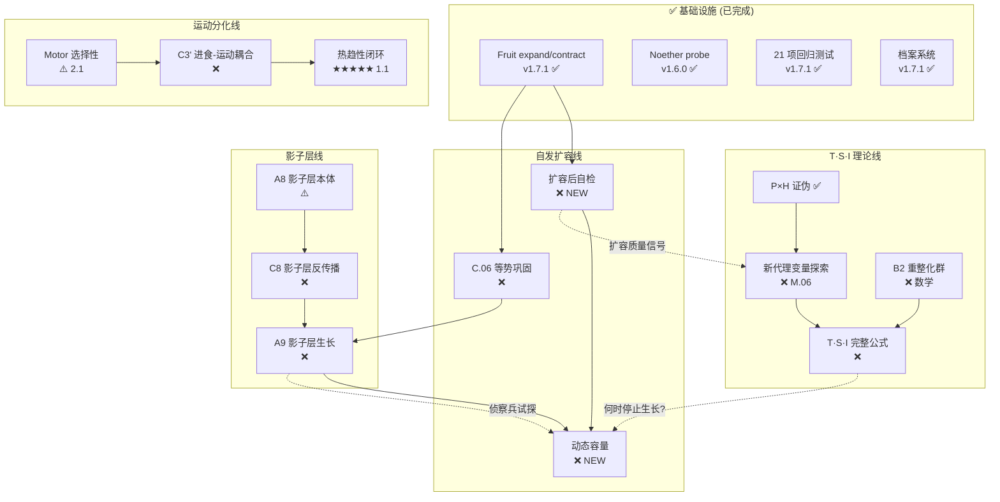

# 项目全局态势与路线图 — v1.7.1

> 日期: 2026-06-07
> 基于: TRACKER_v1.0, CROSSREF_master_task_v1.5, next_phase_priorities, 500k v1.7.1 验证结果

---

## §1 你的核心问题：扩容涌现需要新结构吗？

**是的，但不是另起炉灶——是让现有机制闭环。**

当前 Fruit expand/contract 的**已有**与**缺失**：

| 能力 | 状态 | 说明 |
|---|---|---|
| 识别哪里需要扩容 | ✅ 已有 | Xin 正残差 → expand (v1.7.0) |
| 识别哪里需要收缩 | ✅ 已有 | Xin 负残差 → contract (v1.7.1) |
| 执行扩容/收缩 | ✅ 已有 | sprout_threshold×0.5 / force prune |
| 扩容后自检 | ❌ 缺失 | 不知道扩容是否改善了性能 |
| 动态容量上限 | ❌ 缺失 | 硬编码 MAX_TOTAL_BUNDLES=80 |
| 跨 bundle 协调 | ❌ 缺失 | 每个 bundle 独立决策，不考虑全局 |

**缺的是"闭环"**——系统能扩容但不能评估扩容效果。这直接关联：
- **C.06 等势环流巩固** — fruit 间耦合协同成熟
- **A8 影子层本体** — 影子层应该是扩容的"试验场"
- **A9 影子层生长（侦察兵）** — 影子层先试探，主层再执行

---

## §2 所有任务的依赖关系



---

## §3 T·S·I 与扩容的关系

> **T·S·I 框架不只是学术问题——它回答"系统什么时候该停止生长"。**

P×H 证伪说明代理变量太窄。但扩容涌现提供了新线索：

| 缺失的量 | 候选测度 | 来源 |
|---|---|---|
| **S（空间）** | bundle 数量 / 拓扑直径 / 连接密度 | 现在 MAX=80 硬编码，应该由 T·S·I 推导 |
| **T（时间）** | Fruit maturation time / Xin leak τ | 为什么 τ=1000？应由 T·S·I 约束 |
| **I（信息）** | H_struct (权重熵) + **扩容方向熵** | expand 只发生在 10 个 bundle → 高度有序 |

**新假说**: T·S·I 的"S"不是 P_ν（偏振），而是**结构拓扑的某种测度**。
扩容行为 = S 的变化。如果 T·S·I = const，那么扩容（S↑）应伴随 T↓ 或 I↓。

这可以检验：500k 数据中 bundle 数从 52→80（S↑），encoding 稳定（I≈const），
那么 T 应该变了——具体来说，Fruit maturation 的速率应该放慢。

---

## §4 优先级排序（合并所有追踪表）

### Tier 1: 正在做的事（继续）

| # | 任务 | 依赖 | 理由 |
|---|---|---|---|
| **E1** | 扩容后自检 | F1 ✅ | 闭环扩容的最小必要条件 |
| **T2** | T·S·I 新代理变量 (含结构测度) | T1 ✅ | 核心理论，与扩容直接关联 |

### Tier 2: 影子层（与扩容共进）

| # | 任务 | 依赖 | 理由 |
|---|---|---|---|
| **A8** | 影子层本体验证 | — | 影子层是扩容试验场 |
| **C8** | 影子层反传播（侦察兵） | A8 | 为主层扩容提供预评估 |

### Tier 3: 运动分化（独立线路）

| # | 任务 | 依赖 | 理由 |
|---|---|---|---|
| **M1** | Motor 选择性强化 | — | 运动分化不足是老问题 |
| **C3'** | 进食-运动-体征环流耦合 | M1 | 闭环行为的关键 |
| **1.1** | 对称输入方向涌现 | C3' | 项目是否突破的最终测试 |

### Tier 4: 数学（可并行）

| # | 任务 | 理由 |
|---|---|---|
| **B2** | 重整化群 | T·S·I 的数学基础 |
| **M.08** | 收缩映射证明 | STDP 稳定性保证 |

---

## §5 建议执行策略

```
当前: v1.7.1 (21/21 通过, 500k 验证, 档案系统在线)

Phase 1 (本周):
  E1: 扩容后自检 — Fruit expand 后 1000 步，检查 Xin 是否下降
  T2: 用 500k 数据重新推导 T·S·I 代理变量（含结构变化）

Phase 2 (下周):
  A8: 影子层本体 — 验证影子层 BCM 是否稳定
  C8: 影子层侦察兵 — 影子层 expand 先于主层

Phase 3 (第三周):
  M1 + C3': 运动分化 + 环流耦合
  1.1: 对称输入涌现测试
```

> [!IMPORTANT]
> T·S·I 不应该被搁置——扩容涌现恰好提供了新的切入点。
> "结构什么时候该停止生长" = T·S·I 的直接应用。
