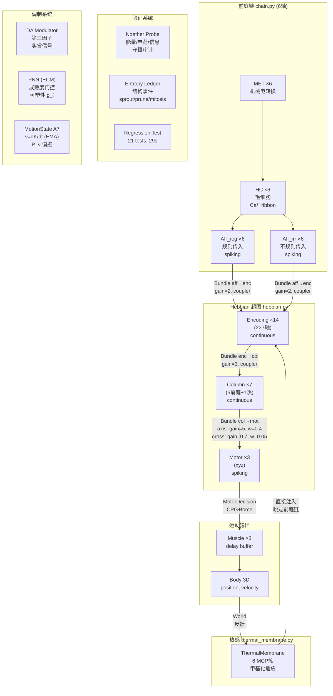

# 全局架构图 — v1.7.2

> 日期: 2026-06-08  
> Git: 776d081  
> 状态: 21/21 回归测试通过

---

## §1 信号链全貌



---

## §2 层级计数

| 层 | 组件文件 | 类 | 数量 | 类型 | 学习规则 |
|---|---|---|---|---|---|
| MET | compensation.py | MET | 6 | continuous | — |
| HC | compensation.py | HairCell | 6 | continuous | — |
| Aff_reg | neuron.py | Neuron | 6 | spiking | — |
| Aff_irr | neuron.py | Neuron | 6 | spiking | — |
| Encoding | neuron.py | Neuron | 14 (2×7) | continuous | — |
| Column | neuron.py | Neuron | 7 | continuous | — |
| Motor | neuron.py | Neuron | 3+ (可 mitosis) | spiking | — |
| Muscle | muscle.py | MuscleBlock | 3 | delay | — |
| Body | world.py | RigidBody | 1 | Newtonian | — |
| **Bundle** | bundle.py | SynapticBundle | ~35+sprouts | — | STDP/BCM/Hebbian |
| Memristor | semiconductor.py | Memristor | ~100+ | — | dw via Bundle |
| TemporalCoupler | temporal_coupler.py | TemporalCoupler | per-target | — | adaptive |
| **总计** | | | **~150+** | | |

---

## §3 Bundle 拓扑

### §3.1 原始 Bundle（不可删除）

| ID 模式 | 来源 | 目标 | 初始w | 天花板 | gain | 角色 |
|---|---|---|---|---|---|---|
| met_to_hc_* | MET | HC | 0.5 | 1.0 | 1.0 | feedforward |
| hc_to_aff_* | HC | Aff | 0.8 | 1.0 | 1.0 | feedforward |
| aff_reg_to_enc_* | Aff_reg | Enc_reg | 0.2 | 1.0 | 2.0 | feedforward |
| aff_irr_to_enc_* | Aff_irr | Enc_irr | 0.2 | 1.0 | 2.0 | feedforward |
| enc_to_col_* | Enc_reg+irr | Col | 0.15 | 1.0 | 3.0 | feedforward |
| col_*_to_move_* | Col_axis | Mot_axis | 0.4 | 0.5 | 5.0 | feedforward |
| col_to_motor_cross | Col_all | Mot_all | 0.05 | 0.15 | 0.7 | feedforward |

### §3.2 Sprouted Bundle（可修剪）

- 由 `_structural_growth()` 在 `|ξ| > 0.3` 时创建
- 继承母本拓扑，初始 w=1e-4 (expand_boost: +30% 父本权重)
- P2.1: 无硬编码上限，热力学能量墙限制 (EnergyStore 门控)
- Grace period: 5000 步后才可修剪

---

## §4 Xin → Fruit → 结构事件链

```
Xin (§7.2)                  Fruit (§7.3)                 结构 (S2)
─────────                    ──────────                  ─────────
预测-比较:                    ∅ → dormant:                expand:
 ŷ = W × a(t-1)              |ξ| > 0.5                   降低 sprout 阈值 50%
 ξ += (ŷ - a(t)) × dt                                    → 更容易长新芽
                              dormant → mature:
Xin leak:                     age ≥ 500 ticks             contract:
 τ = 1000s                    DA < 0.15                   强制修剪 bundle
                              (SW gate 已移除)             → 清除过剩容量

Xin 守恒:                     mature → trigger:
 Noether probe 审计            ξ > 0 → expand
 produced - consumed           ξ < 0 → contract
```

**v1.7.0 首次验证 (60k步)**: 38 matured, 9 expand, 26 contract

---

## §5 验证系统

### Noether Probe (noether_probe.py)

| 守恒律 | 公式 | 500k 状态 |
|---|---|---|
| 能量守恒 | E_in = E_out + E_leak | 0 violations |
| 电荷 KCL | ΣI_in = ΣI_out | 0 violations |
| Landauer | Q/bit >> kT | 通过 |
| 权重平衡 | drift < 0.01/step | 通过 |

### Entropy Ledger (entropy_ledger.py)

- 记录 sprout/prune/mitosis 事件
- 可冻结结构操作 (`_structural_freeze`)
- pre_step / post_step 审计

### Regression Test (test_regression.py)

| 组 | 检测 | 数量 |
|---|---|---|
| T0 | 构建+运行 | 2 |
| T1 | Noether 守恒 | 3 |
| T2 | 编码选择性 | 3 |
| T3 | Column 分化 | 2 |
| T4 | 权重拓扑 | 3 |
| T5 | Xin FFT 周期性 | 2 |
| T6 | Sprouting 安全 | 1 |
| T7 | A7 运动势 | 2 |
| T8 | 结构熵 | 2 |
| T9 | Fan-in 公平性 | 1 |
| **总计** | | **21** |

---

## §6 A7 运动势 (variant_adapter.py)

```
ν = EMA(dK/dt, α=0.01)          运动势 (EMA 平滑)
ν_xyz = EMA(m×v_i×a_i, α=0.01)  分轴运动势
P_ν = max(|ν_i|) / Σ|ν_i|       偏振度
K = ½m|v|²                       动能
```

FFT 验证: ν EMA 恢复 0.5Hz 输入频率 (17.5% power, 43% top-3)

---

## §7 跨尺度结构

| 尺度 | 时间窗口 | 对应 |
|---|---|---|
| spike | 0.001s (1步) | Neuron.step() |
| EMA | 0.1s (100步) | _activation_ema |
| Xin | 10s (10000步) | bundle.compute_xin() |
| Fruit | 50s (50000步) | update_fruit() MATURATION_TICKS=500 |
| Maturation | 100s+ | PNN stage transition |
| Mitosis | 30s+ | mitosis_confirm_steps |

---

## §8 文件→系统映射

### components/ (元件层)

| 文件 | 主要类 | 功能 | 被谁使用 |
|---|---|---|---|
| neuron.py | Neuron, NeuronConfig | RC膜+MOSFET+spike | 所有层 |
| semiconductor.py | Memristor, PowerRail, MOSFET | 忆阻器+电源 | Bundle, Neuron |
| temporal_coupler.py | TemporalCoupler | 时间尺度桥接 | Bundle |
| entropy_ledger.py | EntropyLedger | 结构事件审计 | VariantCircuit |
| modulator.py | DopamineModulator | DA 第三因子 | VariantCircuit |
| world.py | World, RigidBody | 3D 物理 | VariantCircuit |
| muscle.py | MuscleBlock | 运动执行 | MotorDecision |
| shadow_sandbox.py | ShadowSandbox | 影子层 | VariantCircuit |
| ecm.py | ECMCell, PNN | 细胞外基质+成熟度 | VariantCircuit |
| vascular.py | NVC, VascularBed | 血管冷却+能量 | VariantCircuit |
| oscillator.py | Oscillator | CPG | MotorDecision |
| compensation.py | MET, HairCell, VestibularChain | 前庭转换 | HebbianCircuit |
| binding.py | BindingLayer | 共激活绑定 | VariantCircuit |

### circuit/ (电路层)

| 文件 | 主要类 | 功能 |
|---|---|---|
| bundle.py | SynapticBundle, BundleConfig | 突触束: propagate + learn + Xin + Fruit |
| hebbian.py | HebbianCircuit | 基础电路: 层构建 + 结构生长 |
| variant_adapter.py | VariantCircuit, MotionState | 完整电路: DA + PNN + A7 + 熵账本 |
| motor_decision.py | MotorDecision | 运动决策: CPG + force + muscle |
| noether_probe.py | NoetherProbe | 守恒定律审计 |
| circulation.py | CirculationMeter | 环流测量 |
| observer.py | CircuitObserver | 观测/记录 |
| toprxin_ledger.py | TOPRXinLedger | T/O/P/R/Xin 全局审计 |
