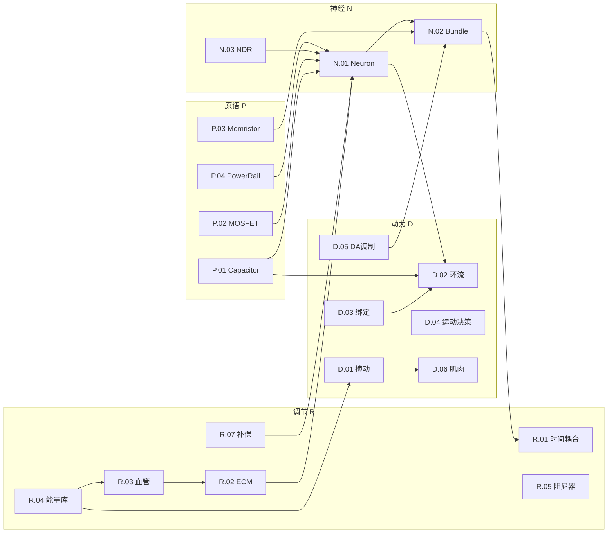

> **导航**: [[00_Dashboard/核心词条索引]] · [[00_Dashboard/理念架构图]]

# nexus_v1 机制总档案

> 版本：2026-06-12 / 源码快照：`d:\cell-cc\nexus_v1\`

---

## 目录

| 编号 | 机制 | 层级 | 文件 |
|------|------|------|------|
| **Ⅰ 原语层** |||
| P.01 | [Capacitor 电容](#p01-capacitor-电容) | 原语 | semiconductor.py |
| P.02 | [MOSFET 阈值门](#p02-mosfet-阈值门) | 原语 | semiconductor.py |
| P.03 | [Memristor 忆阻器](#p03-memristor-忆阻器) | 原语 | semiconductor.py |
| P.04 | [PowerRail 供电轨](#p04-powerrail-供电轨) | 原语 | semiconductor.py |
| **Ⅱ 神经/突触层** |||
| N.01 | [Neuron 神经元](#n01-neuron-神经元) | 核心 | neuron.py |
| N.02 | [Bundle 突触束](#n02-bundle-突触束) | 核心 | bundle.py |
| N.03 | [NDR 负微分电阻](#n03-ndr-负微分电阻) | 核心 | ndr.py |
| **Ⅲ 感觉层** |||
| S.01 | [VestibularChain 前庭链](#s01-vestibularchain-前庭链) | 感觉 | vestibular/chain.py |
| S.02 | [SomatosensoryChain 体感链](#s02-somatosensorychain-体感链) | 感觉 | somatosensory/chain.py |
| S.03 | [ThermalMembrane 温度膜](#s03-thermalmembrane-温度膜) | 感觉 | thermal_membrane.py |
| **Ⅳ 回路动力学** |||
| D.01 | [搏动 VitalOscillator](#d01-搏动-vitaloscillator) | 动力 | vital_oscillator.py |
| D.02 | [环流 Circulation](#d02-环流-circulation) | 动力 | circulation.py + variant_adapter.py |
| D.03 | [绑定 BindingLayer](#d03-绑定-bindinglayer) | 动力 | binding.py |
| D.04 | [运动决策 MotorDecisionLayer](#d04-运动决策-motordecisionlayer) | 动力 | motor_decision.py |
| D.05 | [多巴胺调制 Neuromodulator](#d05-多巴胺调制-neuromodulator) | 动力 | modulator.py |
| D.06 | [肌肉 MuscleSystem](#d06-肌肉-musclesystem) | 动力 | muscle.py |
| **Ⅴ 调节/稳态** |||
| R.01 | [时间耦合器 TemporalCoupler](#r01-时间耦合器-temporalcoupler) | 调节 | temporal_coupler.py |
| R.02 | [ECM 细胞外基质](#r02-ecm-细胞外基质) | 调节 | ecm.py |
| R.03 | [血管冷却 VascularCooling](#r03-血管冷却-vascularcooling) | 调节 | vascular.py |
| R.04 | [能量库 EnergyStore](#r04-能量库-energystore) | 调节 | energy_store.py |
| R.05 | [磁流变阻尼器 MagnetofluidDamper](#r05-磁流变阻尼器-magnetofluiddamper) | 调节 | damper.py |
| R.06 | [液金路由器 LiquidMetalRouter](#r06-液金路由器-liquidmetalrouter) | 调节 | router.py |
| R.07 | [补偿组件 Compensation](#r07-补偿组件-compensation) | 调节 | compensation.py |
| R.08 | [环流比例 CirculationProportion](#r08-环流比例-circulationproportion) | 调节 | circulation_proportion.py |
| **Ⅵ 观测/审计** |||
| O.01 | [影子沙箱 ShadowSandbox](#o01-影子沙箱-shadowsandbox) | 观测 | shadow_sandbox.py |
| O.02 | [Noether 探针](#o02-noether-探针) | 审计 | noether_probe.py |
| O.03 | [权重熵 WeightEntropy](#o03-权重熵-weightentropy) | 审计 | weight_entropy.py |
| O.04 | [结构账簿 StructuralLedger](#o04-结构账簿-structuralledger) | 审计 | structural.py |
| O.05 | [能量账簿 EnergyLedger](#o05-能量账簿-energyledger) | 审计 | energy_ledger.py |

---

## Ⅰ 原语层 — 最小硬件单元

### P.01 Capacitor 电容

| 属性 | 内容 |
|------|------|
| **身份** | 电荷积累 + RC衰减。系统中一切"记忆"的最终物理载体 |
| **文件** | [semiconductor.py](file:///d:/cell-cc/nexus_v1/components/semiconductor.py#L38-L109) |
| **动力学** | `dV/dt = I/C − V/(RC)` ; `Q = CV` |
| **操作** | `inject(I, dt)` → `ΔQ = I·dt` ; `leak(R, dt)` → `Q *= exp(−dt/τ)` |
| **Noether** | KCL 跟踪: `q_in − q_out ≡ ΔQ`，`kcl_imbalance` 恒 ≈ 0 |
| **电子** | 旁路电容 / 去耦电容 |
| **生物** | 膜电容 C_m |
| **使用者** | Neuron膜, TemporalCoupler, FBCap, CirculationProportion, D2R, CRI |

---

### P.02 MOSFET 阈值门

| 属性 | 内容 |
|------|------|
| **身份** | 电压控制开关，V > V_th 时导通。系统中一切"阈值判断"的物理原语 |
| **文件** | [semiconductor.py](file:///d:/cell-cc/nexus_v1/components/semiconductor.py#L115-L191) |
| **动力学** | 超阈: `I = gm × (V − V_th)` ; 亚阈: `I ∝ exp((V−V_th)/(n·V_T))` |
| **门控** | 可选 `tau_gate` → `dm/dt = (m_∞ − m)/τ` (等价HH通道) |
| **电子** | MOSFET (NMOS 增强型) |
| **生物** | 电压门控离子通道 (Na⁺/K⁺/Ca²⁺) |
| **使用者** | TemporalCoupler B/C层, CirculationProportion比较器, D2R, NDR |

---

### P.03 Memristor 忆阻器

| 属性 | 内容 |
|------|------|
| **身份** | 可塑电阻，w ∈ [0,1]。系统中一切"突触权重"的物理载体 |
| **文件** | [semiconductor.py](file:///d:/cell-cc/nexus_v1/components/semiconductor.py#L197-L264) |
| **动力学** | `R = R_min + ΔR × (1 − w)` ; STDP: `Δw = 0.5 × I × (pre_trace − post_trace)` |
| **Noether** | 审计: `w(t) − w(0) = Σ_ltp − Σ_ltd`, `weight_audit_imbalance ≈ 0` |
| **电子** | 忆阻器 (TiO₂ 交叉棒) |
| **生物** | AMPA/NMDA 突触权重 |
| **使用者** | Bundle._memristors (所有突触连接) |

---

### P.04 PowerRail 供电轨

| 属性 | 内容 |
|------|------|
| **身份** | 恒压源 + 内阻。IR 压降是自然增益限制器 |
| **文件** | [semiconductor.py](file:///d:/cell-cc/nexus_v1/components/semiconductor.py#L271-L296) |
| **动力学** | `V_actual = Vdd − I × R_internal` |
| **电子** | VRM (电压调节模块) |
| **生物** | 线粒体ATP供应 (有限功率) |

---

## Ⅱ 神经/突触层

### N.01 Neuron 神经元

| 属性 | 内容 |
|------|------|
| **身份** | Leaky Integrate-and-Fire + HH通道扩展。信号处理的基本单元 |
| **文件** | [neuron.py](file:///d:/cell-cc/nexus_v1/components/neuron.py) (35k bytes, ~900 lines) |
| **膜方程** | `C·dV/dt = I_syn + I_bias − V/R_leak − I_Na − I_K − I_Ca − I_GIRK` |
| **放电** | V > V_th → spike → reset to V_reset, 不应期 τ_refrac |
| **子组件** | Capacitor (膜), MOSFET (通道), CRI (Ca²⁺积分), DivNorm, D2R, AGC |
| **角色分化** | `neuron_role` ∈ {afferent, encoding, column, motor, da, relay, ...} |
| **热输出** | `heat_output = I²R + spike_energy + clamp_energy` (Noether) |
| **电子** | 非线性RC放大器 + 施密特触发器 |
| **生物** | 皮层锥体细胞 / 前庭传入 / VTA DA 神经元 |

---

### N.02 Bundle 突触束

| 属性 | 内容 |
|------|------|
| **身份** | N→M 全连接突触矩阵 + STDP/BCM 学习。连接两组神经元的"线缆" |
| **文件** | [bundle.py](file:///d:/cell-cc/nexus_v1/circuit/bundle.py) (33k bytes) |
| **传播** | `I_post[j] = Σ_i w_ij × a_pre[i]` (Memristor.conduct) |
| **学习** | STDP: `Δw ∝ pre_trace × post_trace × plasticity_gate × DA` |
| **Xin 张力** | `ξ = |ā_pre − ā_post|` → DA → weight adjustment |
| **果实** | `fruit` 生命周期: seed→growing→ripe→decaying |
| **电子** | 交叉棒忆阻器阵列 (crossbar array) |
| **生物** | 突触投射纤维束 (projection fiber tract) |

---

### N.03 NDR 负微分电阻

| 属性 | 内容 |
|------|------|
| **身份** | N型NDR: V↑ → I先升后降。产生可兴奋性、双稳态和振荡 |
| **文件** | [ndr.py](file:///d:/cell-cc/nexus_v1/components/ndr.py) |
| **I-V** | Region1: `I = g₁V` ; Region2(NDR): `I` 下降 ; Region3: `I = I_valley + g₃V` |
| **动态门控** | `I = g_max × m_∞(V) × h(t) × V` (等价HH) |
| **派生** | `InhibitorySynapse`: NDR用于侧向抑制 (WTA竞争) |
| **电子** | 隧道二极管 / Chua二极管 |
| **生物** | Na⁺通道激活+失活 (Hodgkin-Huxley 1952) |

---

## Ⅲ 感觉层

### S.01 VestibularChain 前庭链

| 属性 | 内容 |
|------|------|
| **身份** | Met→HC→Aff三级感觉转导链。6轴角速度/加速度 → 神经脉冲 |
| **文件** | [vestibular/chain.py](file:///d:/cell-cc/nexus_v1/vestibular/chain.py) |
| **轴** | yaw, pitch, roll (半规管) + oto_x, oto_y, oto_z (耳石) |
| **双通路** | Regular (DC, 静态倾斜) + Irregular (AC, 瞬态加加速度) |
| **电子** | MEMS陀螺仪 + 加速度计 → ADC → 数字信号 |
| **生物** | 半规管毛细胞 → 前庭神经 → 前庭核 |

---

### S.02 SomatosensoryChain 体感链

| 属性 | 内容 |
|------|------|
| **身份** | 温度/伤害感受 → 中继神经元。身体内感觉的第二感觉系统 |
| **文件** | [somatosensory/chain.py](file:///d:/cell-cc/nexus_v1/somatosensory/chain.py) |
| **通道** | Thermoreceptor (温觉) + Nociceptor (伤害) + Relay (中继) |
| **电子** | 热敏电阻 + 阈值检测器 → 汇聚放大器 |
| **生物** | C纤维/Aδ纤维 → 脊髓背角 → 丘脑中继 |

---

### S.03 ThermalMembrane 温度膜

| 属性 | 内容 |
|------|------|
| **身份** | 标量温度传感器 + 甲基化适应。只能测量 dT/dt，方向靠跨模态学习 |
| **文件** | [thermal_membrane.py](file:///d:/cell-cc/nexus_v1/components/thermal_membrane.py) |
| **动力学** | `dM/dt = (T − M) / τ` ; 输出 `therm = T − M`, `dtherm = dT/dt` |
| **设计原理** | C-004: 单点标量传感器不可能有方向性。方向通过 Hebbian 关联涌现 |
| **电子** | 热敏电阻 + 带通滤波器 (τ_adapt → AC 耦合) |
| **生物** | 大肠杆菌 MCP (甲基受体趋化蛋白) / 秀丽线虫 AFD 神经元 |

---

## Ⅳ 回路动力学

### D.01 搏动 VitalOscillator

> [!IMPORTANT]
> **三频失谐心脏** — 生命的时钟。能量耗尽则心跳停止，有机体死亡。

| 属性 | 内容 |
|------|------|
| **身份** | 三个独立 Van der Pol 振荡器，频率互不可公度 → 遍历 Lissajous 游走 |
| **文件** | [vital_oscillator.py](file:///d:/cell-cc/nexus_v1/components/vital_oscillator.py) |
| **频率** | f_x=2.00, f_y=2.11, f_z=1.93 Hz (互素比: 200:211:193) |
| **VdP方程** | `dx/dt = y` ; `dy/dt = −ω²x − μ(x²−1)y` ; μ=2.0 (松弛振荡) |
| **积分** | RK4 (4阶Runge-Kutta) |
| **能量耦合** | `ΔE = cost × Σ|output| × dt` → `EnergyStore.withdraw()` |
| **死亡开关** | `fill_fraction < 0.05` → output = [0,0,0] → 心脏骤停 |
| **信号链** | VitalOsc → Motor膜注入 → Body力 → 运动 (基底姿势摆动) |
| **电子** | 三路独立 LC + NDR 振荡器 (互不锁频) |
| **生物** | 窦房结 → 心律 → 血液搏动 → 姿势摇摆 (生理性震颤 ~8-12Hz) |

```
信号流:
  EnergyStore.fill ──→ amplitude_scale ──→ VdP_xyz ──→ [x,y,z]
                                                          ↓
  Motor.inject(vital_pulse[i]) ──→ Body.force ──→ position
                                                          ↓
  EnergyStore.withdraw(cost × Σ|out|) ←── Noether 审计
```

**关键特性**: 三个频率的比是**无理数**（或至少互素），因此相位差永远不重复 → 3D轨迹**遍历**（ergodic）空间。这是**确定性**的"随机游走"，无需随机数生成器。

---

### D.02 环流 Circulation

> [!IMPORTANT]
> **涌现闭合回路** — 不是管道，而是信号在已有拓扑上形成的闭合环。

| 属性 | 内容 |
|------|------|
| **身份** | Col→Bind→Mot→FBCap→Col 的闭合信号环路 (涌现，非专属结构) |
| **文件** | [circulation.py](file:///d:/cell-cc/nexus_v1/circuit/circulation.py) (测量器) + [variant_adapter.py L976-1006](file:///d:/cell-cc/nexus_v1/circuit/variant_adapter.py#L976-L1006) (反馈路径) |
| **大环流路径** | `Column.ema → BindingCell.activation → Motor.spike → FBCap.voltage → Column.inject(−fb)` |
| **测量公式** | `flow = col_ema × bind_act × bind_mot_w × fb_trace` (CirculationMeter) |
| **反馈载体** | `_feedback_caps: Dict[str, Capacitor]`, τ=0.5s, gain=0.05 |
| **三层分布** | 母结构: ❌无 ; 交感层: ✅大环流 ; 影子层: ✅微环流 (cross-axis双向) |
| **电子** | 运算放大器反馈环路 (传出副本 = 反馈采样) |
| **生物** | 感觉运动环路 / 传出副本 (efference copy, von Holst 1950) |

```
三层的环流:

母结构 HebbianCircuit:  Aff → Enc → Col → Mot  (纯前馈，无环流)
                                    
交感层 VariantAdapter:  Col ──→ Bind ──→ Mot ──→ FBCap ──→ Col  (大环流)
                         ↑_________________________________↓

影子层 ShadowSandbox:   s_col_i ←→ s_col_j  (微环流，cross-axis 振荡)
```

---

### D.03 绑定 BindingLayer

| 属性 | 内容 |
|------|------|
| **身份** | 超边(hyperedge)层: 检测多轴共激活。C(6,2)=15个绑定细胞 |
| **文件** | [binding.py](file:///d:/cell-cc/nexus_v1/components/binding.py) |
| **激活公式** | `act = G × Π ReLU((a_i − θ) / θ)` (AND门: 全部超阈才输出) |
| **饱和** | `min(product, 10.0)` 防爆炸 |
| **在环流中** | Binding 是环流路径的第2段: Col → **Bind** → Mot |
| **电子** | 模拟乘法器 (Gilbert cell) |
| **生物** | 多感觉整合 (Stein & Stanford 2008, 上丘) |

---

### D.04 运动决策 MotorDecisionLayer

| 属性 | 内容 |
|------|------|
| **身份** | Col与Motor之间的中间决策层。包含CPG、方向选择、空间导航 |
| **文件** | [motor_decision.py](file:///d:/cell-cc/nexus_v1/circuit/motor_decision.py) |
| **子模块** | MotorRhythmGenerator (CPG, 活跃), DirectionSelector (占位), SpatialNavigator (占位), LateralInhibition (侧向抑制) |
| **CPG方程** | `dφ_i/dt = ω_i + Σ κ sin(φ_j − φ_i − Δφ_ij) + ε·temporal_i` |
| **节律调制** | `envelope = 0.5 + 0.5·sin(φ)` → motor × envelope |
| **侧抑制** | `inhib_i = strength × (Σ_others / N)` (Renshaw细胞) |
| **电子** | 环形振荡器 + 比较器 (WTA) |
| **生物** | 脊髓CPG (Grillner 2006) + 基底节 (Mink 1996) + 海马 (O'Keefe 1978) |

---

### D.05 多巴胺调制 Neuromodulator

| 属性 | 内容 |
|------|------|
| **身份** | 容积传导调制信号: 慢速、弥散、影响增益/学习率/阈值 |
| **文件** | [modulator.py](file:///d:/cell-cc/nexus_v1/components/modulator.py) |
| **浓度ODE** | `dc/dt = release_rate − (c − baseline) / τ_decay` |
| **效应** | `gain_factor = 1 + α_gain × (c − baseline)` ; `lr_factor = 1 + α_lr × (c − baseline)` |
| **预设** | DA (τ=2s, α_lr=2.0), 5-HT (τ=10s), ACh (τ=0.5s) |
| **三因子学习** | `Δw = STDP × DA × PNN_gate` (Izhikevich 2007) |
| **电子** | DAC + PGA (数模转换 + 可编程增益放大) / 衬底偏置 |
| **生物** | VTA多巴胺 / 中缝核5-HT / 基底前脑ACh / 蓝斑NE |

---

### D.06 肌肉 MuscleSystem

| 属性 | 内容 |
|------|------|
| **身份** | Motor神经元激活 → 物理力。3组(x,y,z), FIFO延迟 |
| **文件** | [muscle.py](file:///d:/cell-cc/nexus_v1/components/muscle.py) |
| **转换** | `force = clamp(activation × gain, ±max_force)` |
| **延迟** | `delay_steps = 2` (神经肌肉传导延迟) |
| **能耗** | `cost = |force| × cost_per_force` |
| **电子** | 功率放大器 + 电机驱动 |
| **生物** | 骨骼肌 (简化, 无肌节动力学) |

---

## Ⅴ 调节/稳态

### R.01 时间耦合器 TemporalCoupler

| 属性 | 内容 |
|------|------|
| **身份** | 跨时间尺度阻抗匹配。每条Bundle配一个。环流强度的局部调节器 |
| **文件** | [temporal_coupler.py](file:///d:/cell-cc/nexus_v1/components/temporal_coupler.py) |
| **双层结构** | B层(慢, ~1000步): 上下游ema差分 → C_slow → 调制R_leak → τ漂移 |
|              | C层(快, 每步): 下游ema → MOSFET → 额外泄漏 |
| **B层公式** | `R_leak = R_base × (1 + k × V_slow)` ; `V_slow` 由差分MOSFET比较器驱动 |
| **C层公式** | `drain = g_adapt × V_cap × dt` |
| **Noether** | `E = 0.5 × C × V²` 追踪 |
| **电子** | 阻抗变换器 + AGC反馈 |
| **生物** | 突触缩放 (Turrigiano 2008) + 逆行信使 (内源性大麻素/NO) |

---

### R.02 ECM 细胞外基质

| 属性 | 内容 |
|------|------|
| **身份** | 离子缓冲 + 热质量 + 可塑性门控。三合一微环境调节器 |
| **文件** | [ecm.py](file:///d:/cell-cc/nexus_v1/components/ecm.py) |
| **热动力学** | `dT/dt = (Q_in − G·(T−T_ref)) / C_thermal` |
| **离子缓冲** | `dB/dt = absorption × heat − B / τ_buffer` |
| **PNN成熟** | `dPNN/dt = (target − PNN) / τ_pnn` ; DA降解: `dPNN −= k × DA_excess × PNN` |
| **可塑性门** | `plasticity_gate = 1 − PNN_maturity` (成熟=关闭) |
| **Q10效应** | `τ_corrected = τ / Q10^(ΔT/10)` (温度影响时间常数) |
| **电子** | 散热片 + 旁路电容 + 接地平面 |
| **生物** | PNN (Härtig 1999) + CSPG基质 + 神经血管单元 |

---

### R.03 血管冷却 VascularCooling

| 属性 | 内容 |
|------|------|
| **身份** | 活动耦合散热 + 能量递送。NVC(神经血管耦合)闭环系统 |
| **文件** | [vascular.py](file:///d:/cell-cc/nexus_v1/components/vascular.py) |
| **流速** | `flow = base × (1 + gain × activity_ema)` ; `max_flow = 3×` |
| **散热** | `Q_remove = flow × c × max(T − T_ref, 0)` |
| **能量** | `E_deliver = flow × efficiency × dt` |
| **电子** | 液冷循环 + DVFS (动态电压频率调节) |
| **生物** | 脑血流 (~750mL/min) + 星形胶质细胞Ca²⁺ → 血管舒张 (Attwell 2010) |

---

### R.04 能量库 EnergyStore

| 属性 | 内容 |
|------|------|
| **身份** | 外部能量储备。进食→存储→代谢的中转站。有限容量电池 |
| **文件** | [energy_store.py](file:///d:/cell-cc/nexus_v1/components/energy_store.py) |
| **操作** | `deposit(amount)` ← 进食 ; `withdraw(amount)` → 内部消耗 ; `tick(dt)` → 基础代谢 |
| **容量** | 1000 单位, 初始50% |
| **死亡** | `fill < starvation_threshold(10%)` → 供应衰减 → VitalOsc停振 → 死亡 |
| **Noether** | `deposited = withdrawn + basal_drain + current − initial` |
| **电子** | 电池 + 恒流源充电 (max_deposit_per_step) |
| **生物** | 肝糖原(~400kcal) + 血糖缓冲(~16kcal) |

---

### R.05 磁流变阻尼器 MagnetofluidDamper

| 属性 | 内容 |
|------|------|
| **身份** | 场控自适应阻尼。大信号自动衰减，防止兴奋性失控 |
| **文件** | [damper.py](file:///d:/cell-cc/nexus_v1/components/damper.py) |
| **公式** | `R_eff = R_base × (1 + α × B²)` ; `B = B_ext + β × |I|` |
| **Faraday** | 可选内部振荡: `A × sin(2πft)` 当 `|B| > B_threshold` |
| **电子** | MR流体减震器 (磁流变液) |
| **生物** | 髓鞘 (可变绝缘) + PNN (稳定突触) |

---

### R.06 液金路由器 LiquidMetalRouter

| 属性 | 内容 |
|------|------|
| **身份** | 活动依赖的拓扑重构。相关性高→连接，低→剪枝 |
| **文件** | [router.py](file:///d:/cell-cc/nexus_v1/components/router.py) |
| **状态** | `s ∈ [0,1]` ; `ds/dt = (s_target − s) / τ_reconfig` |
| **规则** | `corr > θ_grow → s_target=1` ; `corr < θ_prune → s_target=0` |
| **导通** | `G = G_metal × s × (1 − oxide × (1−s))` |
| **自愈** | 部分断裂的连接渐进恢复 |
| **电子** | EGaIn液态金属微流道 (Dickey 2017) |
| **生物** | 轴突导航 + 突触修剪 + 结构可塑性 (Holtmaat 2009) |

---

### R.07 补偿组件 Compensation

| 属性 | 内容 |
|------|------|
| **身份** | 4种半导体级稳定器，每个神经元内部可配置使用 |
| **文件** | [compensation.py](file:///d:/cell-cc/nexus_v1/components/compensation.py) |

| 子组件 | 功能 | 公式 | 生物对应 |
|--------|------|------|---------|
| **A. VoltageRegulator** | 活动依赖代谢恢复 | `rate = base + coeff × |act|` | 线粒体ATP (Attwell 2001) |
| **B. DecouplingCapacitor** | 能量缓冲/时间平滑 | `τ = C × R`, 指数衰减 | 树突电缆 (Koch 1999) |
| **C. BiasCurrentSource** | 自发基线活动 | `I_bias = const` | 前庭传入自发放电 ~70Hz |
| **D. AutomaticGainControl** | 稳态可塑性 | `gain = K / (1 + ā/a_target)` | 突触缩放 (Turrigiano 2008) |
| **H. CalciumRateIntegrator** | 脉冲→连续信号 | Cap + Zener (泽纳钳位) | CaMKII (Lisman 2012) |
| **I. DivisiveNormalization** | 输入范围适应 | `I_eff = I × σ/(σ+V_pool)` | V1 除法归一化 (Carandini 2012) |
| **J. D2Autoreceptor** | DA特异负反馈 | Cap + MOSFET → GIRK电流 | D2自受体 (Lacey 1987) |

---

### R.08 环流比例 CirculationProportion

| 属性 | 内容 |
|------|------|
| **身份** | 测量三种信号(稳态/运动/进食)的比例，偏差驱动DA。**不是**环流本身 |
| **文件** | [circulation_proportion.py](file:///d:/cell-cc/nexus_v1/components/circulation_proportion.py) |
| **结构** | 3个Capacitor积分 → V_total → 各自比例 ρ = V_i/V_total |
| **偏差检测** | MOSFET比较器: `|ρ_ref − ρ_homeo|` → DA电流 |
| **设计** | **开环传感器**，不形成闭合环路 |
| **电子** | 三路ADC + 比较器 + DAC |
| **生物** | 下丘脑稳态监测 (体温/饥饿/运动平衡) |

---

## Ⅵ 观测/审计

### O.01 影子沙箱 ShadowSandbox

| 属性 | 内容 |
|------|------|
| **身份** | 主回路的只读镜像。独立的 Enc→Col→Mot 结构，包含交叉轴双向连接 |
| **文件** | [shadow_sandbox.py](file:///d:/cell-cc/nexus_v1/components/shadow_sandbox.py) (44k bytes) |
| **结构** | s_enc_{axis} → s_col_{axis} → s_mot_{xyz} + s_cross_{i}_{j} (双向) |
| **微环流** | s_col_i ↔ s_col_j 通过 cross-axis 双向 bundle 振荡 |
| **只读** | observe() 不修改主系统。影子有自己的STDP学习 |
| **指标** | burial_metric, resonance_metric, decay_metric |
| **电子** | FPGA shadow logic (设计验证仿真) |
| **生物** | 小脑内部模型 / 海马重放 (offline rehearsal) |

---

### O.02 Noether 探针

| 属性 | 内容 |
|------|------|
| **身份** | 全局能量守恒审计。追踪 ds²(信号变化能量) 和 ν(耗散功率) |
| **文件** | [noether_probe.py](file:///d:/cell-cc/nexus_v1/ledger/noether_probe.py) |
| **核心** | `ds² = Σ C·ΔV²` (储能变化) ; `ν = Σ I²R` (耗散) ; 守恒: `ds² + ν ≈ E_input` |
| **审计** | Landauer bound: `Q ≥ kT·ln2·|ΔH|` |

---

### O.03 权重熵 WeightEntropy

| 属性 | 内容 |
|------|------|
| **身份** | Shannon 熵度量权重分布的信息内容。学习 → 熵下降 → 需要散热补偿 |
| **文件** | [weight_entropy.py](file:///d:/cell-cc/nexus_v1/ledger/weight_entropy.py) |
| **公式** | `H = −Σ p_i log₂ p_i` (50-bin 直方图) |
| **分层** | vest_to_enc, enc_to_col, col_to_motor, sprouts, soma_* |
| **Landauer** | `ΔH < 0` → 信息写入 → `Q_dissipated ≥ kT·ln2·|ΔH|` |

---

### O.04 结构账簿 StructuralLedger

| 属性 | 内容 |
|------|------|
| **身份** | 结构事件(sprout/prune/mitosis)的递归追踪 + 超度量空间 |
| **文件** | [structural.py](file:///d:/cell-cc/nexus_v1/ledger/structural.py) |
| **子模块** | RecursionTracker (事件→T/O/P/R/Xin 循环) |
|            | UltrametricSpace (LCA距离: `d_u = 1/(1+depth(LCA))`) |
|            | StructuralEntropy (树复杂度: `H = −Σ p_d log₂ p_d`) |
|            | StructuralBridge (结构↔信号空间关联) |
|            | GuidedConstructionAuditor (过渡自限检测) |

---

### O.05 能量账簿 EnergyLedger

| 属性 | 内容 |
|------|------|
| **身份** | 全系统能量收支追踪。输入(进食+存储) = 输出(神经活动+散热+基代) |
| **文件** | [energy_ledger.py](file:///d:/cell-cc/nexus_v1/ledger/energy_ledger.py) |
| **核心** | `balance = deposited − withdrawn − basal − heat` ≈ 0 |

---

## 交叉引用: 机制间依赖关系



---

## 附录: 成熟机制 (Maturation)

| 属性 | 内容 |
|------|------|
| **位置** | [variant_adapter.py L1529-1584](file:///d:/cell-cc/nexus_v1/circuit/variant_adapter.py#L1529-L1584) |
| **阶段** | stage 0 → 1 → 2 (area, 最大) |
| **条件** | `PNN > θ_pnn AND Φ > θ_phi` |
| **Φ 积累** | 每步: `Φ += ema × ε` (§3, potential_phi) |
| **结晶** | 目标在 area 阶段 + 权重方差 < 0.01 → 束结晶 |

## 附录: 三因子学习规则

| 属性 | 内容 |
|------|------|
| **位置** | [variant_adapter.py L1249-1320](file:///d:/cell-cc/nexus_v1/circuit/variant_adapter.py#L1249-L1320) |
| **公式** | `Δw = STDP(pre, post) × plasticity_gate` |
| **gate组成** | `gate = PNN_gate × DA_lr_mod × g_sync × body_inertia` |
| **PNN_gate** | `1 − PNN_maturity` (ECM层, 临界期) |
| **DA_lr_mod** | `dopamine.gain_factor()` (Xin → DA → 学习增强) |
| **g_sync** | `MOSFET(total_binding_activation)` (绑定层门控运动学习) |
| **body_inertia** | `mass_inertia_factor()` (大体→慢学习) |
