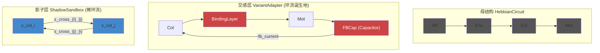

> **导航**: [[00_Dashboard/核心词条索引]] · [[00_Dashboard/理念架构图]]

# 环流的结构解剖 — 三层追踪

## 核心结论

> [!IMPORTANT]
> **环流没有专属管道。** 环流是信号沿已有拓扑结构形成闭合回路时涌现的动力学模式。
> 就像河流不需要"环流管" — 水在河床里流动，地形决定了漩涡出现的位置。

---

## 一、母结构 (HebbianCircuit) — 环流的河床

母结构 [hebbian.py](file:///d:/cell-cc/nexus_v1/circuit/hebbian.py) 提供了信号流动的**单向河床**：

```
VestibularChain → Afferent → Encoding → Column → Motor
```

这是一个**前馈链**（feedforward），信号只能从左往右流。

> [!NOTE]
> 母结构**没有任何反馈连接**。没有 Motor→Column 的回路，没有 Column→Encoding 的逆向连接。
> 因此：**母结构上不存在环流。**

### 结构拓扑（代码证据）

| 连接 | Bundle | 代码位置 |
|------|--------|---------|
| Aff → Enc | `aff_reg_to_enc_{axis}` | [L306-359](file:///d:/cell-cc/nexus_v1/circuit/hebbian.py#L306-L359) |
| Enc → Col | `enc_to_col_{axis}` | [L362-403](file:///d:/cell-cc/nexus_v1/circuit/hebbian.py#L362-L403) |
| Col → Mot | `col_{ax}_to_{mot}` + cross | [L409-470](file:///d:/cell-cc/nexus_v1/circuit/hebbian.py#L409-L470) |

**全部是 `bundle_role="feedforward"`。无一个反向连接。**

---

## 二、交感层 (VariantAdapter) — 环流的诞生地

[variant_adapter.py](file:///d:/cell-cc/nexus_v1/circuit/variant_adapter.py) 继承母结构，**新增了两条反馈路径**，从而闭合了环路：

### 反馈路径 A：Motor → Column 抑制反馈（传出副本）

```
Motor neuron spikes
    ↓ inject into FBCap (Capacitor, τ=0.5)
    ↓ leak(R=1.0)
FBCap.voltage → inhibitory current → Column._membrane.inject(-fb_current)
```

**代码位置**: [L976-1006](file:///d:/cell-cc/nexus_v1/circuit/variant_adapter.py#L976-L1006)

物理载体：
- `_feedback_caps`: `Dict[str, Capacitor]` — 每个 motor 一个电容器
- `_feedback_gain = 0.05` — 抑制增益
- `_feedback_tau = 0.5` — 时间常数（500ms）

### 反馈路径 B：BindingLayer → Motor → Column（间接）

BindingLayer 把 Column 的**共激活信号**投射到 Motor：

```
Col_i × Col_j → BindingCell_{i,j}.activation
    ↓ binding_motor_weights
Motor_m._membrane.inject(bind_current)
    ↓ (Motor spikes)
    ↓ FBCap → Column._membrane.inject(-fb)
```

这形成了完整的闭合环路：

```
Col → Bind → Mot → FBCap → Col
 ↑                          ↓
 └──────────────────────────┘
```

### 这就是"环流"

> [!TIP]
> `CirculationMeter.measure()` 在 [circulation.py:L118](file:///d:/cell-cc/nexus_v1/circuit/circulation.py#L118) 明确枚举的路径就是这个闭合环：
> ```python
> # Path: Col[axis_i] → Bind[axis_i, axis_j] → Mot[m] → feedback → Col[axis_i]
> flow = col_da * cell.activation * bind_mot_w * max(fb_trace, 0.001)
> ```
> 它读取的是 `_feedback_traces`（即 `FBCap.voltage`）、`BindingCell.activation`、`column._activation_ema`。
> **全部是已有组件上的电压读数。没有额外结构。**

---

## 三、影子层 (ShadowSandbox) — 有无环流？

[shadow_sandbox.py](file:///d:/cell-cc/nexus_v1/components/shadow_sandbox.py) 的结构：

```
s_enc_reg_{axis} ──→ s_col_{axis} ──→ s_mot_{x,y,z}
s_enc_irr_{axis} ──↗
                   s_col_{i} ←→ s_col_{j}  (cross-axis, 双向)
```

### 影子层有环流吗？

**有。** 但形式不同：

| 特征 | 交感层环流 | 影子层环流 |
|------|-----------|-----------|
| 闭合路径 | Col→Bind→Mot→FBCap→Col | s_col_i ↔ s_col_j（cross-axis 双向 bundle） |
| 反馈机制 | 传出副本（efference copy） | **无**。没有 Mot→Col 反馈 |
| 环路长度 | 4 节点（col, bind, mot, fb） | 2 节点（col_i ↔ col_j） |
| 环流类型 | **大环流**（跨层） | **微环流**（同层振荡） |

影子层的 cross-axis bundles 是**双向**的（L275-292 创建的虽是单向，但 `_expand_for_new_axes` 在 L423-456 为每对创建了双向连接）。这意味着：

```
s_col_yaw → s_cross_yaw_pitch → s_col_pitch → s_cross_pitch_yaw → s_col_yaw
```

这是一个**2-node 微环流**。信号在两个 column 之间振荡，振幅由 STDP 权重和 Xin 张力决定。

> [!NOTE]
> 影子层**没有 Motor→Column 反馈**，因此不存在大环流。
> 影子层的 STATUS 是 `Read-only observer` — 它不修改主系统，也没有传出副本信号源。

---

## 四、C3' CirculationProportionCircuit — 不是"环流"，是"环流比例"

[circulation_proportion.py](file:///d:/cell-cc/nexus_v1/components/circulation_proportion.py) 的名字容易误导。
它不是环流本身，而是**测量三种信号的比例**，然后用偏差驱动 DA：

```
thermal_stability ──→ [Cap_H] ──→ V_homeo ──┐
body_speed        ──→ [Cap_M] ──→ V_motor ──┤──→ V_total → rho_homeo = V_H / V_total
feed_alignment    ──→ [Cap_F] ──→ V_feed  ──┘
                                                    ↓
                                             |V_ref - rho_homeo| → MOSFET → DA current
```

**这是一个开环传感器，不形成闭合环路。** 它的输出（DA current）注入 DA 神经元，但不直接回到它的输入端（thermal_stability 来自 thermal_membrane，不受 DA 直接控制）。

---

## 五、TemporalCoupler B-layer — 环流的"水位调节器"

[temporal_coupler.py](file:///d:/cell-cc/nexus_v1/components/temporal_coupler.py) 的 B-layer 是**每条 bundle 自带**的局部反馈：

```
ema_upstream → [MOSFET_up] → I_charge ↓
                                       [C_slow] → V_slow → R_leak_eff
ema_downstream → [MOSFET_dn] → I_drain ↑
```

- 上游活动 > 下游 → V_slow 上升 → R_leak 增大 → τ 变长 → 通过更多
- 下游活动 > 上游 → V_slow 下降 → R_leak 减小 → τ 变短 → 通过更少

> [!IMPORTANT]
> B-layer 是一个**局部闭环**（读 ema_downstream → 调节 R_leak → 影响 downstream 输入 → 改变 ema_downstream）。
> 它是环流**强度的调节器**，但不是环流本身。环流流经 Col→Bind→Mot→FB→Col 的大环路；
> B-layer 在每条 bundle 上调节流过该段"河床"的水量。

---

## 六、总结：环流的三个维度



| 层 | 有环流？ | 环路结构 | 专属载体？ |
|----|---------|---------|-----------|
| **母结构** | ❌ | 纯前馈，无反馈 | — |
| **交感层** | ✅ **大环流** | Col→Bind→Mot→FBCap→Col | BindingLayer + FBCap（但它们不是"为了环流"而建的） |
| **影子层** | ✅ **微环流** | s_col_i ↔ s_col_j | cross-axis 双向 bundle |

### 回答你的问题

1. **环流是否有专属的链路/结构/机制？**
   **没有。** BindingLayer 是为共激活检测建的，FBCap 是为传出副本建的。环流是这些功能组件**恰好形成闭合环路时涌现的动力学模式**。

2. **环流是否会被层间结构计算？**
   **不是"计算"，是"测量"。** `CirculationMeter` 是纯观测器（每100步采样一次），读取闭合环路上各段的电压/权重，计算 flow = ∏(各段强度)。`CirculationProportionCircuit` 是信号比例的传感器，输出 DA 调制。两者都不改变环流本身。

3. **你曾说环流无需额外结构 — 为什么？**
   因为环流是**拓扑性质**，不是**组件性质**。只要存在闭合的信号路径（无论路径上的组件是什么功能角色），信号就会在上面循环流动。正如漩涡不需要专门的"漩涡管"，只需要河床形成闭合地形。

> [!CAUTION]
> 但这也意味着：如果 BindingLayer 被移除或 FBCap 失效，交感层的大环流就**立即消失**。
> 环流没有自己的"结构韧性" — 它完全依赖于形成它的组件的健康状态。
> 这是一个设计选择：环流是**二阶涌现**，而非一阶结构。
