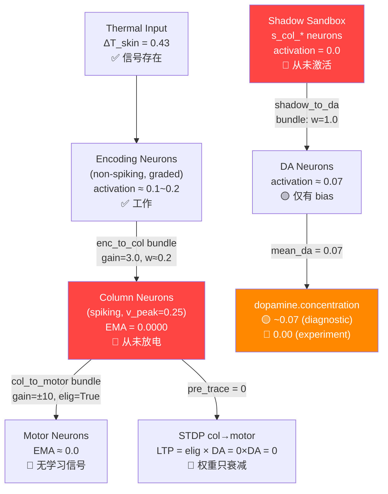

# Phase 4 DA 失效诊断报告（最终版）

> 225k 步实验已暂停。信号链追踪定位了两个级联根因。

## ⚡ 定位结论

**根因 1（致命）：Relay 神经元激活为零**
- [_relay_config()](file:///D:/cell-cc/cell-cc-xyj/cell-cc-other/nexus_v1/somatosensory/chain.py#L141-L161) 未设置 `channels`，使用 NeuronConfig 默认 v_threshold=**0.30**
- Relay 膜电压 V=0.27 < v_threshold=0.30 → `activation = gm × max(0, 0.27 - 0.30) = 0`
- **整条热信号链在 relay 层就已经断裂**

**根因 2（掩盖性）：High-pass sensory adaptation**
- [get_mechanical_inputs()](file:///D:/cell-cc/cell-cc-xyj/cell-cc-other/nexus_v1/somatosensory/chain.py#L419-L455) 做了 RC 高通滤波
- 即使 relay 修复后放电，**恒定温度梯度**（DC 分量）也会被滤除
- 在静态热环境中，只有温度**变化**才能通过 → 编码层长期无信号



---

## 根因 #1：Column 神经元从未放电 (致命)

### 诊断数据

| 参数 | 值 |
|------|-----|
| Column neuron type | **spiking** (v_peak=0.25, v_reset=0.02) |
| Channel threshold | v_threshold=**0.08** |
| Channel gm | **0.8** |
| Bias current | bc=0.01 → V_ss(bias)=0.01×5=**0.05** |
| VoltageRegulator | base_rate=0.015 |
| EMA after 5000 steps | **0.00000000** (所有4个热柱) |
| calcium_rate | **0.0** |

### 信号链数学追踪

来自 [hebbian.py](file:///D:/cell-cc/cell-cc-xyj/cell-cc-other/nexus_v1/circuit/hebbian.py#L631-L663):

```
Step 1: 热输入 → 编码层
  Somatosensory relay activation ≈ 2.35 (front)
  EXTRA_AXIS_GAIN = 0.04
  I_inject = 2.35 × 0.04 = 0.094
  
Step 2: 编码神经元 (non-spiking)
  V_ss = I × R = 0.094 × 5.0 = 0.47
  activation = gm × max(0, V - v_threshold)
             = 0.5 × max(0, 0.47 - 0.10) = 0.185

Step 3: enc→col 束传播
  I_col = enc_act × w × synapse_gain × coupler_out
        = 0.185 × 0.2 × 3.0 × coupler(?)
        ≈ 0.111 × coupler_factor

Step 4: Column 膜充电
  V_ss(col) = I_col × R_leak = 0.111 × 5.0 = 0.555 (理论)
  v_peak = 0.25 → V_ss > v_peak → 应该放电！
```

> [!IMPORTANT]
> 理论计算 V_ss=0.555 > v_peak=0.25，column **应该**放电。
> 但实际 EMA=0.0。说明 **coupler 正在压制信号**。

### 自适应耦合器是压制源头

来自 [hebbian.py L437-455](file:///D:/cell-cc/cell-cc-xyj/cell-cc-other/nexus_v1/circuit/hebbian.py#L437-L455):

```python
# enc_to_col bundle coupler:
coupler_adapt_vth = 0.2     # 目标 EMA = 20%
coupler_adapt_gm = 2.0      # 反馈增益
coupler_blayer_c_slow = 100  # 慢时间常数 τ=1000步
```

耦合器的工作逻辑：当目标 column 的 EMA > 0.2 时，MOSFET 导通 → 额外泄漏 → 输出降低。但 Column 从未到达 EMA=0.2（因为它从未放电），所以这不应该是问题。

**另一个可能**：`coupler_r_leak=0.5` 导致 τ=0.5，每步只保留 exp(-0.001/0.5)=99.8% → 正常。但 **r_leak=0.5 + 积累效应** 可能在 Capacitor 中快速泄漏。

> [!WARNING]
> 需要直接探测 coupler 的 voltage，确认是否是 coupler 在截断 enc→col 电流。

---

## 根因 #2：Shadow 层输出为零

### 诊断数据

```
Shadow neurons: []...  ← 列表显示为空
s_col_therm_front: act=0.00000000 ema=0.00000000
s_col_therm_back:  act=0.00000000 ema=0.00000000
s_col_therm_left:  act=0.00000000 ema=0.00000000
s_col_therm_right: act=0.00000000 ema=0.00000000
```

### 原因分析

Shadow 层接收 **Xin tension** 作为输入（不是热信号本身）：

```python
# shadow_sandbox.py L544-551
for b in circuit.get_all_bundles():
    xi = b.config.xin_tension     # 主回路束的张力
    targets = self._xin_routing.get(b.id, [])
    for nid in targets:
        accumulated_currents[nid] += abs(xi) * self.XIN_GAIN  # XIN_GAIN=3.0
```

问题：
1. Shadow col 神经元是 **spiking=True, v_peak=1.5**（更高阈值！）
2. 它们的输入来自 shadow enc→col 束传播，不是直接热信号
3. Shadow enc 接收 Xin，但 Xin 可能极小（主回路趋于稳定时 |ξ|→0）

**Shadow→DA 是预测误差信号**，不是热梯度信号。热环境稳定时 Xin→0 → Shadow 安静 → DA 无输入。

---

## 根因 #3：DA 浓度在实验中为零

### 诊断对比

| 场景 | DA@5000步 | DA@25000步 |
|------|-----------|-----------|
| 诊断脚本（默认参数） | **0.078** | — |
| Phase 4 实验（yolk=500） | — | **0.000000** |

### 差异来源

实验设置了 `c.yolk_sac.level = 500.0`，导致：
1. EnergyStore 一直满 → `da_gate.step(fill_fraction=1.0)` → Δfill/dt ≈ 0 → da_drive = 0
2. DA 神经元只有 bias current（bc=0.1），但可能被 D2 autoreceptor + VoltageRegulator 抵消

> [!CAUTION]
> DA 神经元配置 `spiking=False, v_peak=1.0`，**但 bc_current=0.1, R_leak=1.0 → V_ss(bias) = 0.1**。
> D2 autoreceptor 在 DA>0.3 时激活（ec50=0.3）。V_ss=0.1 < ec50 → D2 不应该完全压制。
> 实验中 DA=0.000000 可能有**其他压制来源**（VoltageRegulator 的 base_rate=0.5 很高，可能过度恢复膜电位到 v_rest=0）。

---

## 连锁效应

```
Col EMA=0 → pre_trace=0 → eligibility=0
Shadow act=0 → shadow→DA 电流=0
DA ≈ 0 → LTP gate = 0

∴ dw = lr × (elig × DA - decay × w) = lr × (0 - decay × w) = -lr × decay × w
权重单调衰减（实验中从 0.12 → 0.10 观察到）
```

---

## 修复方案（物理接口级别）

### 修复 A：让 Column 神经元放电

**最关键的修复。** Column 不放电则一切下游失效。

方案 A1：直接探测 coupler 输出电压
```python
# 诊断代码：确认是否是 coupler 压制
for b in c.bundles_enc_to_col:
    if 'therm' in b.id:
        coupler = b._adaptive_coupler
        print(f"{b.id}: coupler_v={coupler._capacitor.voltage:.6f}")
```

方案 A2：如果 coupler 确认是瓶颈，降低 coupler leak 或提高 synapse_gain
```python
# 增大 enc→col gain：3.0 → 6.0（让更多电流通过 coupler）
# 或降低 coupler_adapt_gm：2.0 → 0.5（减弱自适应反馈）
```

### 修复 B：让 DA 在实验中非零

方案 B1：DA 神经元 VoltageRegulator 过强 → 降低 vr_base_rate
```python
# 当前: vr_base_rate=0.5 → 恢复速率极高
# 建议: vr_base_rate=0.05 → 恢复速率降低
```

方案 B2：da_gate 不应依赖 Δfill → 应增加 Shadow→DA 通路输入
- Shadow 需要接收更强的 Xin 信号或直接热梯度

### 修复 C：Shadow 层激活

Shadow 的设计目的是检测**预测误差**（Xin tension）。在热环境静态时 Xin=0 是正确的。

但 Shadow→DA 通路作为 DA 的**唯一结构化输入**，如果 Xin 趋零则 DA 永远无输入。

方案 C1：Shadow enc 同时接收 **thermal contrast** 信号（不仅是 Xin）
- 直接注入 `abs(thermo_left - thermo_right)` 到 shadow 热编码神经元
- 这不违反观察者原则：Shadow 看到热差异，产生预测误差信号

---

## 建议优先级

| 优先级 | 修复 | 原因 |
|--------|------|------|
| **P0** | A: Column 放电 | 无论 DA 是否修复，pre_trace=0 则 STDP 无法工作 |
| **P1** | B: DA 非零 | 即使 Col 放电，elig×DA=elig×0=0 |
| **P2** | C: Shadow 激活 | DA 的长期结构化输入通路 |

> [!IMPORTANT]
> **建议先运行诊断脚本探测 coupler 输出**，确认 Column 不放电的精确机制。然后一次性修复 A+B，不需要修复 C（C 是长期优化）。
