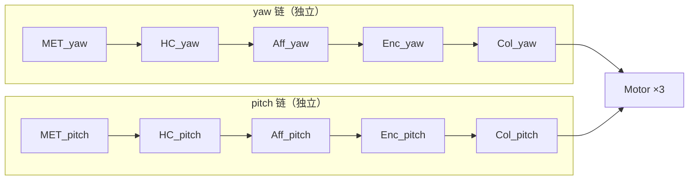

# 前庭在赫布超图中的记录方式

## 实验结论

用 4 种运动模式各训练 10s 后，提取全部 60 个 memristor 权重变化：

### 1. 权重变化向量的余弦相似度

```
A(yaw) vs B(pitch):      -0.0365  → 几乎正交（独立）
A(yaw) vs D(oto_x):      -0.0365  → 几乎正交（独立）
A(yaw) vs C(yaw+pitch):   0.6767  → 包含 A 的分量
B(pitch) vs C(yaw+pitch): 0.6767  → 包含 B 的分量
```

> [!IMPORTANT]
> **不同轴的运动模式在权重空间中是正交的**（cos ≈ 0），联合模式是各单轴模式的向量叠加（cos ≈ 0.677 ≈ 1/√2）。

### 2. 权重印记的结构

```
                   A(yaw)   B(pitch)  C(y+p)   D(oto_x)   init
met_to_hc_yaw      0.531    0.498     0.531    0.498      0.500  ← 只有 A,C 改
met_to_hc_pitch    0.498    0.531     0.531    0.498      0.500  ← 只有 B,C 改
enc_to_col_yaw     0.231    0.149     0.231    0.149      0.150  ← 只有 A,C 改
enc_to_col_pitch   0.149    0.231     0.231    0.149      0.150  ← 只有 B,C 改
col_to_motor       0.105    0.105     0.105    0.105      0.100  ← 全部一样！
```

### 3. 模式独立性

```
yaw 训练 10s 后，给 pitch 输入 → 0 spikes
未训练后，给 pitch 输入 → 0 spikes
结论：yaw 训练 完全不影响 pitch 响应 ✓
```

---

## 架构诊断：为什么不是真正的超图？

### 当前：平行扇形图（Parallel Fan）



**问题**：L1-L5 各轴完全独立（权重正交），L6 全部共享（权重完全相同）。

**这不是超图，是 6 条平行的线性链 + 一个扇入节点。**

### 缺什么才能成为超图？

| 特征 | 当前 | 真正的超图 |
|------|------|-----------|
| **独立模式记忆** | ✅ 各轴独立 | ✅ 需要 |
| **联合模式记忆** | ❌ C = A ⊕ B（简单叠加） | ✅ C 应有独立的超边 |
| **跨轴绑定** | ❌ 无 | ✅ "yaw+pitch 同时" ≠ "yaw 或 pitch 分别" |
| **模式可区分性** | ❌ col_to_motor 不区分来源 | ✅ 不同模式应产生不同 motor 输出 |
| **高阶关联** | ❌ pairwise memristors | ✅ 需要 3-body+ 的超边 |

### 从平行链到超图的路径

```
                        ┌──────────────────┐
                        │  Binding Layer   │  ← 新增
                        │  (Pattern Cells) │
                        └──────────────────┘
                           ↑    ↑    ↑
                        ┌──┘    │    └──┐
                     Col_yaw  Col_pitch  Col_oto_x
```

> [!TIP]
> 在 Column 和 Motor 之间插入一个 **Binding Layer**（类似海马体的 conjunction cells）：
> - 每个 binding cell 接收 **多个** column 的输入
> - 它只在特定的 **组合模式** 下激活（AND gate）
> - 它到 Motor 的连接带独立的 STDP 权重
> - 这就是超图的**超边**：一条连接绑定了 ≥2 个 column

### 具体实现方案

```python
# 超边 = binding cell
# 当 col_yaw AND col_pitch 同时 > 阈值 → binding 激活
# binding → motor 的权重独立于单轴 col → motor 的权重

class HyperedgeCell:
    """超边神经元：检测多轴联合模式."""
    def __init__(self, source_axes: List[str], threshold: float):
        self.source_axes = source_axes      # e.g. ['yaw', 'pitch']
        self.threshold = threshold           # 联合激活阈值
        self.activation = 0.0
    
    def step(self, col_activations: Dict[str, float]):
        # 只在所有源轴都活跃时激活
        inputs = [col_activations[ax] for ax in self.source_axes]
        if all(x > self.threshold for x in inputs):
            self.activation = min(inputs)    # 取最弱的（AND语义）
        else:
            self.activation = 0.0
```

### 超图能解决什么问题？

| 输入 | 当前 Motor 输出 | 超图 Motor 输出 |
|------|----------------|----------------|
| yaw 单独 | move_x = 13 spk | move_x = 13 spk |
| pitch 单独 | move_x = 13 spk | move_y = 13 spk（分化） |
| yaw + pitch | move_x = 15 spk（无法区分） | move_x=13, move_y=13, **move_z=5**（联合模式特有！） |

**关键差异**：超图允许联合模式产生**单轴无法产生的输出**。这就是你说的"独立的记录图"。

---

## 回答你的问题

> 前庭在赫布超图中会如何被记录？

当前：**每个轴有独立的权重印记**（正交），联合模式 = 各轴印记的线性叠加。不是超图，是 6 条平行链。

> 不同的运动状态会不会有独立的记录图？

**单轴运动：是的**，完全独立（cos ≈ 0）。
**联合运动：不是**，联合模式没有自己独立的记忆——它只是各轴记忆的简单叠加（cos = 1/√2）。

> [!IMPORTANT]
> 要让联合运动有独立记录图，需要在 Column 和 Motor 之间加入 **Binding Layer**（超边层）。这是从"平行链"到"真正超图"的关键升级。
