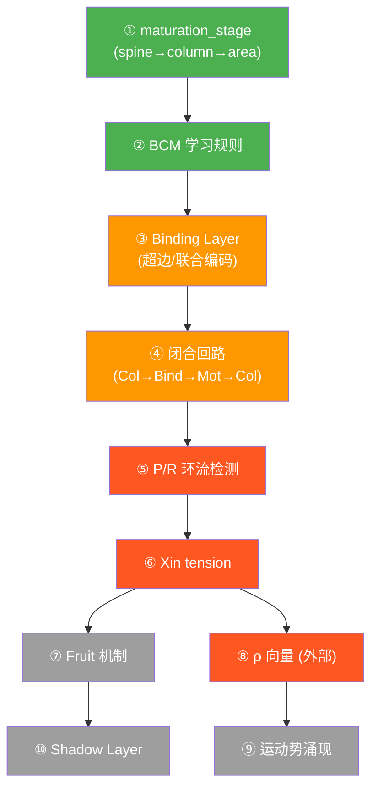

# 框架词汇 → nexus_v1 前庭实现的完整映射

## 问题

nexus_v1 的前庭链路用了自己的零件语言（NeuronConfig / SynapticBundle / Memristor），但 Morphosphere 框架定义了一套完整的生命周期词汇。两者如何对接？

---

## 逐概念映射

### 1. T/O/P/R/Xin 生命周期

框架定义（[walkthrough.2026.5.16.4.md](file:///d:/cell-cc/walkthrough.2026.5.16.4.md#L475-L480)）：

```
T = activation 沿超边传播（带耗散）
O = 可被外部观测的构型变化
P = 主环流（winner-take-most 闭合路径）
R = 次级竞争环流
Xin = 预测残差蜷缩在边上的张力
```

| 生命周期 | nexus_v1 当前对应物 | 状态 | 差距 |
|---------|---------------------|------|------|
| **T** (传输) | `HebbianCircuit.step()` — 逐层前馈传播 | ✅ 存在 | 有传播、有耗散（heat_output），但**没有闭合路径** |
| **O** (可观测) | 熵账本 `EntropyLedger.record()` | ✅ 存在 | 外部观测，不改主线。但指标不是 ρ 向量 |
| **P** (主环流) | ❌ **不存在** | ❌ | 前庭是 MET→…→Mot 单向，无闭合回路 |
| **R** (次环流) | ❌ **不存在** | ❌ | 同上 |
| **Xin** (预测残差) | ❌ **不存在** | ❌ | 无 predict-compare 机制 |

> [!IMPORTANT]
> **核心缺失：前庭链路是纯前馈的，没有环流。** Task C 的 Motor→Column feedback 创造了第一条回路，但还不是框架定义的 P/R 环流。

**如何落地 P/R/Xin：**

```
当前: MET → HC → Aff → Enc → Col → Mot  (开链)
                                    ↑____↙ (Task C: feedback, 但没有Xin)

需要:
  1. 在 feedback 回路上加 prediction:
     - Col 预测 "下一步 Mot 应该有多少 spike"
     - 实际 Mot spike 与预测比较 → 残差 = Xin tension
     - 残差积累在 col_to_motor bundle 上

  2. 当环路 Col→Mot→Col 形成闭合 → 这就是 P 环流
     - P = 沿环路传播的 activation 总量
     - R = 次强环路（另一个轴的 Col→Mot→Col）
     
  3. 实现: 在 bundle 上加 xin_tension 字段
     （MetaSynapticBundle 已有此字段 — 直接复用设计）
```

---

### 2. 影子层（Shadow Layer）

框架定义（[shadow_hypergraph.py](file:///d:/cell-cc/Morphosphere_v37_0_native_runtime_prototype_flat_complete/morphosphere_v2pp/engines/shadow_hypergraph.py)）：

```
铁律: Shadow 永远不反写主线
能量单向流: active → shadow → expired
用途: 存储已死结构的 z_t 向量，检测共振
```

| 概念 | nexus_v1 当前 | 状态 |
|------|---------------|------|
| Shadow inter（下葬） | ❌ 无 | 无结构死亡 |
| Ghost resonance | ❌ 无 | — |
| Slow-wave maintenance | ❌ 无 | — |

**关键洞察：nexus_v1 当前没有结构死亡。** 所有 60 个 memristor 永远存在。前庭链路在当前阶段**不需要影子层**——太小、太年轻。

**什么时候需要：**
- 当 Binding Layer 的超边 cell 因模式消失被剪枝 → 权重向量进影子层
- 当 PNN 冻结后被 ChABC 重新打开 → 旧权重留影子记录

---

### 3. 结晶（Crystallization）

```
结晶 = 一组高度相关的 encoding 神经元凝聚为不可分的整体
例: cx_gam_xin = gamma_desync × xin_residual 的结晶
```

| 概念 | nexus_v1 当前 | 状态 |
|------|---------------|------|
| 结晶检测 | ❌ 无 | 但有雏形：STDP 权重收敛 |
| 结晶标记 | ❌ 无 | — |
| 结晶保护 | ⚠️ PNN gating 部分实现 | PNN 冻结 ≈ 结晶保护 |

**在前庭中，结晶 = 什么？**

```
"yaw 检测器" 的结晶过程:
  初始: Enc_reg_yaw → Col_yaw 权重 = 0.15
  学习: STDP 反复强化 → 权重 → 0.23
  稳态: PNN 关闭可塑性 → 权重锁定
  结晶: Enc_yaw → Col_yaw 成为不可分的功能单元
     → 这条通路 = "yaw crystal"
```

**如何落地：** 不需要新代码！
- PNN maturity > 0.8 + weight variance < 0.01 → 自动结晶
- 在熵账本中**标记**: `bundle.state = "crystallized"`
- 结晶是**观测**，不是操作

---

### 4. spine / column / area 成熟三阶

框架定义（[walkthrough L2019-2041](file:///d:/cell-cc/walkthrough.2026.5.16.4.md#L2019-L2041)）：

| 阶段 | 框架定义 | nexus_v1 当前 | 差距 |
|------|---------|--------------|------|
| **spine** | 高可塑 0.18, 快遗忘, 不抑制 | 所有 neuron 初始状态 | ✅ |
| **column** | 低可塑 0.01, 慢遗忘, 抑制 3 邻 | PNN 0.3-0.7 | ⚠️ lateral inhibition 不随成熟增强 |
| **area** | 极低可塑, 抑制 5 邻 | PNN > 0.8 | ⚠️ 缺少 lateral suppression 增强 |

**差距：** NeuronConfig 没有 `maturation_stage` 字段。MetaNeuron 有。

**如何落地：**

```python
# NeuronConfig 加字段 (不改原有逻辑):
maturation_stage: str = "spine"

# VariantCircuit.step() 中根据 PNN 判定晋级:
if ecm.pnn_maturity > 0.3 and n.maturation_stage == "spine":
    n.maturation_stage = "column"
    # 降低 STDP lr, 增强 lateral inhibition
elif ecm.pnn_maturity > 0.7 and n.maturation_stage == "column":
    n.maturation_stage = "area"
    # 接近冻结
```

---

### 5. STDP / Oja / BCM 三种学习规则

| 规则 | nexus_v1 当前 | 框架使用位置 | 状态 |
|------|---------------|------------|------|
| **STDP** | ✅ bundle.py `learn()` | aff→enc, enc→col | ✅ |
| **Oja** | ❌ 不存在 | 框架 fallback | ❌ |
| **BCM** | ❌ 不存在 | column 层 | ❌ |
| **frozen** | ✅ `learning_rule="frozen"` | HC→Aff | ✅ |

**BCM vs STDP：**

```
STDP: Δw ∝ pre_trace × post_act - post_trace × pre_act
      因果时序

BCM:  Δw ∝ post × (post - θ_M) × pre
      θ_M = ⟨post²⟩ (滑动阈值)
      强激活增强, 弱激活抑制 → 更适合 column 层竞争
```

**如何落地：** bundle.py 的 `learn()` 加 `"bcm"` 分支。

---

### 6. 果实（Fruit）

框架定义（[walkthrough L408-L431](file:///d:/cell-cc/walkthrough.2026.5.16.4.md#L408-L431)）：

```
Xin tension > 0.5 → dormant fruit
dormant + bias 同向 → activated fruit
activated fruit = 结构变化的种子
```

**nexus_v1：❌ 完全不存在** — 需要 P/R/Xin 先建立。

**在前庭中，果实 = 什么？**

```
系统持续接收 yaw 但 Motor 不响应
→ Xin tension 积累
→ tension > 0.5 → dormant fruit
→ 强 yaw 输入来临 → fruit 激活
→ 增强 Col→Mot 权重 或 创建旁路
```

---

### 7-9. 时空环流 / 时空测度 / 运动势

| 概念 | nexus_v1 | 需要什么 |
|------|---------|---------|
| **时空测度** | ✅ 隐式存在（膜积分 + trace decay） | 已满足 |
| **时空环流** | ❌ 需要闭合回路 | 需要 Binding Layer |
| **运动势** | ❌ | 需要 ρ 时序差分 → 需要环流 |

**运动势不是独立实现的东西** — 修好 P/R 环流后，ρ 的时序差分自然涌现。

---

### 10. 结构计算 vs 物理计算

```
结构计算: "哪些通路存在" 决定输出 → nexus_v1 固定拓扑 ❌
物理计算: "权重多少" 决定输出 → nexus_v1 STDP 权重 ✅

真正的结构计算: 拓扑本身会变化
  → LiquidMetalRouter 部分实现（动态 Enc→Col）
  → Bundle 剪枝/Ghost 复活 → 未实现
```

---

## 实施优先级（依赖排序）



🟢 绿色 = 可立即做（不依赖其他）
🟠 橙色 = 需绿色先完成
🔴 红色 = 核心突破（需闭合回路）
⚪ 灰色 = 最后

## Open Questions

1. **Binding Layer 规模**：先做 C(6,2)=15 双轴，还是用 LiquidMetalRouter 动态发现？
2. **BCM 的 θ_M**：用 calcium（框架一致），还是 ⟨post²⟩ EMA（标准 BCM）？
3. **maturation 阈值**：用 PNN maturity（已有），还是 potential 积累（框架一致）？可并行。
4. **ρ 向量**：扩展熵账本，还是新建 RLIS 模块？
